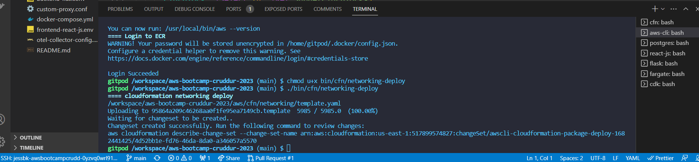
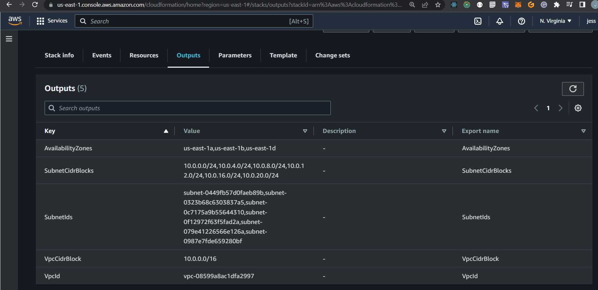
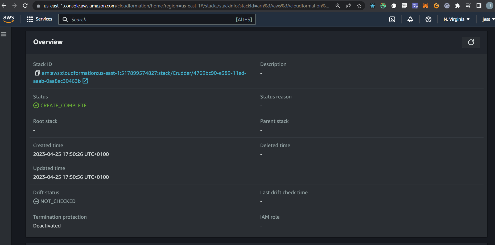
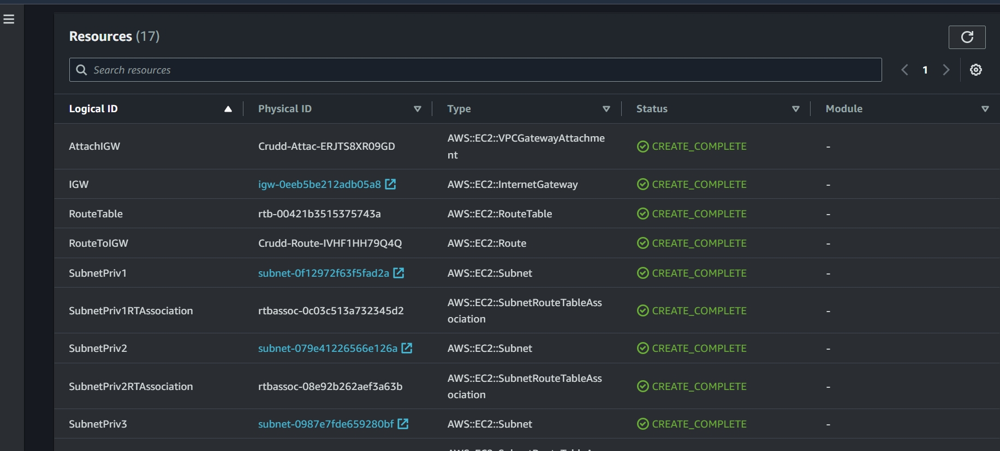
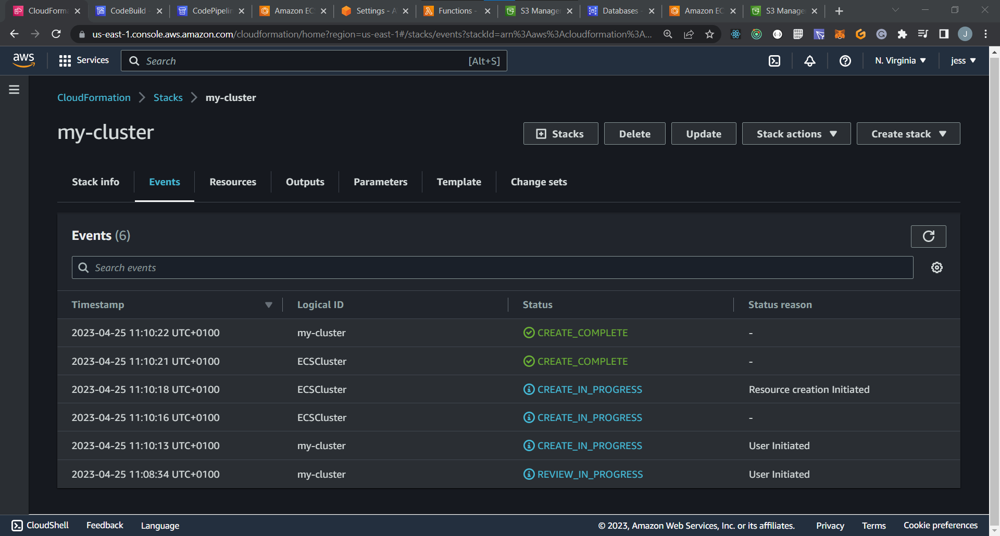

# Week 10 — CloudFormation Part 1

**AWS CloudFormation** is a service that allows you to manage and automate your infrastructure and applications in AWS. With CloudFormation, you can define templates in either JSON or YAML format that describe the resources you want to create, configure, and manage. These resources can include AWS services like EC2 instances, S3 buckets, and RDS databases, as well as custom resources you create yourself.

**Using CloudFormation**, you can easily and efficiently provision and update your resources in a repeatable and automated manner. You can also track changes to your infrastructure over time, and roll back changes if needed. This makes it an ideal solution for managing complex and large-scale infrastructure and applications.

# Key features of CloudFormation

* **Infrastructure as Code (IaC)**: CloudFormation allows you to treat your infrastructure as code, enabling you to version control and manage it just like you would any other codebase. This makes it easy to collaborate with other team members and ensure consistency across your deployments.

* **Templates**: CloudFormation templates are used to describe your infrastructure as code. They are written in JSON or YAML, and define the resources and their configurations that you want to create and manage. Templates can be easily versioned, shared, and reused.

* **Automation**: With CloudFormation, you can automate the deployment and management of your infrastructure and applications. This means you can easily replicate your infrastructure in multiple environments, such as development, staging, and production, ensuring consistency and reducing human error.

* **Rollback**: If a deployment fails or produces unexpected results, CloudFormation makes it easy to roll back to a previous, known-good state. This can be done with a single click, and ensures that your infrastructure is always in a consistent state.

* **Integrations**: CloudFormation integrates with many other AWS services, including CloudTrail, CloudWatch, and AWS Config. This enables you to monitor and audit changes to your infrastructure, and ensure compliance with security and regulatory requirements.

* **Security**: CloudFormation can help you to improve the security of your AWS infrastructure by centralizing the configuration of your resources. This can make it easier to manage and audit your security settings.

* **Consistency**: CloudFormation templates can be used to create a repeatable and consistent deployment process for your AWS resources. This can help to ensure that your infrastructure is always up to date and that it meets your specific needs.

* **Reliability**: CloudFormation templates can be used to create highly reliable AWS infrastructure. This is because CloudFormation templates are idempotent, which means that they can be safely executed multiple times without causing any harm to your AWS resources.

# Cfn-lint and Cfn-guard with AWS CloudFormation Templates
**Cfn-lint** and **Cfn-guard** are two open-source tools that help developers and infrastructure engineers to validate and enforce best practices and standards when deploying AWS CloudFormation templates.

**Cfn-lint** is a command-line tool that checks CloudFormation templates for errors and best practices. It performs a static analysis of the template to identify any syntax errors, logical errors, or other issues that may cause the template to fail during deployment. It can be used to catch issues such as missing required properties, invalid data types, and unsupported resource types. By using Cfn-lint, developers can ensure that their CloudFormation templates are valid before deploying them, saving time and avoiding potential issues during the deployment process.

**Cfn-guard**, on the other hand, is a policy-as-code framework for CloudFormation templates. It allows you to define and enforce rules for your templates, ensuring that they meet the compliance and security requirements of your organization. Cfn-guard works by validating templates against a set of rules defined in a policy file, and it will fail templates that do not comply with the rules. This helps to ensure that your templates are secure and compliant with your organization's policies and best practices.

# Installing Cfn-lint and Cfn-guard in Project
Added configuration to gitpod.yml file to install on launching gitpod.

```
tasks:
  - name: cfn
    before: |
      pip install cfn-lint
      cargo install cfn-guard
```

*you will need to re-deploy gitpod to take effect alternatively install manually by running
```
pip install cfn-lint
cargo install cfn-guard
```

# Cloud Formation Implementation In Project

#CLOUDFORMATION FOR NETWORK LAYER

**First** create a S3 Bucket <add a name that will store all the cloudformation artifacts> and leave the rest as default.
**Second** create a new folder in bin/cfn/networking and create a new file in the folder template.yaml.

*add the code to the template.yaml file.

```
AWSTemplateFormatVersion: 2010-09-09

Description: |
  The base networking components for our stack:
  - VPC
    - sets DNS hostnames for EC2 instances
    - Only IPV4, IPV6 is disabled
  - InternetGateway
  - Route Table
    - route to the IGW
    - route to Local
  - 6 Subnets Explicity Associated to Route Table
    - 3 Public Subnets numbered 1 to 3
    - 3 Private Subnets numbered 1 to 3
Parameters:
  VpcCidrBlock:
    Type: String
    Default: 10.0.0.0/16
  Az1:
    Type: AWS::EC2::AvailabilityZone::Name
    Default: us-east-1a
  SubnetCidrBlocks:
    Description: "Comma-delimited list of CIDR blocks for our private public subnets"
    Type: CommaDelimitedList
    Default: >
      10.0.0.0/24, 
      10.0.4.0/24, 
      10.0.8.0/24, 
      10.0.12.0/24,
      10.0.16.0/24,
      10.0.20.0/24
  Az2:
    Type: AWS::EC2::AvailabilityZone::Name
    Default: us-east-1b
  Az3:
    Type: AWS::EC2::AvailabilityZone::Name
    Default: us-east-1d
Resources:
  VPC:
    # https://docs.aws.amazon.com/AWSCloudFormation/latest/UserGuide/aws-resource-ec2-vpc.html
    Type: AWS::EC2::VPC
    Properties:
      CidrBlock: !Ref VpcCidrBlock
      EnableDnsHostnames: true
      EnableDnsSupport: true
      InstanceTenancy: default
      Tags:
        - Key: Name
          Value: !Sub "${AWS::StackName}VPC"
  IGW:
    # https://docs.aws.amazon.com/AWSCloudFormation/latest/UserGuide/aws-resource-ec2-internetgateway.html
    Type: AWS::EC2::InternetGateway
    Properties:
      Tags:
        - Key: Name
          Value: !Sub "${AWS::StackName}IGW"
  AttachIGW:
    Type: AWS::EC2::VPCGatewayAttachment
    Properties:
      VpcId: !Ref VPC
      InternetGatewayId: !Ref IGW
  RouteTable:
    # https://docs.aws.amazon.com/AWSCloudFormation/latest/UserGuide/aws-resource-ec2-routetable.html
    Type: AWS::EC2::RouteTable
    Properties:
      VpcId: !Ref VPC
      Tags:
        - Key: Name
          Value: !Sub "${AWS::StackName}RT"
  RouteToIGW:
    # https://docs.aws.amazon.com/AWSCloudFormation/latest/UserGuide/aws-resource-ec2-route.html
    Type: AWS::EC2::Route
    DependsOn: AttachIGW
    Properties:
      RouteTableId: !Ref RouteTable
      GatewayId: !Ref IGW
      DestinationCidrBlock: 0.0.0.0/0
  SubnetPub1:
    # https://docs.aws.amazon.com/AWSCloudFormation/latest/UserGuide/aws-resource-ec2-subnet.html
    Type: AWS::EC2::Subnet
    Properties:
      AvailabilityZone: !Ref Az1
      CidrBlock: !Select [0, !Ref SubnetCidrBlocks]
      EnableDns64: false
      MapPublicIpOnLaunch: true #public subnet
      VpcId: !Ref VPC
      Tags:
        - Key: Name
          Value: !Sub "${AWS::StackName}SubnetPub1"
  SubnetPub2:
    # https://docs.aws.amazon.com/AWSCloudFormation/latest/UserGuide/aws-resource-ec2-subnet.html
    Type: AWS::EC2::Subnet
    Properties:
      AvailabilityZone: !Ref Az2
      CidrBlock: !Select [1, !Ref SubnetCidrBlocks]
      EnableDns64: false
      MapPublicIpOnLaunch: true #public subnet
      VpcId: !Ref VPC
      Tags:
        - Key: Name
          Value: !Sub "${AWS::StackName}SubnetPub2"
  SubnetPub3:
    # https://docs.aws.amazon.com/AWSCloudFormation/latest/UserGuide/aws-resource-ec2-subnet.html
    Type: AWS::EC2::Subnet
    Properties:
      AvailabilityZone: !Ref Az3
      CidrBlock: !Select [2, !Ref SubnetCidrBlocks]
      EnableDns64: false
      MapPublicIpOnLaunch: true #public subnet
      VpcId: !Ref VPC
      Tags:
        - Key: Name
          Value: !Sub "${AWS::StackName}SubnetPub3"
  SubnetPriv1:
    # https://docs.aws.amazon.com/AWSCloudFormation/latest/UserGuide/aws-resource-ec2-subnet.html
    Type: AWS::EC2::Subnet
    Properties:
      AvailabilityZone: !Ref Az1
      CidrBlock: !Select [3, !Ref SubnetCidrBlocks]
      EnableDns64: false
      MapPublicIpOnLaunch: false #public subnet
      VpcId: !Ref VPC
      Tags:
        - Key: Name
          Value: !Sub "${AWS::StackName}SubnetPriv1"
  SubnetPriv2:
    # https://docs.aws.amazon.com/AWSCloudFormation/latest/UserGuide/aws-resource-ec2-subnet.html
    Type: AWS::EC2::Subnet
    Properties:
      AvailabilityZone: !Ref Az2
      CidrBlock: !Select [4, !Ref SubnetCidrBlocks]
      EnableDns64: false
      MapPublicIpOnLaunch: false #public subnet
      VpcId: !Ref VPC
      Tags:
        - Key: Name
          Value: !Sub "${AWS::StackName}SubnetPriv2"
  SubnetPriv3:
    # https://docs.aws.amazon.com/AWSCloudFormation/latest/UserGuide/aws-resource-ec2-subnet.html
    Type: AWS::EC2::Subnet
    Properties:
      AvailabilityZone: !Ref Az3
      CidrBlock: !Select [5, !Ref SubnetCidrBlocks]
      EnableDns64: false
      MapPublicIpOnLaunch: false #public subnet
      VpcId: !Ref VPC
      Tags:
        - Key: Name
          Value: !Sub "${AWS::StackName}SubnetPriv3"
  SubnetPub1RTAssociation:
    Type: AWS::EC2::SubnetRouteTableAssociation
    Properties:
      SubnetId: !Ref SubnetPub1
      RouteTableId: !Ref RouteTable
  SubnetPub2RTAssociation:
    Type: AWS::EC2::SubnetRouteTableAssociation
    Properties:
      SubnetId: !Ref SubnetPub2
      RouteTableId: !Ref RouteTable
  SubnetPub3RTAssociation:
    Type: AWS::EC2::SubnetRouteTableAssociation
    Properties:
      SubnetId: !Ref SubnetPub3
      RouteTableId: !Ref RouteTable
  SubnetPriv1RTAssociation:
    Type: AWS::EC2::SubnetRouteTableAssociation
    Properties:
      SubnetId: !Ref SubnetPriv1
      RouteTableId: !Ref RouteTable
  SubnetPriv2RTAssociation:
    Type: AWS::EC2::SubnetRouteTableAssociation
    Properties:
      SubnetId: !Ref SubnetPriv2
      RouteTableId: !Ref RouteTable
  SubnetPriv3RTAssociation:
    Type: AWS::EC2::SubnetRouteTableAssociation
    Properties:
      SubnetId: !Ref SubnetPriv3
      RouteTableId: !Ref RouteTable
Outputs:
  VpcId:
    Value: !Ref VPC
    Export:
      Name: !Sub "${AWS::StackName}VpcId"
  VpcCidrBlock:
    Value: !GetAtt VPC.CidrBlock
    Export:
      Name: !Sub "${AWS::StackName}VpcCidrBlock"
  SubnetCidrBlocks:
    Value: !Join [",", !Ref SubnetCidrBlocks]
    Export:
      Name: !Sub "${AWS::StackName}SubnetCidrBlocks"
  PublicSubnetIds:
    Value: !Join
      - ","
      - - !Ref SubnetPub1
        - !Ref SubnetPub2
        - !Ref SubnetPub3
    Export:
      Name: !Sub "${AWS::StackName}PublicSubnetIds"
  PrivateSubnetIds:
    Value: !Join
      - ","
      - - !Ref SubnetPriv1
        - !Ref SubnetPriv2
        - !Ref SubnetPriv3
    Export:
      Name: !Sub "${AWS::StackName}PrivateSubnetIds"
  AvailabilityZones:
    Value: !Join
      - ","
      - - !Ref Az1
        - !Ref Az2
        - !Ref Az3
    Export:
      Name: !Sub "${AWS::StackName}AvailabilityZones"
```

The template.yaml file creates a VPC with 3 public and 3 private subnets in 3 availability zones. The public subnets have public IP addresses and can be accessed from the internet, while the private subnets do not have public IP addresses and can only be accessed from within the VPC. The template also creates a route table and routes all traffic from the public subnets to the internet through the internet gateway.
 
***Resources created by the template***:

* VPC: A virtual private cloud (VPC) is a logically isolated section of the AWS cloud.
* Subnets: A subnet is a smaller range of IP addresses within a VPC.
* Internet gateway: An internet gateway is a network interface that allows traffic to flow between the VPC and the internet.
* Route table: A route table is a collection of routes that determine how traffic is routed within a VPC.
* Public subnets: Public subnets have public IP addresses and can be accessed from the internet.
* Private subnets: Private subnets do not have public IP addresses and can only be accessed from within the VPC.
  
***The template also exports the following values***:

* VpcId: The ID of the VPC.
* VpcCidrBlock: The CIDR block of the VPC.
* SubnetCidrBlocks: A list of the CIDR blocks for the public and private subnets.
* SubnetIds: A list of the IDs for the public and private subnets.
* AvailabilityZones: A list of the availability zones for the public and private subnets.
  
**This template can be used to create a VPC infrastructure that can be used to host a variety of applications.**

# Bash Script To Deploy The Networking Template
```
#! /usr/bin/env bash
set -e # stop the execution of the script if it fails

CYAN='\033[1;36m'
NO_COLOR='\033[0m'
LABEL="Cloudformation Deploy Networking"
printf "${CYAN}==== ${LABEL}${NO_COLOR}\n"

CFN_PATH="/workspace/aws-bootcamp-cruddur-2023/aws/cfn/networking/template.yaml"
CONFIG_PATH="/workspace/aws-bootcamp-cruddur-2023/aws/cfn/networking/config.toml"
echo $CFN_PATH

cfn-lint $CFN_PATH

BUCKET=$(cfn-toml key deploy.bucket -t $CONFIG_PATH)
REGION=$(cfn-toml key deploy.region -t $CONFIG_PATH)
STACK_NAME=$(cfn-toml key deploy.stack_name -t $CONFIG_PATH)

aws cloudformation deploy \
  --stack-name $STACK_NAME \
  --s3-bucket $BUCKET \
  --region $REGION \
  --template-file "$CFN_PATH" \
  --no-execute-changeset \
  --tags group=cruddur-networking \
  --s3-prefix networking \
  --capabilities CAPABILITY_NAMED_IAM

```

# Creating and Saving Environment Variables for S3 Bucket
*created a Readme.md file for explanation
  
```
aws s3 mk s3://jessbk-cfn-artifacts
export CFN_BUCKET="jessbk-cfn-artifacts"
gp env CFN_BUCKET="jessbk-cfn-artifacts"
```

  
* Chmod the bash script and excute the command
```
# Grant access
chmod u+x bin/cfn/networking-deploy
  
# Execute the script
./bin/cfn/networking-deploy
```  
  
# Proof Of Implementation
  







  



# CLOUDFORMATION FOR CLUSTER LAYER PART 2
  
**This AWS CloudFormation template is used to create and configure networking and cluster resources to support Fargate containers.**

1. **AWSTemplateFormatVersion:** Specifies the CloudFormation template version.
  
2. **Description:** Provides a description of the template and its purpose.
  
3. **Parameters:** Defines input parameters that can be provided when creating a stack based on this template. These parameters allow customization of various settings, such as networking components, ports, health checks, etc.
  
4. **Resources:** Describes the AWS resources that will be created and configured by the CloudFormation stack. The template defines the following resources:
  
* **FargateCluster:** Creates an ECS Fargate cluster with specified settings, such as capacity providers, cluster name, logging configuration, and more.
  
* **ALB:** Creates an Application Load Balancer (ALB) with specified settings, such as the load balancer name, type (application), IP address type (ipv4), security groups, subnets, and load balancer attributes.
  
* **HTTPSListener:** Creates an HTTPS listener for the ALB, which listens on port 443 and forwards traffic to a target group.

* **HTTPListener:** Creates an HTTP listener for the ALB, which listens on port 80 and redirects traffic to the HTTPS listener.

* **ApiALBListernerRule:** Creates a listener rule for the ALB that matches the host header value and forwards traffic to a backend target group.

* **ALBSG:** Creates a security group for the ALB with inbound rules allowing HTTP (port 80) and HTTPS (port 443) traffic from any IP address.

* **ServiceSG:** Creates a security group for the Fargate services, with an inbound rule allowing HTTP traffic from the ALB security group.

* **BackendTG:** Creates a target group for the backend services, with specified health check settings, attributes, and VPC configuration.

* **FrontendTG:** Creates a target group for the frontend services, with specified health check settings, attributes, and VPC configuration.
  
5. **Outputs:** Defines the outputs of the CloudFormation stack, which can be used by other stacks or resources. The outputs include the cluster name, service security group ID, ALB security group ID, frontend target group ARN, and backend target group ARN.
  
These resources and configurations are defined in the template to set up networking, load balancing, and routing for Fargate containers, enabling the deployment of a scalable and resilient application infrastructure on AWS.

**Here is the link to the cloudformation template file.** [Link to Template File](https://github.com/jess-bk/aws-bootcamp-cruddur-2023/blob/main/aws/cfn/cluster/template.yaml)

***CONFIG TOML FILE FOR CLUSTER***
  
The TOML file is defining a section called [deploy] with three key-value pairs inside it. TOML (Tom's Obvious, Minimal Language) is a configuration file format that is often used for specifying settings and parameters in various application.
  
1. bucket = 'jessbk-cfn-artifacts': This line assigns the value 'jessbk-cfn-artifacts' to the key bucket inside the [deploy] section. It indicates the name of the S3 bucket where CloudFormation artifacts (such as templates and related files) will be stored or retrieved from during the deployment process.
  
2. region = 'us-east-1': This line assigns the value 'us-east-1' to the key region inside the [deploy] section. It specifies the AWS region where the CloudFormation stack will be deployed. In this case, the stack will be deployed in the US East (N. Virginia) region.
  
3. stack_name = 'CrdNet': This line assigns the value 'CrdCluster' to the key stack_name inside the [deploy] section. It indicates the desired name for the CloudFormation stack that will be created or updated during the deployment process. In this case, the stack will be named 'CrdCluster'.]
  
4. CertificateArn: Specifies the ARN (Amazon Resource Name) of an ACM (AWS Certificate Manager) certificate (arn:aws:acm:us-east-1:517899574827:certificate/e9413679-adc8-4578-a3ae-47f94111bcd8).
  
5. NetworkingStack: Specifies the name of the networking stack (CrdNet) that this CloudFormation stack depends on.
  
**Here is the link to the cloudformation toml file.** [Link to TOML File](https://github.com/jess-bk/aws-bootcamp-cruddur-2023/blob/main/aws/cfn/cluster/config.toml)
  
This TOML file provides configuration settings related to the deployment of a CloudFormation stack, including the S3 bucket name, AWS region, and stack name. These settings can be referenced and used by deployment scripts or tools to deploy the stack with the specified parameters.The CertificateArn and NetworkingStack values may be used as parameters within the CloudFormation template to configure resources or define dependencies on other stacks.

  
**BASH SCRIPT** To run the cloudformation template i have created a bash script, The script performs the following actions:
* set -e: This command sets the script to exit immediately if any command within it fails (returns a non-zero exit status). This is often used to ensure the script stops execution if an error occurs.
  
* CFN_PATH="/workspace/aws-bootcamp-cruddur-2023/aws/cfn/cluster/template.yaml": This line assigns the file path of the CloudFormation template (template.yaml) to the CFN_PATH variable.
  
* CONFIG_PATH="/workspace/aws-bootcamp-cruddur-2023/aws/cfn/cluster/config.toml": This line assigns the file path of the configuration file (config.toml) to the CONFIG_PATH variable.

* echo $CFN_PATH: This line prints the value of the CFN_PATH variable to the console.

* cfn-lint $CFN_PATH: This command runs the cfn-lint tool to check the CloudFormation template file for any potential issues or errors.

* BUCKET=$(cfn-toml key deploy.bucket -t $CONFIG_PATH): This line retrieves the value of the deploy.bucket key from the config.toml file using the cfn-toml tool and assigns it to the BUCKET variable.

* REGION=$(cfn-toml key deploy.region -t $CONFIG_PATH): This line retrieves the value of the deploy.region key from the config.toml file using the cfn-toml tool and assigns it to the REGION variable.

* STACK_NAME=$(cfn-toml key deploy.stack_name -t $CONFIG_PATH): This line retrieves the value of the deploy.stack_name key from the config.toml file using the cfn-toml tool and assigns it to the STACK_NAME variable.
  
* PARAMETERS=$(cfn-toml params v2 -t $CONFIG_PATH): This line retrieves the CloudFormation parameters from the config.toml file using the cfn-toml tool and assigns them to the PARAMETERS variable.

* aws cloudformation deploy ...: This command deploys the CloudFormation stack using the AWS CLI (aws cloudformation deploy). It specifies the stack name, S3 bucket, AWS region, CloudFormation template file, and other deployment options such as tags, prefix, parameter overrides, and capabilities.
  
**Here is the link to the bash script.** [Link to Bash Script](https://github.com/jess-bk/aws-bootcamp-cruddur-2023/blob/main/bin/cfn/cluster)

# CLOUDFORMATION FOR SERVICE LAYER (FLASK-BACKEND) PART 3

**This AWS CloudFormation template provided is used to define and deploy a stack for a Fargate service running on Amazon ECS (Elastic Container Service). Let's go through the different sections and their functionalities:**

1. **AWSTemplateFormatVersion:** Specifies the version of the AWS CloudFormation template.

2. **Description:** Provides a brief description of the template.

3. **Parameters:** Defines the input parameters for the template. Users can provide values for these parameters during stack creation or use default values.
  
* **NetworkingStack:** This parameter represents the base layer of networking components, such as VPC and subnets. It allows you to specify the networking stack name. The default value is set to "CrdNet".
  
* **ClusterStack:** This parameter represents the cluster layer, which includes ECS cluster and ALB (Application Load Balancer). It allows you to specify the cluster stack name. The default value is set to       "CrdCluster".
  
* **ContainerPort:** This parameter specifies the port number on which the container within the Fargate service will listen. The default value is set to 4567.
  
* **ServiceCpu:** This parameter defines the CPU units to be allocated to the Fargate service. The default value is set to "256".
  
* **ServiceMemory:** This parameter specifies the amount of memory (in MiB) to be allocated to the Fargate service. The default value is set to "512".
  
* **ServiceName:** This parameter represents the name of the Fargate service. It allows you to specify a custom service name. The default value is set to "backend-flask".
  
* **ContainerName:** This parameter represents the name of the container within the Fargate service. It allows you to specify a custom container name. The default value is set to "backend-flask".
  
* **TaskFamily:** This parameter specifies the family name for the ECS task definition. It allows you to group multiple versions of the same task definition under a single family name. The default value is set to "backend-flask".
  
* **EcrImage:** This parameter represents the ECR (Elastic Container Registry) image URL for the container to be used in the Fargate service. It allows you to specify the image URL for your container. The        default value is set to "517899574827.dkr.ecr.us-east-1.amazonaws.com/backend-flask".
  
* **EnvOtelServiceName:** This parameter represents the value of the environment variable "OTEL_SERVICE_NAME" to be set in the container. It is used for configuring OpenTelemetry service name. The default value is set to "backend-flask".
  
* **EnvOtelExporterOtlpEndpoint:** This parameter represents the value of the environment variable "OTEL_EXPORTER_OTLP_ENDPOINT" to be set in the container. It is used for configuring the OpenTelemetry exporter OTLP (OpenTelemetry Protocol) endpoint. The default value is set to "https://api.honeycomb.io".
  
* **EnvAWSCognitoUserPoolId:** This parameter represents the value of the environment variable "AWS_COGNITO_USER_POOL_ID" to be set in the container. It is used for configuring the AWS Cognito User Pool ID. The default value is set to "us-east-1_FpcgxtNfc".
  
* **EnvCognitoUserPoolClientId:** This parameter represents the value of the environment variable "AWS_COGNITO_USER_POOL_CLIENT_ID" to be set in the container. It is used for configuring the AWS Cognito User Pool Client ID. The default value is set to "6jbj9dn4cf8oldfrvmm5cg34t9".
  
* **EnvFrontendUrl:** This parameter represents the value of the environment variable "FRONTEND_URL" to be set in the container. It is used for configuring the URL of the frontend application. The default value is set to "*".
  
* **EnvBackendUrl:** This parameter represents the value of the environment variable "BACKEND_URL" to be set in the container. It is used for configuring the URL of the backend application. The default value is set to "*".
  
* **SecretsAWSAccessKeyId:** This parameter represents the AWS SSM (Systems Manager) parameter ARN for the secret value "AWS_ACCESS_KEY_ID". It is used for accessing sensitive information securely. The default value is set to "arn:aws:ssm:us-east-1:517899574827:parameter/cruddur/backend-flask/AWS_ACCESS_KEY_ID".
  
* **SecretsSecretAccessKey:** This parameter represents the AWS SSM parameter ARN for the secret value "AWS_SECRET_ACCESS_KEY". It is used for accessing sensitive information securely. The default value is set to "arn:aws:ssm:us-east-1:517899574827:parameter/cruddur/backend-flask/AWS_SECRET_ACCESS_KEY".
  
* **SecretsConnectionUrl:** This parameter represents the AWS SSM parameter ARN for the secret value "CONNECTION_URL". It is used for accessing sensitive information securely. The default value is set to "arn:aws:ssm:us-east-1:517899574827:parameter/cruddur/backend-flask/CONNECTION_URL".
  
* **SecretsRollbarAccessToken:** This parameter represents the AWS SSM parameter ARN for the secret value "ROLLBAR_ACCESS_TOKEN". It is used for accessing sensitive information securely. The default value is set to "arn:aws:ssm:us-east-1:517899574827:parameter/cruddur/backend-flask/ROLLBAR_ACCESS_TOKEN".
  
  
4. **Resources:**
  **FargateService:**
  **Type:** AWS::ECS::Service
  **Description:** This resource defines an Amazon Elastic Container Service (ECS) service running on AWS Fargate. It represents the deployment of containers and manages their lifecycle.
  * **Properties:**
    * **Cluster:** Specifies the ECS cluster where the service is deployed. It uses the Fn::ImportValue function to import the value from the ${ClusterStack}ClusterName exported value.
    * **DeploymentController:** Specifies the deployment controller type for the service, which is set to "ECS" (default).
    * **DesiredCount:** Specifies the desired number of tasks (containers) to run in the service, which is set to 1 (default).
    * **EnableECSManagedTags:** Enables or disables automatic generation of AWS managed tags for the service, which is set to true (default).
    * **EnableExecuteCommand:** Enables or disables the ECS ExecuteCommand feature, which allows running commands in a container, set to true (default).
    * **HealthCheckGracePeriodSeconds:** Specifies the time (in seconds) to ignore the health check status during a service deployment, set to 0 (default).
    * **LaunchType:** Specifies the launch type for the service, which is set to "FARGATE".
    * **LoadBalancers:** Specifies the load balancer configuration for the service. It uses the Fn::ImportValue function to import the value of the target group ARN from the ${ClusterStack}BackendTGArn exported       value.
    * **NetworkConfiguration:** Specifies the network configuration for the service. It uses the Fn::ImportValue function to import the value of the security group and subnet IDs from the                               ${NetworkingStack}PublicSubnetIds exported value.
    * **PlatformVersion:** Specifies the platform version for the Fargate task, which is set to "LATEST" (default).
    * **PropagateTags:** Specifies how to propagate tags from the service to the tasks, set to "SERVICE" (default).
    * **ServiceConnectConfiguration:** Specifies the AWS Cloud Map service discovery configuration for the service.
    * **ServiceName:** Specifies the name of the service, which is obtained from the FargateService resource's name.
    * **TaskDefinition:** Specifies the task definition to use for the service, obtained from the TaskDefinition resource.

  **TaskDefinition:**
  * Type: AWS::ECS::TaskDefinition
  * Description: This resource defines an ECS task definition that describes how a container should be launched and configured.
  * Properties:
    * Family: Specifies the family name of the task definition, obtained from the TaskFamily parameter.
    * ExecutionRoleArn: Specifies the ARN of the task execution role, obtained from the ExecutionRole resource.
    * TaskRoleArn: Specifies the ARN of the task role, obtained from the TaskRole resource.
    * NetworkMode: Specifies the network mode for the task, which is set to "awsvpc".
    * Cpu: Specifies the CPU units to allocate to the task, obtained from the ServiceCpu parameter.
    * Memory: Specifies the memory to allocate to the task, obtained from the ServiceMemory parameter.
    * RequiresCompatibilities: Specifies the compatibility requirements for the task, which is set to "FARGATE".
    * ContainerDefinitions: Specifies the list of containers and their configurations within the task:
      * Name: Specifies the name of the container.
      * Image: Specifies the Docker image to use for the container, obtained from the EcrImage parameter.
      * Essential: Specifies whether the container is essential for the task.
      * HealthCheck: Specifies the health check configuration for the container.
      * PortMappings: Specifies the port mappings for the container.
      * LogConfiguration: Specifies the log configuration for the container.
      * Environment: Specifies the environment variables for the container, including values obtained from the parameter references.
      * Secrets: Specifies the secrets for the container, including values obtained from the parameter references.

  **ExecutionRole:**
  * **Type:** AWS::IAM::Role
  * **Description:** This resource defines an IAM role used by the ECS service to execute tasks.
  * **Properties:**
    * RoleName: Specifies the name of the IAM role.
    * AssumeRolePolicyDocument: Specifies the permissions policy that grants ECS tasks the permission to assume this role.
    * Policies: Specifies the list of policies attached to the role, including permissions for ECR, CloudWatch Logs, and SSM.
    * ManagedPolicyArns: Specifies the ARNs of the managed policies attached to the role, including CloudWatch Logs and X-Ray access.

  **TaskRole:**
  * **Type: AWS::IAM::Role**
  * **Description:** This resource defines an IAM role used by the ECS task to access SSM for parameter retrieval and SSM Session Manager.
  * **Properties:**
    * RoleName: Specifies the name of the IAM role.
    * AssumeRolePolicyDocument: Specifies the permissions policy that grants ECS tasks the permission to assume this role.
    * Policies: Specifies the list of policies attached to the role, including permissions for SSM messaging.
    * ManagedPolicyArns: Specifies the ARNs of the managed policies attached to the role, including CloudWatch Logs and X-Ray access.

5. **Outputs:**
**ServiceUrl:**
* Description: This resource defines an IAM role used by the ECS service to execute tasks.
* Value: It uses the Fn::Sub function to substitute the desired path with the exported value ${AWS::Region} to construct the URL.
  
**ClusterName:**
* **Description:** This output provides the name of the ECS cluster where the service is deployed.
* **Value:** It uses the Ref function to reference the FargateService resource and extract the cluster name.
  
**BackendTGArn:**
* **Description:** This output provides the ARN (Amazon Resource Name) of the target group associated with the ECS service.
* **Value:** It uses the Fn::ImportValue function to import the target group ARN from the ${ClusterStack}BackendTGArn exported value.

**Here is the link to the Cloudformation template file.** [Link to CFN service template](https://github.com/jess-bk/aws-bootcamp-cruddur-2023/blob/main/aws/cfn/service/template.yaml)

**CONFIG TOML FILE FOR SERVICE**
The is a configuration file, TOML format, used for deploying a backend Flask service in AWS. Let's break down its contents:

[deploy] section:
This section defines deployment-specific configurations.
**bucket:** Specifies the name of the S3 bucket where deployment artifacts will be stored. In this case, the bucket name is set to 'jessbk-cfn-artifacts'.
**region:** Specifies the AWS region where the deployment will take place. The region is set to 'us-east-1'.
**stack_name:** Specifies the name of the CloudFormation stack that will be created or updated. The stack name is set to 'CrdSrvBackendFlask'.

**[parameters] section:** This section defines various parameters that can be customized during the deployment process.
**EnvFrontendUrl:** Specifies the URL of the frontend application associated with the backend service. The default value is 'https://jessbkcloudcampus.com'.
**EnvBackendUrl:** Specifies the URL of the backend service itself. The default value is 'https://api.jessbkcloudcampus.com'.
**DDBMessageTable:** Specifies the name of a DynamoDB table that will be used for storing messages. The default value is 'CrdDdb-DynamoDBTable-8VFSE0DDW6OR'.
  
**Here is the link to the TOML file.** [Link to TOML file](https://github.com/jess-bk/aws-bootcamp-cruddur-2023/blob/main/aws/cfn/service/config.toml)
  
**BASH SCRIPT** To run the cloudformation service(backend-flask) template, i have created a bash script, this script performs linting on the CloudFormation template, reads the necessary configuration values from a TOML file, and deploys the CloudFormation stack using the AWS CLI command. The use of set -e ensures that the script stops execution if any command fails, helping to catch errors early in the deployment process.
  
**Here is the link to the bash script.** [Link to Bash Script](https://github.com/jess-bk/aws-bootcamp-cruddur-2023/blob/main/bin/cfn/service)
  
# CLOUDFORMATION FOR DATABASE RDS (POSTGRESQL) PART 4
The template primarily focuses on creating an RDS database instance, its associated security group, and subnet group. The parameters allow customization of various settings, making the template adaptable to different deployment scenarios.

The CloudFormation template is used to define and deploy AWS resources for a primary PostgreSQL RDS database. Let's break down its structure and components:
**AWSTemplateFormatVersion:** Specifies the version of the AWS CloudFormation template format being used.

**Description:** Provides a description of the CloudFormation template and its purpose.

**Parameters:** Defines input parameters that can be customized when deploying the CloudFormation stack.
Parameters include networking stack, cluster stack, backup retention period, RDS instance class, database instance identifier, database name, deletion protection, engine version, master username, and master user password.

**Resources:** Describes the AWS resources to be created and managed by the CloudFormation stack.

**RDSPostgresSG:** Defines an EC2 security group for the RDS database. Specifies the group name, description, VPC ID, and inbound rule allowing traffic from a security group associated with the cluster stack.
Allows inbound traffic on port 5432, which is the default port for PostgreSQL.

**DBSubnetGroup:** Creates an RDS subnet group for the RDS instance. Specifies the subnet group name, description, and a list of subnet IDs. The subnet IDs are imported from the networking stack's exported value of public subnet IDs.

**Database:** Creates an RDS DB instance using the specified engine (PostgreSQL). Configures various properties such as allocated storage, backup retention period, instance class, instance identifier, database name, subnet group, deletion protection, and more. The security group created earlier (RDSPostgresSG) is associated with the DB instance.

**Outputs (commented out in the provided template):** Defines outputs that can be exported and used by other CloudFormation stacks. In this case, an output named ServiceSecurityGroupId is defined, which represents the security group ID of the service. However, it is currently commented out and not active in the template.
  
**Here is the link to the Cloudformation template file.** [Link to CFN DATABASE template](https://github.com/jess-bk/aws-bootcamp-cruddur-2023/blob/main/aws/cfn/db/template.yaml)
  
**CONFIG TOML FILE FOR DATABASE**
The provided TOML file is a configuration file used for deploying a CloudFormation stack. Let's break down its structure and components:

**[deploy] section:** Specifies the deployment settings for the CloudFormation stack.
**bucket parameter:** Specifies the S3 bucket where CloudFormation artifacts will be stored.
**region parameter:** Specifies the AWS region where the stack will be deployed.
**stack_name parameter:** Specifies the name of the CloudFormation stack.

**[parameters] section:** Defines additional parameters used during the stack deployment.
**NetworkingStack parameter:** Specifies the name of the networking stack to be used. This value is likely used to reference the networking stack within the CloudFormation template.
**ClusterStack parameter:** Specifies the name of the cluster stack to be used. This value is likely used to reference the cluster stack within the CloudFormation template.
**MasterUsername parameter:** Specifies the username for the master user of the deployed resources. It appears to be a specific username chosen for this deployment.

**TOML FILE** 
**Here is the link to the TOML file.** [Link to TOML file](https://github.com/jess-bk/aws-bootcamp-cruddur-2023/blob/main/aws/cfn/db/config.toml)
  
**BASH SCRIPT** **Here is the link to the bash script.** [Link to Bash Script](https://github.com/jess-bk/aws-bootcamp-cruddur-2023/blob/main/bin/cfn/service)
  
To run the cloudformation DataBase template, i have created a bash script, this script performs linting on the CloudFormation template, reads the necessary configuration values from a TOML file, and deploys the CloudFormation stack using the AWS CLI command. The use of set -e ensures that the script stops execution if any command fails, helping to catch errors early in the deployment process.


  
# CLOUDFORMATION FOR FRONTEND REACT TEMPLATE PART 5
  
The provided CloudFormation template creates the necessary AWS resources to set up a static website with CloudFront, S3 buckets, and Route 53 records. Here's an explanation of what the template does:
  
**AWSTemplateFormatVersion:** 2010-09-09: Specifies the CloudFormation template version.

**Description:** |: Provides a description of the resources being created.

**Parameters:** Defines the input parameters that can be passed to the CloudFormation stack during deployment. The template expects the following parameters:

**CertificateArn:** A string parameter representing the ARN (Amazon Resource Name) of an ACM certificate.

**WwwBucketName:** A string parameter representing the name of the S3 bucket for the "www" subdomain.

**RootBucketName:** A string parameter representing the name of the S3 bucket for the root/naked domain.

**Resources:** Defines the AWS resources that will be created within the stack.

**RootBucketPolicy:** Creates an S3 bucket policy for the root bucket. The policy allows public read access to objects in the bucket.

**WWWBucket:** Creates an S3 bucket for the "www" subdomain and configures it as a website that redirects all requests to the root domain.

**RootBucket:** Creates an S3 bucket for the root/naked domain. It is configured as a website and specifies the index and error documents.

**RootBucketDomain and WwwBucketDomain:** Create Route 53 record sets for the root and "www" subdomain, respectively. These record sets use alias targets pointing to the CloudFront distribution.

**Distribution:** Creates a CloudFront distribution for the static website. It specifies the aliases, origins (using the root S3 bucket), default cache behavior, SSL certificate, and error responses.

**Here is the link to the Cloudformation template file.** [Link to CFN frontend template](https://github.com/jess-bk/aws-bootcamp-cruddur-2023/blob/main/aws/cfn/frontend/template.yaml)
  
The template sets up the infrastructure required for hosting a static website, including the CloudFront distribution for content delivery, S3 buckets for storing the website files, and Route 53 record sets for DNS resolution.
  
**CONFIG TOML FILE FOR FRONTEND**
The TOML configuration file contains settings for deploying a CloudFormation stack named 'CrdFrontend'. Here's an explanation of the configuration:

**[deploy]:** Represents a section in the TOML file for deployment-specific settings.
**bucket** = 'jessbk-cfn-artifacts': Specifies the name of the S3 bucket where CloudFormation artifacts will be stored. In this case, the bucket name is 'jessbk-cfn-artifacts'.
**region** = 'us-east-1': Specifies the AWS region where the CloudFormation stack will be deployed. The region is set to 'us-east-1' (US East - N. Virginia).
**stack_name** = 'CrdFrontend': Specifies the name of the CloudFormation stack that will be created. The stack name is set to 'CrdFrontend'.

**[parameters]:** Represents a section in the TOML file for defining parameters used during stack deployment.
**CertificateArn** = 'arn:aws:acm:us-east-1:517899574827:certificate/e9413679-adc8-4578-a3ae-47f94111bcd8': Specifies the ARN (Amazon Resource Name) of an ACM certificate. The certificate is used for enabling HTTPS on the CloudFront distribution.
**WwwBucketName** = 'www.jessbkcloudcampus.com': Specifies the name of the S3 bucket for the "www" subdomain. The value is set to 'www.jessbkcloudcampus.com'.
**RootBucketName** = 'jessbkcloudcampus.com': Specifies the name of the S3 bucket for the root/naked domain. The value is set to 'jessbkcloudcampus.com'.
  
**TOML FILE** Here is the link to the TOML file. [Link to TOML file](https://github.com/jess-bk/aws-bootcamp-cruddur-2023/blob/main/aws/cfn/frontend/config.toml)

**BASH SCRIPT** 
To run the cloudformation DataBase template, i have created a bash script, this script performs linting on the CloudFormation template, The Bash script is responsible for deploying a CloudFormation stack CrdFrontend for the frontend application, this script sets up the necessary variables, performs linting on the CloudFormation template, retrieves deployment settings from the TOML configuration file, and then deploys the CloudFormation stack using the AWS CLI. It provides a streamlined way to deploy the frontend.
  
**Here is the link to the bash script.** [Link to Bash Script](https://github.com/jess-bk/aws-bootcamp-cruddur-2023/blob/main/bin/cfn/frontend)
  
# CLOUDFORMATION FOR CICD TEMPLATE PART 5
This AWS CloudFormation template describes the infrastructure and resources required to set up a CI/CD pipeline using CodeStar Connections, CodePipeline, CodeBuild, and ECS (Elastic Container Service). Let's go through the different sections and what they do:
  
**AWSTemplateFormatVersion and Description:** These sections specify the version of AWS CloudFormation being used and provide a description of the template.

**Parameters:** This section defines input parameters that can be provided when deploying the CloudFormation stack. These parameters include GitHubBranch, GithubRepo, ClusterStack, ServiceStack, ArtifactBucketName, and BuildSpec, each with their own types and default values. These parameters allow customization and flexibility when deploying the stack.

**Resources:** This section defines the AWS resources that will be provisioned. Here are the main resources:
* **Codebuild:** This resource provisions a nested CloudFormation stack using the AWS::CloudFormation::Stack type. It references a template located at **nested/codebuild.yaml** and passes in parameters **ArtifactBucketName** and **BuildSpec**. This nested stack sets up a CodeBuild project.
* **CodeStarConnection:** This resource provisions a CodeStar Connection for GitHub using the **AWS::CodeStarConnections::Connection type.** It specifies a connection name and sets the provider type to GitHub.

**Pipeline:** This resource provisions a CodePipeline using the AWS::CodePipeline::Pipeline type. It defines the pipeline's artifact store location, role, and stages. The stages include "Source," "Build," and "Deploy," each with their own actions and configurations. The source stage uses CodeStar Source Connection to retrieve source code from the specified GitHub repository. The build stage uses CodeBuild to build container images. The deploy stage uses ECS (Elastic Container Service) to deploy the built image to a cluster and service.

**CodePipelineRole:** This resource provisions an IAM role for CodePipeline. It defines policies that allow access to S3 buckets, CloudFormation, IAM, CodeStar Connections, and CodeBuild resources.

This CloudFormation template sets up a CodePipeline that fetches source code from a GitHub repository, builds it using CodeBuild, and deploys the built image to an ECS cluster and service. The template provides flexibility through input parameters and ensures proper access control through IAM roles and policies.(you will need to allow access to github by allowing access to the repo in aws, you can do this once you have build the cfn template, AWS PIPELINE GOTO SETTINGS AND INTO CONNECTIONS AND SELECT THE THE NEW CONNECTION CREATED BY CFN AND CLICK ON UPDATE PENDING CONNECTION AND IN THE 
POP UP WINDOW SELECT THE GITHUB REPO CONNECTION).

The nested CloudFormation template located at aws/cfn/cicd/nested/codebuild.yaml sets up a CodeBuild project for building container images. Here's a breakdown of its contents:

**Parameters:**
  * LogGroupPath: A string parameter that specifies the path for the CloudWatch Logs log group associated with CodeBuild.
  * LogStreamName: A string parameter that specifies the name of the CloudWatch Logs log stream associated with CodeBuild.
  * CodeBuildImage: A string parameter that specifies the Docker image to be used for the CodeBuild project.
  * CodeBuildComputeType: A string parameter that specifies the compute type for CodeBuild.
  * CodeBuildTimeoutMins: A number parameter that specifies the timeout duration for the CodeBuild project.
  * BuildSpec: A string parameter that specifies the build specification file to be used by CodeBuild.
  * ArtifactBucketName: A string parameter that specifies the name of the bucket where artifacts will be stored during the build process.

**Resources:**
  * CodeBuild: Creates an AWS CodeBuild project using the AWS::CodeBuild::Project resource type. It configures various properties including the project timeout, service role, build artifacts (set as CODEPIPELINE   type), environment settings (compute type, Docker image, privileged mode), logs configuration, and source type (set as CODEPIPELINE). It also references the BuildSpec parameter for the build specification       file.
  * CodeBuildRole: Creates an IAM role (AWS::IAM::Role) for the CodeBuild project. It defines an assume role policy, granting permissions for CodeBuild service. The role has several policies attached to it,       allowing access to S3 artifacts, ECR (Elastic Container Registry), VPC (Virtual Private Cloud) resources, and CloudWatch Logs.

**Outputs:**
  * CodeBuildProjectName: Exposes the CodeBuild project name as an output.

The nested CloudFormation template provides the infrastructure and configuration needed to set up a CodeBuild project for building container images, with the necessary permissions and resource access.

**Here is the link to the Cloudformation template file.** [Link to CFN CICD template](https://github.com/jess-bk/aws-bootcamp-cruddur-2023/blob/main/aws/cfn/cicd/template.yaml)
  
**Here is the link to the Cloudformation template file.** [Link to CFN CICD NESTED template](https://github.com/jess-bk/aws-bootcamp-cruddur-2023/blob/main/aws/cicd/nested/codebuild.yaml)
  
**CONFIG TOML FILE FOR CICD** [Link to TOML file](https://github.com/jess-bk/aws-bootcamp-cruddur-2023/blob/main/aws/cfn/cicd/config.toml)

The provided configuration represent a deployment process using AWS CloudFormation and CodePipeline for a project called "CrdCicd". Here's a breakdown of the steps involved:

1. The deployment is triggered, and the deployment process starts.
2. The CodePipeline process begins by retrieving the source code from the GitHub repository specified in the GithubRepo parameter (jess-bk/aws-bootcamp-cruddur-2023) using the specified branch (prod).
3. The source code is downloaded and packaged into a ZIP file, which is stored in the S3 bucket specified in the ArtifactBucketName parameter (jessbk-codepipeline-cruddur-artifacts).
4. The CodePipeline then invokes a CodeBuild project to build the container image for the application. The CodeBuild project is defined in the aws/cfn/cicd/nested/codebuild.yaml nested CloudFormation template.
5. The CodeBuild project uses the provided build specification file located at backend-flask/buildspec.yml (assuming the file exists) as specified by the BuildSpec parameter. This build specification file  defines the necessary steps and commands to build the container image.
6. Once the container image is successfully built, it is pushed to an Elastic Container Registry (ECR) repository.
7. The final stage in the CodePipeline process is the deployment stage. It deploys the container image to an ECS (Elastic Container Service) cluster specified by the ClusterStack parameter (CrdCluster) and the service specified by the ServiceStack parameter (CrdSrvBackendFlask).
8. The deployed service runs the application using the container image from the ECR repository.

In summary, the provided configuration sets up a continuous deployment pipeline using CodePipeline and CodeBuild. It retrieves the source code from GitHub, builds a container image using CodeBuild, and deploys the image to an ECS cluster using CloudFormation stacks (ClusterStack and ServiceStack).
  
**Here is the link to the bash script.** [Link to Bash Script](https://github.com/jess-bk/aws-bootcamp-cruddur-2023/blob/main/bin/cfn/cicd)
  
This script automates the packaging and deployment of the CloudFormation template using AWS CLI commands, based on the provided configuration file. It helps streamline the deployment process and ensures that the template is properly packaged and deployed to the designated stack.
  
# CLOUDFORMATION SAM TEMPLATE PART 6
The YAML template is written in AWS CloudFormation syntax and defines a serverless application consisting of a DynamoDB table, a Lambda function, and associated resources. Let's break down the template and understand its components:
  
**AWSTemplateFormatVersion:** "2010-09-09": Specifies the CloudFormation template version.
**Transform:** AWS::Serverless-2016-10-31: Indicates that the template uses the AWS Serverless Application Model (SAM) for defining serverless resources.
**Description: |:** Provides a description of the template.
**Parameters::** Defines input parameters that can be customized when deploying the stack.
**Resources::**Defines the AWS resources that make up the application.

**Let's focus on the key resources defined in the template:**
  
**DynamoDBTable:**
**Type:** AWS::DynamoDB::Table
**Properties:** Configures a DynamoDB table.
**AttributeDefinitions:** Defines the attributes of the table.
**KeySchema:** Specifies the primary key attributes.
**ProvisionedThroughput:** Sets the provisioned capacity for read and write operations.
**BillingMode:** Sets the billing mode for the table.
**GlobalSecondaryIndexes:** Configures global secondary indexes for the table.
**StreamSpecification:** Enables DynamoDB Streams for the table.
**ProcessDynamoDBStream:** Type: AWS::Serverless::Function
**Properties:** Defines a Lambda function.
**CodeUri:** Specifies the location of the function code.
**Handler:** Specifies the entry point for the function.
**Runtime:** Sets the runtime environment for the function.
**Role:** Specifies the IAM role used by the function.
**MemorySize:** Sets the memory allocation for the function.
**Timeout:** Sets the maximum execution time for the function.
**Events:** Configures event sources for the function.
**Stream:** Defines a DynamoDB stream as the event source.
**LambdaLogGroup:** Type: AWS::Logs::LogGroup
**Properties:** Creates a log group for the Lambda function.
**LambdaLogStream:** Type: AWS::Logs::LogStream
**Properties:** Creates a log stream within the LambdaLogGroup.
**ExecutionRole:** Type: AWS::IAM::Role
**Properties:** Defines an IAM role for the Lambda function.
**AssumeRolePolicyDocument:** Specifies the trust policy allowing Lambda to assume this role.
**Policies:** Defines the permissions policies associated with the role.

The template sets up a DynamoDB table with a primary key, global secondary index, and DynamoDB Streams enabled. It also provisions a Lambda function that processes the DynamoDB stream. The IAM role and necessary permissions are defined for the Lambda function, along with log group and log stream configurations.

By deploying this CloudFormation template, you can create the specified DynamoDB table, Lambda function, IAM role, and associated resources required for processing the DynamoDB stream.
  
**Here is the link to the template file.** [Link to template yaml file](https://github.com/jess-bk/aws-bootcamp-cruddur-2023/blob/main/ddb/template.yaml)
  
**LAMBDA FUNCTION** [Link to lambda function](https://github.com/jess-bk/aws-bootcamp-cruddur-2023/blob/main/ddb/function/lambda_function.py)

This Lambda function is designed to process DynamoDB stream events, specifically targeting events related to message groups. It extracts relevant information from the event, queries the DynamoDB table based on that information, and then re-creates the message group rows with a new sk value.
  
1. **Importing necessary libraries and initializing the DynamoDB resource:**
  * The json and boto3 libraries are imported.
  * The boto3 library is used to create a DynamoDB resource object.
  * The resource object is configured with the region and endpoint URL of the DynamoDB service.
 
2. **lambda_handler function:**
  * This is the entry point for the Lambda function. It is triggered by events from the DynamoDB stream.
  * The function receives the event and context parameters.
  * The function extracts the primary key (pk) and sort key (sk) values from the incoming DynamoDB stream event.
  * If the pk starts with 'MSG#', it indicates a specific message group.
  * The group_uuid is derived from the pk by removing the 'MSG#' prefix.
  * The message value is extracted from the NewImage attribute of the event.
  * The extracted group_uuid and message values are printed.
 
 3. **Querying DynamoDB table based on the group_uuid:**
  * The function defines the table name and index name to perform the query.
  * The DynamoDB table object is created using the configured resource.
  * A query is executed on the table using the query method.
  * The query specifies the index name and the condition to match the message_group_uuid with the extracted group_uuid.
  * The query result (data) is printed.
  
4. **Recreating message group rows with a new sk value:**
  * The function loops over the items (data['Items']) returned from the query.
  * For each item, it performs the following operations:
  * Deletes the existing item from the table using the delete_item method.
  * Prints the result of the deletion operation.
  * Creates a new item in the table using the put_item method.
  * The new item contains the updated sk value and other attributes from the original item.
  * Prints the result of the creation operation.
  
**CONFIG TOML FILE FOR DDB**
  
The [default.build.parameters], [default.package.parameters], and [default.deploy.parameters] sections provide a way to specify region-specific parameters for each stage of the deployment process. By setting the region parameter to "us-east-1" in each section, it ensures consistency and specifies that all stages should be performed in the US East (N. Virginia) region.

The version=0.1 statement at the beginning of the configuration file suggests that this file follows a specific version or format, potentially for compatibility or versioning purposes.
  
**CONFIG TOML FILE FOR DDB** [Link to TOML file](https://github.com/jess-bk/aws-bootcamp-cruddur-2023/blob/main/ddb/config.toml)
  
**BASH SCRIPT RUNNING Serverless Application Model (SAM) to create package** [Link to ddb bash script to package ](https://github.com/jess-bk/aws-bootcamp-cruddur-2023/blob/main/aws/ddb/package)
  
The script essentially packages the SAM application by executing the sam package command with the provided options and arguments, resulting in a packaged template file that is uploaded to the specified S3 bucket. The output of the script includes formatted output indicating the progress or completion of the packaging operation.

**BASH SCRIPT RUNNING Serverless Application Model (SAM) to deploy** [Link to ddb bash script to deploy ](https://github.com/jess-bk/aws-bootcamp-cruddur-2023/blob/main/aws/ddb/deploy)
  
The script essentially deploys the SAM application by executing the sam deploy command with the provided options and arguments. It deploys the packaged template file, creates or updates the CloudFormation stack, and applies the specified tags and capabilities. The output of the script includes formatted output indicating the progress or completion of the deployment operation
  
**BASH SCRIPT RUNNING Serverless Application Model (SAM) to create a build** [Link to ddb bash script to run build ](https://github.com/jess-bk/aws-bootcamp-cruddur-2023/blob/main/aws/ddb/build)
 
The bash script is performing a build operation using the AWS Serverless Application Model (SAM) CLI. Let's break down what the script is doing:

1. **Shebang and set -e:**
  * The shebang #! /usr/bin/env bash specifies that the script should be executed using the Bash shell.
  *set -e is a Bash option that ensures the script stops executing if any command within it fails.

2. **Variable declaration:**
    * The script defines three variables:
    * CYAN='\033[1;36m' and NO_COLOR='\033[0m' are escape sequences used to format the output with colored text.
    * LABEL is set to "DDB BUILD WITH SAM AWS" and will be used for display purposes.

3. **Output formatting:**
  *The script uses printf to display the formatted output with the LABEL variable enclosed in cyan color.

4. **Variable assignment:**
  * FUNC_DIR is set to "/workspace/aws-bootcamp-cruddur-2023/ddb/function", specifying the directory where the SAM function code is located.
  * TEMPLATE_PATH is set to "/workspace/aws-bootcamp-cruddur-2023/ddb/template.yaml", indicating the path to the SAM template file.
  * CONFIG_PATH is set to "/workspace/aws-bootcamp-cruddur-2023/ddb/config.toml", specifying the path to the configuration file used by SAM.

5. **Validation:**
  * The script executes the sam validate command to validate the SAM template.
  * The -t option is used to specify the path to the SAM template file.

6. **Build operation:**
  * The script executes the sam build command to build the SAM application.
  * The specified options and arguments are as follows:**
  * --use-container: This option is used to build the Lambda function inside a container, using the specified runtime.
  * --config-file $CONFIG_PATH: Specifies the configuration file to use for the build operation.
  * --template $TEMPLATE_PATH: Specifies the path to the SAM template file.
  * --base-dir $FUNC_DIR: Specifies the base directory where the function code is located.

  
The script essentially performs a build operation for the SAM application by executing the sam build command. It validates the SAM template using the sam validate command and then builds the application using the specified options and arguments. The output of the script includes formatted output indicating the progress or completion of the build operation.
  
# CLOUDFORMATION FOR MACHINE USER TEMPLATE PART 7 
The CloudFormation template defines two resources: an IAM user (CruddurMachineUser) and an IAM policy (DynamoDBFullAccessPolicy).

1. **CruddurMachineUser:** This resource creates an IAM user named "cruddur_machine_user". IAM users are identities that can be used to interact with AWS services and resources. This user can be used to authenticate and authorize access to various AWS services.

2. **DynamoDBFullAccessPolicy:** This resource creates an IAM policy named "DynamoDBFullAccessPolicy" that grants full access permissions to DynamoDB actions for the specified IAM user (CruddurMachineUser). The policy allows the user to perform actions such as putting items, getting items, scanning, querying, updating items, deleting items, and performing batch writes on any DynamoDB resource (Resource: "*").

This CloudFormation template creates an IAM user named "cruddur_machine_user" and attaches an IAM policy that provides full access to DynamoDB actions. The user can then use the assigned credentials to interact with DynamoDB resources within the AWS environment.
 
**Here is the link to the Cloudformation template file.** [Link to MACHINE USER template](https://github.com/jess-bk/aws-bootcamp-cruddur-2023/blob/main/aws/cfn/machine-user/template.yaml)
  
**CONFIG TOML FILE FOR MACHINE USER** [Link to TOML file](https://github.com/jess-bk/aws-bootcamp-cruddur-2023/blob/main/aws/cfn/machine-user/config.toml)
 
When running the deployment process using these parameter values, it will likely involve creating or updating a CloudFormation stack named 'CrdMachineUser' in the 'us-east-1' region. The artifacts related to this stack will be stored in the 'jessbk-cfn-artifacts' S3 bucket.
  
**Here is the link to the bash script.** [Link to Bash Script](https://github.com/jess-bk/aws-bootcamp-cruddur-2023/blob/main/bin/cfn/cicd)
  
The script performs linting on the CloudFormation template, extracts necessary configuration values, and deploys the stack using the AWS CLI and CloudFormation, with specific options and parameters.
  
