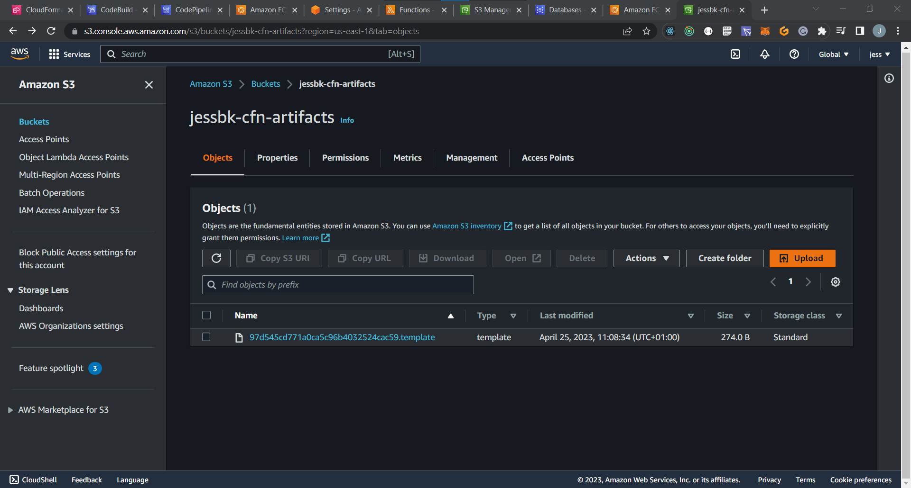

# Week 10 — CloudFormation Part 1

**AWS CloudFormation** is a service that allows you to manage and automate your infrastructure and applications in AWS. With CloudFormation, you can define templates in either JSON or YAML format that describe the resources you want to create, configure, and manage. These resources can include AWS services like EC2 instances, S3 buckets, and RDS databases, as well as custom resources you create yourself.

**Using CloudFormation**, you can easily and efficiently provision and update your resources in a repeatable and automated manner. You can also track changes to your infrastructure over time, and roll back changes if needed. This makes it an ideal solution for managing complex and large-scale infrastructure and applications.

# Key features of CloudFormation

* **Infrastructure as Code (IaC)**: CloudFormation allows you to treat your infrastructure as code, enabling you to version control and manage it just like you would any other codebase. This makes it easy to collaborate with other team members and ensure consistency across your deployments.

* **Templates**: CloudFormation templates are used to describe your infrastructure as code. They are written in JSON or YAML, and define the resources and their configurations that you want to create and manage. Templates can be easily versioned, shared, and reused.

* **Automation**: With CloudFormation, you can automate the deployment and management of your infrastructure and applications. This means you can easily replicate your infrastructure in multiple environments, such as development, staging, and production, ensuring consistency and reducing human error.

* **Rollback**: If a deployment fails or produces unexpected results, CloudFormation makes it easy to roll back to a previous, known-good state. This can be done with a single click, and ensures that your infrastructure is always in a consistent state.

* **Integrations**: CloudFormation integrates with many other AWS services, including CloudTrail, CloudWatch, and AWS Config. This enables you to monitor and audit changes to your infrastructure, and ensure compliance with security and regulatory requirements.

* **Security**: CloudFormation can help you to improve the security of your AWS infrastructure by centralizing the configuration of your resources. This can make it easier to manage and audit your security settings.

* **Consistency**: CloudFormation templates can be used to create a repeatable and consistent deployment process for your AWS resources. This can help to ensure that your infrastructure is always up to date and that it meets your specific needs.

* **Reliability**: CloudFormation templates can be used to create highly reliable AWS infrastructure. This is because CloudFormation templates are idempotent, which means that they can be safely executed multiple times without causing any harm to your AWS resources.

# Cfn-lint and Cfn-guard with AWS CloudFormation Templates
**Cfn-lint** and **Cfn-guard** are two open-source tools that help developers and infrastructure engineers to validate and enforce best practices and standards when deploying AWS CloudFormation templates.

**Cfn-lint** is a command-line tool that checks CloudFormation templates for errors and best practices. It performs a static analysis of the template to identify any syntax errors, logical errors, or other issues that may cause the template to fail during deployment. It can be used to catch issues such as missing required properties, invalid data types, and unsupported resource types. By using Cfn-lint, developers can ensure that their CloudFormation templates are valid before deploying them, saving time and avoiding potential issues during the deployment process.

**Cfn-guard**, on the other hand, is a policy-as-code framework for CloudFormation templates. It allows you to define and enforce rules for your templates, ensuring that they meet the compliance and security requirements of your organization. Cfn-guard works by validating templates against a set of rules defined in a policy file, and it will fail templates that do not comply with the rules. This helps to ensure that your templates are secure and compliant with your organization's policies and best practices.

# Installing Cfn-lint and Cfn-guard in Project
Added configuration to gitpod.yml file to install on launching gitpod.

```
tasks:
  - name: cfn
    before: |
      pip install cfn-lint
      cargo install cfn-guard
```

*you will need to re-deploy gitpod to take effect alternatively install manually by running
```
pip install cfn-lint
cargo install cfn-guard
```

# Cloud Formation Implementation In Project

***CLOUDFORMATION FOR NETWORK LAYER***

**First** create a S3 Bucket <add a name that will store all the cloudformation artifacts> and leave the rest as default.
**Second** create a new folder in bin/cfn/networking and create a new file in the folder template.yaml.

*add the code to the template.yaml file.

```
AWSTemplateFormatVersion: 2010-09-09

Description: |
  The base networking components for our stack:
  - VPC
    - sets DNS hostnames for EC2 instances
    - Only IPV4, IPV6 is disabled
  - InternetGateway
  - Route Table
    - route to the IGW
    - route to Local
  - 6 Subnets Explicity Associated to Route Table
    - 3 Public Subnets numbered 1 to 3
    - 3 Private Subnets numbered 1 to 3
Parameters:
  VpcCidrBlock:
    Type: String
    Default: 10.0.0.0/16
  Az1:
    Type: AWS::EC2::AvailabilityZone::Name
    Default: us-east-1a
  SubnetCidrBlocks:
    Description: "Comma-delimited list of CIDR blocks for our private public subnets"
    Type: CommaDelimitedList
    Default: >
      10.0.0.0/24, 
      10.0.4.0/24, 
      10.0.8.0/24, 
      10.0.12.0/24,
      10.0.16.0/24,
      10.0.20.0/24
  Az2:
    Type: AWS::EC2::AvailabilityZone::Name
    Default: us-east-1b
  Az3:
    Type: AWS::EC2::AvailabilityZone::Name
    Default: us-east-1d
Resources:
  VPC:
    # https://docs.aws.amazon.com/AWSCloudFormation/latest/UserGuide/aws-resource-ec2-vpc.html
    Type: AWS::EC2::VPC
    Properties:
      CidrBlock: !Ref VpcCidrBlock
      EnableDnsHostnames: true
      EnableDnsSupport: true
      InstanceTenancy: default
      Tags:
        - Key: Name
          Value: !Sub "${AWS::StackName}VPC"
  IGW:
    # https://docs.aws.amazon.com/AWSCloudFormation/latest/UserGuide/aws-resource-ec2-internetgateway.html
    Type: AWS::EC2::InternetGateway
    Properties:
      Tags:
        - Key: Name
          Value: !Sub "${AWS::StackName}IGW"
  AttachIGW:
    Type: AWS::EC2::VPCGatewayAttachment
    Properties:
      VpcId: !Ref VPC
      InternetGatewayId: !Ref IGW
  RouteTable:
    # https://docs.aws.amazon.com/AWSCloudFormation/latest/UserGuide/aws-resource-ec2-routetable.html
    Type: AWS::EC2::RouteTable
    Properties:
      VpcId: !Ref VPC
      Tags:
        - Key: Name
          Value: !Sub "${AWS::StackName}RT"
  RouteToIGW:
    # https://docs.aws.amazon.com/AWSCloudFormation/latest/UserGuide/aws-resource-ec2-route.html
    Type: AWS::EC2::Route
    DependsOn: AttachIGW
    Properties:
      RouteTableId: !Ref RouteTable
      GatewayId: !Ref IGW
      DestinationCidrBlock: 0.0.0.0/0
  SubnetPub1:
    # https://docs.aws.amazon.com/AWSCloudFormation/latest/UserGuide/aws-resource-ec2-subnet.html
    Type: AWS::EC2::Subnet
    Properties:
      AvailabilityZone: !Ref Az1
      CidrBlock: !Select [0, !Ref SubnetCidrBlocks]
      EnableDns64: false
      MapPublicIpOnLaunch: true #public subnet
      VpcId: !Ref VPC
      Tags:
        - Key: Name
          Value: !Sub "${AWS::StackName}SubnetPub1"
  SubnetPub2:
    # https://docs.aws.amazon.com/AWSCloudFormation/latest/UserGuide/aws-resource-ec2-subnet.html
    Type: AWS::EC2::Subnet
    Properties:
      AvailabilityZone: !Ref Az2
      CidrBlock: !Select [1, !Ref SubnetCidrBlocks]
      EnableDns64: false
      MapPublicIpOnLaunch: true #public subnet
      VpcId: !Ref VPC
      Tags:
        - Key: Name
          Value: !Sub "${AWS::StackName}SubnetPub2"
  SubnetPub3:
    # https://docs.aws.amazon.com/AWSCloudFormation/latest/UserGuide/aws-resource-ec2-subnet.html
    Type: AWS::EC2::Subnet
    Properties:
      AvailabilityZone: !Ref Az3
      CidrBlock: !Select [2, !Ref SubnetCidrBlocks]
      EnableDns64: false
      MapPublicIpOnLaunch: true #public subnet
      VpcId: !Ref VPC
      Tags:
        - Key: Name
          Value: !Sub "${AWS::StackName}SubnetPub3"
  SubnetPriv1:
    # https://docs.aws.amazon.com/AWSCloudFormation/latest/UserGuide/aws-resource-ec2-subnet.html
    Type: AWS::EC2::Subnet
    Properties:
      AvailabilityZone: !Ref Az1
      CidrBlock: !Select [3, !Ref SubnetCidrBlocks]
      EnableDns64: false
      MapPublicIpOnLaunch: false #public subnet
      VpcId: !Ref VPC
      Tags:
        - Key: Name
          Value: !Sub "${AWS::StackName}SubnetPriv1"
  SubnetPriv2:
    # https://docs.aws.amazon.com/AWSCloudFormation/latest/UserGuide/aws-resource-ec2-subnet.html
    Type: AWS::EC2::Subnet
    Properties:
      AvailabilityZone: !Ref Az2
      CidrBlock: !Select [4, !Ref SubnetCidrBlocks]
      EnableDns64: false
      MapPublicIpOnLaunch: false #public subnet
      VpcId: !Ref VPC
      Tags:
        - Key: Name
          Value: !Sub "${AWS::StackName}SubnetPriv2"
  SubnetPriv3:
    # https://docs.aws.amazon.com/AWSCloudFormation/latest/UserGuide/aws-resource-ec2-subnet.html
    Type: AWS::EC2::Subnet
    Properties:
      AvailabilityZone: !Ref Az3
      CidrBlock: !Select [5, !Ref SubnetCidrBlocks]
      EnableDns64: false
      MapPublicIpOnLaunch: false #public subnet
      VpcId: !Ref VPC
      Tags:
        - Key: Name
          Value: !Sub "${AWS::StackName}SubnetPriv3"
  SubnetPub1RTAssociation:
    Type: AWS::EC2::SubnetRouteTableAssociation
    Properties:
      SubnetId: !Ref SubnetPub1
      RouteTableId: !Ref RouteTable
  SubnetPub2RTAssociation:
    Type: AWS::EC2::SubnetRouteTableAssociation
    Properties:
      SubnetId: !Ref SubnetPub2
      RouteTableId: !Ref RouteTable
  SubnetPub3RTAssociation:
    Type: AWS::EC2::SubnetRouteTableAssociation
    Properties:
      SubnetId: !Ref SubnetPub3
      RouteTableId: !Ref RouteTable
  SubnetPriv1RTAssociation:
    Type: AWS::EC2::SubnetRouteTableAssociation
    Properties:
      SubnetId: !Ref SubnetPriv1
      RouteTableId: !Ref RouteTable
  SubnetPriv2RTAssociation:
    Type: AWS::EC2::SubnetRouteTableAssociation
    Properties:
      SubnetId: !Ref SubnetPriv2
      RouteTableId: !Ref RouteTable
  SubnetPriv3RTAssociation:
    Type: AWS::EC2::SubnetRouteTableAssociation
    Properties:
      SubnetId: !Ref SubnetPriv3
      RouteTableId: !Ref RouteTable
Outputs:
  VpcId:
    Value: !Ref VPC
    Export:
      Name: !Sub "${AWS::StackName}VpcId"
  VpcCidrBlock:
    Value: !GetAtt VPC.CidrBlock
    Export:
      Name: !Sub "${AWS::StackName}VpcCidrBlock"
  SubnetCidrBlocks:
    Value: !Join [",", !Ref SubnetCidrBlocks]
    Export:
      Name: !Sub "${AWS::StackName}SubnetCidrBlocks"
  PublicSubnetIds:
    Value: !Join
      - ","
      - - !Ref SubnetPub1
        - !Ref SubnetPub2
        - !Ref SubnetPub3
    Export:
      Name: !Sub "${AWS::StackName}PublicSubnetIds"
  PrivateSubnetIds:
    Value: !Join
      - ","
      - - !Ref SubnetPriv1
        - !Ref SubnetPriv2
        - !Ref SubnetPriv3
    Export:
      Name: !Sub "${AWS::StackName}PrivateSubnetIds"
  AvailabilityZones:
    Value: !Join
      - ","
      - - !Ref Az1
        - !Ref Az2
        - !Ref Az3
    Export:
      Name: !Sub "${AWS::StackName}AvailabilityZones"
```

The template.yaml file creates a VPC with 3 public and 3 private subnets in 3 availability zones. The public subnets have public IP addresses and can be accessed from the internet, while the private subnets do not have public IP addresses and can only be accessed from within the VPC. The template also creates a route table and routes all traffic from the public subnets to the internet through the internet gateway.
 
***Resources created by the template***:

* VPC: A virtual private cloud (VPC) is a logically isolated section of the AWS cloud.
* Subnets: A subnet is a smaller range of IP addresses within a VPC.
* Internet gateway: An internet gateway is a network interface that allows traffic to flow between the VPC and the internet.
* Route table: A route table is a collection of routes that determine how traffic is routed within a VPC.
* Public subnets: Public subnets have public IP addresses and can be accessed from the internet.
* Private subnets: Private subnets do not have public IP addresses and can only be accessed from within the VPC.
  
***The template also exports the following values***:

* VpcId: The ID of the VPC.
* VpcCidrBlock: The CIDR block of the VPC.
* SubnetCidrBlocks: A list of the CIDR blocks for the public and private subnets.
* SubnetIds: A list of the IDs for the public and private subnets.
* AvailabilityZones: A list of the availability zones for the public and private subnets.
  
**This template can be used to create a VPC infrastructure that can be used to host a variety of applications.**

# Bash Script To Deploy The Networking Template
```
#! /usr/bin/env bash
set -e # stop the execution of the script if it fails

CYAN='\033[1;36m'
NO_COLOR='\033[0m'
LABEL="Cloudformation Deploy Networking"
printf "${CYAN}==== ${LABEL}${NO_COLOR}\n"

CFN_PATH="/workspace/aws-bootcamp-cruddur-2023/aws/cfn/networking/template.yaml"
CONFIG_PATH="/workspace/aws-bootcamp-cruddur-2023/aws/cfn/networking/config.toml"
echo $CFN_PATH

cfn-lint $CFN_PATH

BUCKET=$(cfn-toml key deploy.bucket -t $CONFIG_PATH)
REGION=$(cfn-toml key deploy.region -t $CONFIG_PATH)
STACK_NAME=$(cfn-toml key deploy.stack_name -t $CONFIG_PATH)

aws cloudformation deploy \
  --stack-name $STACK_NAME \
  --s3-bucket $BUCKET \
  --region $REGION \
  --template-file "$CFN_PATH" \
  --no-execute-changeset \
  --tags group=cruddur-networking \
  --s3-prefix networking \
  --capabilities CAPABILITY_NAMED_IAM

```

# Creating and Saving Environment Variables for S3 Bucket
*created a Readme.md file for explanation
  
```
aws s3 mk s3://jessbk-cfn-artifacts
export CFN_BUCKET="jessbk-cfn-artifacts"
gp env CFN_BUCKET="jessbk-cfn-artifacts"
```

  
* Chmod the bash script and excute the command
```
# Grant access
chmod u+x bin/cfn/networking-deploy
  
# Execute the script
./bin/cfn/networking-deploy
```  
  
# Proof Of Implementation
  


  




# CLOUDFORMATION FOR CLUSTER LAYER
  
**This AWS CloudFormation template is used to create and configure networking and cluster resources to support Fargate containers.**

1. **AWSTemplateFormatVersion:** Specifies the CloudFormation template version.
  
2. **Description:** Provides a description of the template and its purpose.
  
3. **Parameters:** Defines input parameters that can be provided when creating a stack based on this template. These parameters allow customization of various settings, such as networking components, ports, health checks, etc.
  
4. **Resources:** Describes the AWS resources that will be created and configured by the CloudFormation stack. The template defines the following resources:
  
* **FargateCluster:** Creates an ECS Fargate cluster with specified settings, such as capacity providers, cluster name, logging configuration, and more.
  
* **ALB:** Creates an Application Load Balancer (ALB) with specified settings, such as the load balancer name, type (application), IP address type (ipv4), security groups, subnets, and load balancer attributes.
  
* **HTTPSListener:** Creates an HTTPS listener for the ALB, which listens on port 443 and forwards traffic to a target group.

* **HTTPListener:** Creates an HTTP listener for the ALB, which listens on port 80 and redirects traffic to the HTTPS listener.

* **ApiALBListernerRule:** Creates a listener rule for the ALB that matches the host header value and forwards traffic to a backend target group.

* **ALBSG:** Creates a security group for the ALB with inbound rules allowing HTTP (port 80) and HTTPS (port 443) traffic from any IP address.

* **ServiceSG:** Creates a security group for the Fargate services, with an inbound rule allowing HTTP traffic from the ALB security group.

* **BackendTG:** Creates a target group for the backend services, with specified health check settings, attributes, and VPC configuration.

* **FrontendTG:** Creates a target group for the frontend services, with specified health check settings, attributes, and VPC configuration.
  
5. **Outputs:** Defines the outputs of the CloudFormation stack, which can be used by other stacks or resources. The outputs include the cluster name, service security group ID, ALB security group ID, frontend target group ARN, and backend target group ARN.
  
These resources and configurations are defined in the template to set up networking, load balancing, and routing for Fargate containers, enabling the deployment of a scalable and resilient application infrastructure on AWS.

**Here is the link to the cloudformation template file.** [Link to Template File](https://github.com/jess-bk/aws-bootcamp-cruddur-2023/blob/main/aws/cfn/cluster/template.yaml)

***CONFIG TOML FILE***
  
The TOML file is defining a section called [deploy] with three key-value pairs inside it. TOML (Tom's Obvious, Minimal Language) is a configuration file format that is often used for specifying settings and parameters in various application.
  
1. bucket = 'jessbk-cfn-artifacts': This line assigns the value 'jessbk-cfn-artifacts' to the key bucket inside the [deploy] section. It indicates the name of the S3 bucket where CloudFormation artifacts (such as templates and related files) will be stored or retrieved from during the deployment process.
  
2. region = 'us-east-1': This line assigns the value 'us-east-1' to the key region inside the [deploy] section. It specifies the AWS region where the CloudFormation stack will be deployed. In this case, the stack will be deployed in the US East (N. Virginia) region.
  
3. stack_name = 'CrdNet': This line assigns the value 'CrdCluster' to the key stack_name inside the [deploy] section. It indicates the desired name for the CloudFormation stack that will be created or updated during the deployment process. In this case, the stack will be named 'CrdCluster'.]
  
4. CertificateArn: Specifies the ARN (Amazon Resource Name) of an ACM (AWS Certificate Manager) certificate (arn:aws:acm:us-east-1:517899574827:certificate/e9413679-adc8-4578-a3ae-47f94111bcd8).
  
5. NetworkingStack: Specifies the name of the networking stack (CrdNet) that this CloudFormation stack depends on.
  
**Here is the link to the cloudformation toml file.** [Link to TOML File](https://github.com/jess-bk/aws-bootcamp-cruddur-2023/blob/main/aws/cfn/cluster/config.toml)
  
This TOML file provides configuration settings related to the deployment of a CloudFormation stack, including the S3 bucket name, AWS region, and stack name. These settings can be referenced and used by deployment scripts or tools to deploy the stack with the specified parameters.The CertificateArn and NetworkingStack values may be used as parameters within the CloudFormation template to configure resources or define dependencies on other stacks.

  
**BASH SCRIPT** To run the cloudformation template i have created a bash script, The script performs the following actions:
* set -e: This command sets the script to exit immediately if any command within it fails (returns a non-zero exit status). This is often used to ensure the script stops execution if an error occurs.
  
* CFN_PATH="/workspace/aws-bootcamp-cruddur-2023/aws/cfn/cluster/template.yaml": This line assigns the file path of the CloudFormation template (template.yaml) to the CFN_PATH variable.
  
* CONFIG_PATH="/workspace/aws-bootcamp-cruddur-2023/aws/cfn/cluster/config.toml": This line assigns the file path of the configuration file (config.toml) to the CONFIG_PATH variable.

* echo $CFN_PATH: This line prints the value of the CFN_PATH variable to the console.

* cfn-lint $CFN_PATH: This command runs the cfn-lint tool to check the CloudFormation template file for any potential issues or errors.

* BUCKET=$(cfn-toml key deploy.bucket -t $CONFIG_PATH): This line retrieves the value of the deploy.bucket key from the config.toml file using the cfn-toml tool and assigns it to the BUCKET variable.

* REGION=$(cfn-toml key deploy.region -t $CONFIG_PATH): This line retrieves the value of the deploy.region key from the config.toml file using the cfn-toml tool and assigns it to the REGION variable.

* STACK_NAME=$(cfn-toml key deploy.stack_name -t $CONFIG_PATH): This line retrieves the value of the deploy.stack_name key from the config.toml file using the cfn-toml tool and assigns it to the STACK_NAME variable.
  
* PARAMETERS=$(cfn-toml params v2 -t $CONFIG_PATH): This line retrieves the CloudFormation parameters from the config.toml file using the cfn-toml tool and assigns them to the PARAMETERS variable.

* aws cloudformation deploy ...: This command deploys the CloudFormation stack using the AWS CLI (aws cloudformation deploy). It specifies the stack name, S3 bucket, AWS region, CloudFormation template file, and other deployment options such as tags, prefix, parameter overrides, and capabilities.
  
**Here is the link to the bash script.** [Link to Bash Script](https://github.com/jess-bk/aws-bootcamp-cruddur-2023/blob/main/bin/cfn/cluster)

# CLOUDFORMATION FOR SERVICE LAYER (FLASK-BACKEND)

**This AWS CloudFormation template provided is used to define and deploy a stack for a Fargate service running on Amazon ECS (Elastic Container Service). Let's go through the different sections and their functionalities:**

1. **AWSTemplateFormatVersion:** Specifies the version of the AWS CloudFormation template.

2. **Description:** Provides a brief description of the template.

3. **Parameters:** Defines the input parameters for the template. Users can provide values for these parameters during stack creation or use default values.
  
* **NetworkingStack:** This parameter represents the base layer of networking components, such as VPC and subnets. It allows you to specify the networking stack name. The default value is set to "CrdNet".
  
* **ClusterStack:** This parameter represents the cluster layer, which includes ECS cluster and ALB (Application Load Balancer). It allows you to specify the cluster stack name. The default value is set to       "CrdCluster".
  
* **ContainerPort:** This parameter specifies the port number on which the container within the Fargate service will listen. The default value is set to 4567.
  
* **ServiceCpu:** This parameter defines the CPU units to be allocated to the Fargate service. The default value is set to "256".
  
* **ServiceMemory:** This parameter specifies the amount of memory (in MiB) to be allocated to the Fargate service. The default value is set to "512".
  
* **ServiceName:** This parameter represents the name of the Fargate service. It allows you to specify a custom service name. The default value is set to "backend-flask".
  
* **ContainerName:** This parameter represents the name of the container within the Fargate service. It allows you to specify a custom container name. The default value is set to "backend-flask".
  
* **TaskFamily:** This parameter specifies the family name for the ECS task definition. It allows you to group multiple versions of the same task definition under a single family name. The default value is set to "backend-flask".
  
* **EcrImage:** This parameter represents the ECR (Elastic Container Registry) image URL for the container to be used in the Fargate service. It allows you to specify the image URL for your container. The        default value is set to "517899574827.dkr.ecr.us-east-1.amazonaws.com/backend-flask".
  
* **EnvOtelServiceName:** This parameter represents the value of the environment variable "OTEL_SERVICE_NAME" to be set in the container. It is used for configuring OpenTelemetry service name. The default value is set to "backend-flask".
  
* **EnvOtelExporterOtlpEndpoint:** This parameter represents the value of the environment variable "OTEL_EXPORTER_OTLP_ENDPOINT" to be set in the container. It is used for configuring the OpenTelemetry exporter OTLP (OpenTelemetry Protocol) endpoint. The default value is set to "https://api.honeycomb.io".
  
* **EnvAWSCognitoUserPoolId:** This parameter represents the value of the environment variable "AWS_COGNITO_USER_POOL_ID" to be set in the container. It is used for configuring the AWS Cognito User Pool ID. The default value is set to "us-east-1_FpcgxtNfc".
  
* **EnvCognitoUserPoolClientId:** This parameter represents the value of the environment variable "AWS_COGNITO_USER_POOL_CLIENT_ID" to be set in the container. It is used for configuring the AWS Cognito User Pool Client ID. The default value is set to "6jbj9dn4cf8oldfrvmm5cg34t9".
  
* **EnvFrontendUrl:** This parameter represents the value of the environment variable "FRONTEND_URL" to be set in the container. It is used for configuring the URL of the frontend application. The default value is set to "*".
  
* **EnvBackendUrl:** This parameter represents the value of the environment variable "BACKEND_URL" to be set in the container. It is used for configuring the URL of the backend application. The default value is set to "*".
  
* **SecretsAWSAccessKeyId:** This parameter represents the AWS SSM (Systems Manager) parameter ARN for the secret value "AWS_ACCESS_KEY_ID". It is used for accessing sensitive information securely. The default value is set to "arn:aws:ssm:us-east-1:517899574827:parameter/cruddur/backend-flask/AWS_ACCESS_KEY_ID".
  
* **SecretsSecretAccessKey:** This parameter represents the AWS SSM parameter ARN for the secret value "AWS_SECRET_ACCESS_KEY". It is used for accessing sensitive information securely. The default value is set to "arn:aws:ssm:us-east-1:517899574827:parameter/cruddur/backend-flask/AWS_SECRET_ACCESS_KEY".
  
* **SecretsConnectionUrl:** This parameter represents the AWS SSM parameter ARN for the secret value "CONNECTION_URL". It is used for accessing sensitive information securely. The default value is set to "arn:aws:ssm:us-east-1:517899574827:parameter/cruddur/backend-flask/CONNECTION_URL".
  
* **SecretsRollbarAccessToken:** This parameter represents the AWS SSM parameter ARN for the secret value "ROLLBAR_ACCESS_TOKEN". It is used for accessing sensitive information securely. The default value is set to "arn:aws:ssm:us-east-1:517899574827:parameter/cruddur/backend-flask/ROLLBAR_ACCESS_TOKEN".
  
  
4. **Resources:**
  **FargateService:**
  **Type:** AWS::ECS::Service
  **Description:** This resource defines an Amazon Elastic Container Service (ECS) service running on AWS Fargate. It represents the deployment of containers and manages their lifecycle.
  * **Properties:**
    * **Cluster:** Specifies the ECS cluster where the service is deployed. It uses the Fn::ImportValue function to import the value from the ${ClusterStack}ClusterName exported value.
    * **DeploymentController:** Specifies the deployment controller type for the service, which is set to "ECS" (default).
    * **DesiredCount:** Specifies the desired number of tasks (containers) to run in the service, which is set to 1 (default).
    * **EnableECSManagedTags:** Enables or disables automatic generation of AWS managed tags for the service, which is set to true (default).
    * **EnableExecuteCommand:** Enables or disables the ECS ExecuteCommand feature, which allows running commands in a container, set to true (default).
    * **HealthCheckGracePeriodSeconds:** Specifies the time (in seconds) to ignore the health check status during a service deployment, set to 0 (default).
    * **LaunchType:** Specifies the launch type for the service, which is set to "FARGATE".
    * **LoadBalancers:** Specifies the load balancer configuration for the service. It uses the Fn::ImportValue function to import the value of the target group ARN from the ${ClusterStack}BackendTGArn exported       value.
    * **NetworkConfiguration:** Specifies the network configuration for the service. It uses the Fn::ImportValue function to import the value of the security group and subnet IDs from the                               ${NetworkingStack}PublicSubnetIds exported value.
    * **PlatformVersion:** Specifies the platform version for the Fargate task, which is set to "LATEST" (default).
    * **PropagateTags:** Specifies how to propagate tags from the service to the tasks, set to "SERVICE" (default).
    * **ServiceConnectConfiguration:** Specifies the AWS Cloud Map service discovery configuration for the service.
    * **ServiceName:** Specifies the name of the service, which is obtained from the FargateService resource's name.
    * **TaskDefinition:** Specifies the task definition to use for the service, obtained from the TaskDefinition resource.

  **TaskDefinition:**
  * Type: AWS::ECS::TaskDefinition
  * Description: This resource defines an ECS task definition that describes how a container should be launched and configured.
  * Properties:
    * Family: Specifies the family name of the task definition, obtained from the TaskFamily parameter.
    * ExecutionRoleArn: Specifies the ARN of the task execution role, obtained from the ExecutionRole resource.
    * TaskRoleArn: Specifies the ARN of the task role, obtained from the TaskRole resource.
    * NetworkMode: Specifies the network mode for the task, which is set to "awsvpc".
    * Cpu: Specifies the CPU units to allocate to the task, obtained from the ServiceCpu parameter.
    * Memory: Specifies the memory to allocate to the task, obtained from the ServiceMemory parameter.
    * RequiresCompatibilities: Specifies the compatibility requirements for the task, which is set to "FARGATE".
    * ContainerDefinitions: Specifies the list of containers and their configurations within the task:
      * Name: Specifies the name of the container.
      * Image: Specifies the Docker image to use for the container, obtained from the EcrImage parameter.
      * Essential: Specifies whether the container is essential for the task.
      * HealthCheck: Specifies the health check configuration for the container.
      * PortMappings: Specifies the port mappings for the container.
      * LogConfiguration: Specifies the log configuration for the container.
      * Environment: Specifies the environment variables for the container, including values obtained from the parameter references.
      * Secrets: Specifies the secrets for the container, including values obtained from the parameter references.

  **ExecutionRole:**
  * **Type:** AWS::IAM::Role
  * **Description:** This resource defines an IAM role used by the ECS service to execute tasks.
  * **Properties:**
    * RoleName: Specifies the name of the IAM role.
    * AssumeRolePolicyDocument: Specifies the permissions policy that grants ECS tasks the permission to assume this role.
    * Policies: Specifies the list of policies attached to the role, including permissions for ECR, CloudWatch Logs, and SSM.
    * ManagedPolicyArns: Specifies the ARNs of the managed policies attached to the role, including CloudWatch Logs and X-Ray access.

  **TaskRole:**
  * **Type: AWS::IAM::Role**
  * **Description:** This resource defines an IAM role used by the ECS task to access SSM for parameter retrieval and SSM Session Manager.
  * **Properties:**
    * RoleName: Specifies the name of the IAM role.
    * AssumeRolePolicyDocument: Specifies the permissions policy that grants ECS tasks the permission to assume this role.
    * Policies: Specifies the list of policies attached to the role, including permissions for SSM messaging.
    * ManagedPolicyArns: Specifies the ARNs of the managed policies attached to the role, including CloudWatch Logs and X-Ray access.

5. **Outputs:**
**ServiceUrl:**
* Description: This resource defines an IAM role used by the ECS service to execute tasks.
* Value: It uses the Fn::Sub function to substitute the desired path with the exported value ${AWS::Region} to construct the URL.
  
**ClusterName:**
* **Description:** This output provides the name of the ECS cluster where the service is deployed.
* **Value:** It uses the Ref function to reference the FargateService resource and extract the cluster name.
  
**BackendTGArn:**
* **Description:** This output provides the ARN (Amazon Resource Name) of the target group associated with the ECS service.
* **Value:** It uses the Fn::ImportValue function to import the target group ARN from the ${ClusterStack}BackendTGArn exported value.

**Here is the link to the Cloudformation template file.** [Link to CFN service template] (https://github.com/jess-bk/aws-bootcamp-cruddur-2023/blob/main/aws/cfn/service/template.yaml)
