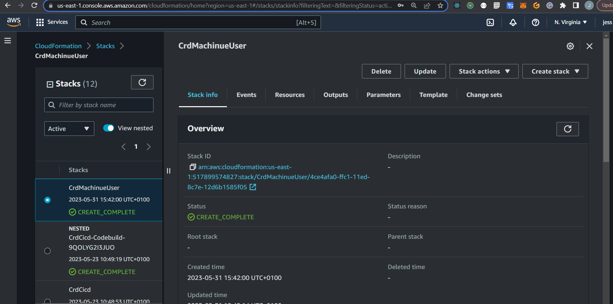

# Week X — Clean Up

# THE FOLLOWING CONTENT IS THE FINAL UPDATES MADE TO THE APPLICATION

# SQL Script (Backend-Flask) (seed data manually by running bash script).
*  This script inserts user data into the users table and related activities into the activities table, establishing a relationship between the two tables using the UUID of each user.
*  [Link to Seed SQL Script](https://github.com/jess-bk/aws-bootcamp-cruddur-2023/blob/main/backend-flask/db/seed.sql)
*  [Link to Bash Script](https://github.com/jess-bk/aws-bootcamp-cruddur-2023/blob/main/bin/db/seed)

# ShowActivity (Backend-Flask).
*  The code defines a class ShowActivity with a method run that retrieves information about a specific activity using a predefined SQL template from a custom database module (db). The result of the query is        returned as a JSON object.
*  [Link to show_activity.py file](https://github.com/jess-bk/aws-bootcamp-cruddur-2023/blob/main/backend-flask/services/show_activity.py)

# ActivityItem.js (Frontend React.JS).
*  Updates includes the navigation functionality using react-router-dom, allowing the activity_item div to be clickable and navigate to a specific URL. It also omits the replies functionality present in the        first snippet.
*  [Link to ActivityItem.js](https://github.com/jess-bk/aws-bootcamp-cruddur-2023/blob/main/frontend-react-js/src/components/ActivityItem.js)
*  CSS file was updated to reflect the changes made in ActivityItem.js.
*  [Link to ActivityItem.js CSS File](https://github.com/jess-bk/aws-bootcamp-cruddur-2023/blob/main/frontend-react-js/src/components/ActivityItem.css)

# Created New Component Replies.js (Frontend React.JS).
*  The Replies component is responsible for rendering a collection of ActivityItem components based on the props.replies array. If there are no replies (props.replies.length is 0), it displays a message            indicating that there is nothing to see yet. Otherwise, it renders the ActivityItem components. The CSS for the component is imported from the 'Replies.css' file.
*  [Link to Replies.js](https://github.com/jess-bk/aws-bootcamp-cruddur-2023/blob/main/frontend-react-js/src/components/Replies.js)

# Created New Component Requests.js Functions For Making HTTP Requests (Frontend React.JS).
*   This code provides a simple abstraction for making HTTP requests and handling responses. It supports authentication by adding an access token to the request headers when specified. The exported functions         make it easier to perform common HTTP methods such as POST, PUT, GET, and DELETE.
*   **Request Function:** 
*   The request function is an async function that takes four parameters: method, url, payload_data, and options. It is responsible for making the actual HTTP request.
*   It first checks if the options object has a property named setErrors. If it does, it sets its value to an empty string.
*   Next, it creates an object named attrs that holds the HTTP request attributes like method, headers, and potentially body.
*   If the options object has a property named auth and its value is true, it calls the getAccessToken function. This function likely retrieves an access token and stores it in the local storage. The access         token is then added to the request headers.
*   If the method is not "GET", the payload_data is converted to JSON and assigned to the attrs.body property.
*   The fetch function is then called with the provided url and attrs object. The response is stored in the res variable, and the JSON response data is stored in the data variable.
*   If the response status is 200 (indicating a successful request), the options.success function is called with the response data.
*   If the response status is not 200, the options.setErrors function is called with the response data. Additionally, the response and data are logged to the console.
*   **HTTP Request Functions:**
*   Four functions are exported from the module: post, put, get, and destroy.
*   These functions are convenience wrappers around the request function, making it easier to perform common HTTP methods.
*   The post function calls the request function with the "POST" method.
*   The put function calls the request function with the "PUT" method.
*   The get function calls the request function with the "GET" method.
*   The destroy function (often used for DELETE requests) calls the request function with the "DELETE" method.
*   [Link to Requests.js](https://github.com/jess-bk/aws-bootcamp-cruddur-2023/blob/main/frontend-react-js/src/lib/Requests.js)

# Request.js Updated Made In The Application (Frontend React.JS).
*   ReplyForm.js: [Link to ActivityContent.js](https://github.com/jess-bk/aws-bootcamp-cruddur-2023/blob/main/frontend-react-js/src/components/ReplyForm.js)
*   MessageForm.js: [Link to MessageForm.js](https://github.com/jess-bk/aws-bootcamp-cruddur-2023/blob/main/frontend-react-js/src/components/MessageForm.js)
*   ActivityForm.js: [Link to ActivityForm.js](https://github.com/jess-bk/aws-bootcamp-cruddur-2023/blob/main/frontend-react-js/src/components/ActivityForm.js)
*   ProfileForm.js: [Link to ProfileForm.js](https://github.com/jess-bk/aws-bootcamp-cruddur-2023/blob/main/frontend-react-js/src/components/ProfileForm.js)
*   HomeFeedPage.js: [Link to HomeFeedPage.js](https://github.com/jess-bk/aws-bootcamp-cruddur-2023/blob/main/frontend-react-js/src/pages/HomeFeedPage.js)
*   NotificationsFeedPage.js: [Link to NotificationsFeedPage.js](https://github.com/jess-bk/aws-bootcamp-cruddur-2023/blob/main/frontend-react-js/src/pages/NotificationsFeedPage.js)
*   MessageGroupPage.js: [Link to MessageGroupPage.js](https://github.com/jess-bk/aws-bootcamp-cruddur-2023/blob/main/frontend-react-js/src/pages/MessageGroupPage.js)
*   MessageGroupsPage.js: [Link to MessageGroupsPage.js](https://github.com/jess-bk/aws-bootcamp-cruddur-2023/blob/main/frontend-react-js/src/pages/MessageGroupsPage.js)
*   MessageGroupNewPage.js: [Link to MessageGroupNewPage.js](https://github.com/jess-bk/aws-bootcamp-cruddur-2023/blob/main/frontend-react-js/src/pages/MessageGroupNewPage.js)
*   UserFeedPage.js: [Link to UserFeedPage.js](https://github.com/jess-bk/aws-bootcamp-cruddur-2023/blob/main/frontend-react-js/src/pages/UserFeedPage.js)
*   ActivityShowPage.js: [Link to ActivityShowPage.js](https://github.com/jess-bk/aws-bootcamp-cruddur-2023/blob/main/frontend-react-js/src/pages/ActivityShowPage.js)

# Created Component ActivityShowPage.js Added Request.js (Frontend React.JS).
*   The ActivityShowPage component fetches and displays a specific activity along with its replies. It provides forms to create new activities and replies. The component also includes navigation and sidebar         components for the overall page layout.
*   The component defines an loadData function that makes an HTTP GET request to fetch activity data and replies from the backend API.
*   The loadData function is called within the useEffect hook when the component mounts.
*   The fetched activity and replies are stored in the component state variables using the setActivity and setReplies functions.
*   The ActivityForm, ReplyForm, and Replies components are passed appropriate props, including state variables and functions to handle interactions.
*   [Link to ActivityShowPage.js](https://github.com/jess-bk/aws-bootcamp-cruddur-2023/blob/main/frontend-react-js/src/pages/ActivityShowPage.js)

# Fixed Time And Date DateTimeFormats.js (Frontend React.JS).
*   Updated the seed file by adding by updating "current_timestamp 0 interval '10 day'"
*   format_datetime(value): This function takes a date/time value, converts it to a Luxon DateTime object, and formats it as a localized string representation of the full date and time.
*   message_time_ago(value): This function calculates the time difference between a given value and the current time. It returns a string indicating the time elapsed since the given value, such as "2h" for 2         hours ago, "5m" for 5 minutes ago, or "Oct 15" for a date more than 24 hours ago.
*   time_ago(value): This function is similar to message_time_ago, but it provides a more general time ago representation without any specific context. It calculates the time difference between a given value and     the current time and returns a string indicating the elapsed time, such as "2h" for 2 hours ago, "5m" for 5 minutes ago, or "3d" for 3 days ago.
*   time_future(value): This function calculates the time difference between the current time and a given future value. It returns a string indicating the remaining time until the future value, such as "2h" for     2 hours remaining, "5m" for 5 minutes remaining, or "3d" for 3 days remaining
*   [Link to DateTimeFormats.js](https://github.com/jess-bk/aws-bootcamp-cruddur-2023/blob/main/frontend-react-js/src/lib/DateTimeFormats.js)

# Update Time And Date To Following Components In Application (Frontend React.JS).
*   ActivityContent.js: [Link to ActivityContent.js](https://github.com/jess-bk/aws-bootcamp-cruddur-2023/blob/main/frontend-react-js/src/components/ActivityContent.js)
*   ActivityShowItem.js: [Link to ActivityShowItem.js](https://github.com/jess-bk/aws-bootcamp-cruddur-2023/blob/main/frontend-react-js/src/components/ActivityShowItem.js)
*   MessageItem.js: [Link to MessageItem.js](https://github.com/jess-bk/aws-bootcamp-cruddur-2023/blob/main/frontend-react-js/src/components/MessageItem.js)
*   MessageGroupItem.js [Link to MessageGroupItem.js](https://github.com/jess-bk/aws-bootcamp-cruddur-2023/blob/main/frontend-react-js/src/components/MessageGroupItem.js)

# Created Component ActivityShowItem.js (Frontend React.JS).
*   The component imports CSS styles from a separate file (ActivityItem.css).
*   The component imports several child components related to different actions on the activity, such as replying, reposting, liking, and sharing.
*   The component imports the Link component from React Router for creating links.
*   The component imports utility functions for formatting date and time from a file called DateTimeFormats.
*   The component defines the ActivityShowItem function component that renders the activity item's content and actions.
*   The component uses the imported child components (ActivityActionReply, ActivityActionRepost, ActivityActionLike, ActivityActionShare) to render the specific actions related to the activity.
*   The component renders the activity item's main content, including the user avatar, display name, handle, creation time, expiration time, and message.
*   The component renders the expanded metadata of the activity, including the creation time.
*   The component renders the activity actions section, which contains buttons or icons for replying, reposting, liking, and sharing the activity.
*   [Link to ActivityShowItem.js](https://github.com/jess-bk/aws-bootcamp-cruddur-2023/blob/main/frontend-react-js/src/components/ActivityShowItem.js)

# ActivityItem.js Updated (Frontend React.JS).
*   **useNavigate:** The useNavigate hook from "react-router-dom" is imported. This hook allows for navigation to different routes programmatically.
*   **Navigation:** The useNavigate hook is used to obtain the navigate function, which is then used in the click function. The click function is triggered when the clickable element is clicked. It prevents the     default behavior of the click event, constructs a URL based on the props.activity.handle and props.activity.uuid values, and navigates to that URL using the navigate function. This allows for navigation to a     specific activity's details when clicked.
*   **Updated attrs object:** The attrs object is still present to store the attributes that will be assigned to the rendered HTML element. However, the className attribute is always set to "activity_item           clickable", indicating that the rendered element will have this class applied to it. This suggests that the element will always be clickable.
*   The functionality of the component remains similar to the previous version, with the addition of navigation to the activity's details when the item is clicked. The ActivityContent component is                   rendered to display the activity's content, and the ActivityAction components are rendered to provide interaction options for the activity (e.g., reply, repost, like, share).
*   [Link to ActivityItem.js](https://github.com/jess-bk/aws-bootcamp-cruddur-2023/blob/main/frontend-react-js/src/components/ActivityItem.js)

# Run Migrations On Prod DataBase (Backend-Flask)

*   To run migrations on DataBase we have done this manually by first updating the Security Groups associated with the DataBase, the following is the method that was applied to update the DB in the cli.

1. ## Setting DB_SG_RULE_ID environment variable:
   * In the command line interface (CLI), the command export DB_SG_RULE_ID="<ENTER SG RULE ID THAT YOU WILL NEED TO CREATE TO ALLOW ACCESS TO>" is executed.
   * This sets the value of the environment variable DB_SG_RULE_ID to "<ENTER SG RULE ID THAT YOU WILL NEED TO CREATE TO ALLOW ACCESS TO>".
   * The purpose of this variable is likely to specify the security group rule ID for the database.

2. ## Setting DB_SG_RULE_ID environment variable using gp command:
   * In the CLI, the command gp | env DB_SG_RULE_ID="<ENTER SG RULE ID THAT YOU WILL NEED TO CREATE TO ALLOW ACCESS TO>" is executed.
   * This command sets the value of the environment variable DB_SG_RULE_ID to "<ENTER SG RULE ID THAT YOU WILL NEED TO CREATE TO ALLOW ACCESS TO>" for the current session.
   * The gp command is likely a custom command or alias used to set environment variables.

3. ## Setting DB_SG_ID environment variable:
   * In the CLI, the command export DB_SG_ID="<ENTER SG ID THAT YOU WILL NEED TO CREATE TO ALLOW ACCESS TO>" is executed.
   * This sets the value of the environment variable DB_SG_ID to "<ENTER SG RULE THAT YOU WILL NEED TO CREATE TO ALLOW ACCESS TO>".
   * The purpose of this variable is likely to specify the security group ID for the database.

4. ## Setting DB_SG_ID environment variable using gp command:
   * In the CLI, the command gp | env DB_SG_ID="<ENTER SG RULE THAT YOU WILL NEED TO CREATE TO ALLOW ACCESS TO>" is executed.
   * This command sets the value of the environment variable DB_SG_ID to "<ENTER SG RULE THAT YOU WILL NEED TO CREATE TO ALLOW ACCESS TO>" for the current session.
   * The gp command is likely a custom command or alias used to set environment variables.

5. ## Running script to update SG rule:
   * In the CLI, the command GITPOD_IP=$(curl ifconfig.me) ./bin/rds/db-rds-update-sg-rule is executed.
   * This command runs a script (db-rds-update-sg-rule) to update the security group (SG) rule associated with the database.
   * The GITPOD_IP=$(curl ifconfig.me) part retrieves the current IP address and sets it to the GITPOD_IP environment variable, which will be used to update the rds data base.

6. ## Setting PROD_CONNECTION_URL environment variable:
   * In the CLI, the command export PROD_CONNECTION_URL="<ENTER THE PROD CONNECTION URL FOR THE DATA BASE INSTANCE>" is executed.
   * This sets the value of the environment variable PROD_CONNECTION_URL to the connection URL of the production database.
   * The connection URL includes the necessary details for connecting to the database, such as username, password, host, port, and database name.
 
7. ## Setting PROD_CONNECTION_URL environment variable using gp command:
   * In the CLI, the command gp | env PROD_CONNECTION_URL="<ENTER THE PROD CONNECTION URL FOR THE DATA BASE INSTANCE>" is executed.
   * This command sets the value of the environment variable PROD_CONNECTION_URL to the production database connection URL for the current session.
   * The gp command is likely a custom command or alias used to set environment variables.

8. ## Running migration script:
   * n the CLI, the command CONNECTION_URL=$PROD_CONNECTION_URL ./bin/db/migrate is executed.
   * This command runs a migration script (migrate) on the database using the PROD_CONNECTION_URL environment variable as the connection URL.
   * The migration script is responsible for updating the database schema, applying any necessary changes or updates.
   * These steps are to set environment variables related to security groups and connection URLs, update the security group rule, and run a database migration on a production database. These steps are                 crucial for maintaining the security and integrity of the database while making necessary changes to its structure or schema.

 **EXAMPLE BELOW:**
 ```
 * type in cli and hit enter --> export DB_SG_RULE_ID="ENTER DB SECURITY GROUP RULE ID"
 * type in cli and hit enter --> gp | env DB_SG_RULE_ID="ENTER DB SECURITY GROUP RULE ID"
 * type in cli and hit enter --> export DB_SG_ID="ENTER DB SECURITY GROUP ID"
 * type in cli and hit enter --> gp | env DB_SG_ID="ENTER DB SECURITY GROUP ID"
 * Run script to update SG RULE --> GITPOD_IP=$(curl ifconfig.me) ./bin/rds/db-rds-update-sg-rule. 

 export PROD_CONNECTION_URL="postgresql://cruddurroot:<ENTER PROD CONNECTION URL>:5432/cruddur"
 gp | env PROD_CONNECTION_URL="postgresql://cruddurroot:<ENTER PROD CONNECTION URL>:5432/cruddur"

 * type in cli and hit enter --> CONNECTION_URL=$PROD_CONNECTION_URL ./bin/db/migrate
 ```

9. ## Now Check DataBase Connection Successfull
 ```
 type in cli and hit enter --> ./bin/db/connect prod
 \d activities
 ```

10. ## Bash Scripts For Migration And DB Connection
  * [Link to Migrations Bash Script](https://github.com/jess-bk/aws-bootcamp-cruddur-2023/blob/main/bin/db/migrate)
  * [Link to DB Connection Bash Script](https://github.com/jess-bk/aws-bootcamp-cruddur-2023/blob/main/bin/db/connect)

# Creating and Verifying a Pull Request for Backend Code Update to AWS CodePipeline(CICD) (Backend-Flask).
*  Create a new pull request.
   * Base: prod
   * Compare: main
*  Click on "Create a pull request"
*  Add a comment: "Update backend codebase to week-x"
*  Create the pull request
*  Click on "Merge pull request"
*  Confirm the merge
*  Check CodePipeline to verify if the update was successful
*  The provided steps outline the process of creating a new pull request to update the backend codebase. The pull request is created with the base set to "prod" (representing the production branch) and the          compare set to "main" (the main branch where the code changes are made). After creating the pull request, a comment is added to describe the update being made, such as updating the backend codebase to a          specific week or version. Once the pull request is created, it can be merged by clicking on "Merge pull request" and confirming the merge action. Finally, to ensure the update is successful, CodePipeline, a      continuous integration and delivery service, can be checked to verify if the code changes have been successfully deployed and integrated into the production environment.

# Building Frontend (Frontend-React.js).
*   Command: ./bin/frontend/static-build (bash script)
*   [Link to build frontend Bash Script](https://github.com/jess-bk/aws-bootcamp-cruddur-2023/blob/main/bin/frontend/static-build)
*   This command initiates the build process for the frontend of the application. It generates static files that can be deployed to a web server.
  
# AWS S3 Website Sync Tool Bash Script (Frontend-React.js).
*   The script performs the following actions: 
    1. Loads environment variables from the specified sync.env file.
    2. Displays the configuration details, including AWS region, S3 bucket, CloudFront distribution ID, and build directory.
    3. Sets the output changeset path, appending a timestamp to the original filename.
    4. Prints the output changeset path and the auto-approve setting.
    5. Executes the synchronization process using the AwsS3WebsiteSync::Runner.run method.
       * It provides AWS access key ID, secret access key, default region, S3 bucket, CloudFront distribution ID, build directory, output changeset path, auto-approve setting, and other options.
       * The silent option ignores specific types of changes and prevents printing of no-change messages.
       * The ignore_files option specifies a list of files to be ignored during synchronization.
*   The bash script is used to synchronize a website with AWS S3 and CloudFront. It utilizes the aws_s3_website_sync gem and requires the dotenv gem for environment variable management.
*   [Link to Sync Tool Bash Script](https://github.com/jess-bk/aws-bootcamp-cruddur-2023/blob/main/bin/frontend/sync)
*   To complete this action you will need to run "bundle install" and then run "gem install dotenv". This will download the required dependencies in application.(make sure to be in the correct directory)
*   In AWS console goto CLOUDFRONT: Distrubution : check frontend react js cruddur and for invalidation to complete.
  
# Update DDB for prod --> ddb.py (Backend-Flask).
*   The update that was made in ddb.py was table_name = 'cruddur-messages' is replaced with table_name = os.getenv("DDB_MESSAGE_TABLE"). This change is made to retrieve the table name from an environment             variable instead of hard-coding it in the code.   
*   I have added a value for the DDB (DynamoDB) table name in the erb/backend-flask.env.erb file and manually updated the backend environment file. Specifically, I have set the value of DDB_MESSAGE_TABLE to         cruddur-messages.
*   The reason for this action is to provide the backend application with the necessary configuration for connecting to the DynamoDB table. By specifying the table name in the environment file, the backend           application can dynamically retrieve this value and use it when interacting with the DynamoDB database.
*   After making this change, i run docker compose up to start the Docker containers and run the backend application. This command launches the necessary infrastructure, including the backend service, and           ensures that the application is up and running.
*   Following that, i run the bash script ./bin/db/setup, for setting up the database and performing any necessary migrations or initializations. This script creates tables, populate them with initial data.
*   [Link to build frontend bash script](https://github.com/jess-bk/aws-bootcamp-cruddur-2023/blob/main/backend-flask/lib/ddb.py)
*   [Link to setup bash script](https://github.com/jess-bk/aws-bootcamp-cruddur-2023/blob/main/bin/db/setup)
*   Updated were made to cfn template([cfn template](https://github.com/jess-bk/aws-bootcamp-cruddur-2023/blob/main/aws/cfn/service/template.yaml) and tomlfile([toml file](https://github.com/jess-bk/aws-             bootcamp-cruddur-2023/blob/main/aws/cfn/service/config.toml) for the DDB to add the DynamoDB Table (I have already done this in week 10, please check week 10 journal of cfn template file).
*   Now run the bash script to create DDB Message Table: ./bin/cfn/service.
*   AWS cloudformation execute the change set.
*   Check in task definition if the DynamoDB env var's have been successfully uploaded.
  
# Create Machine User For DDB  (Backend-Flask).

The CloudFormation template defines two resources: an IAM user (CruddurMachineUser) and an IAM policy (DynamoDBFullAccessPolicy).

## CruddurMachineUser: 
This resource creates an IAM user named "cruddur_machine_user". IAM users are identities that can be used to interact with AWS services and resources. This user can be used to authenticate and                   authorize access to various AWS services.

## DynamoDBFullAccessPolicy: 
This resource creates an IAM policy named "DynamoDBFullAccessPolicy" that grants full access permissions to DynamoDB actions for the specified IAM user (CruddurMachineUser). The policy allows the user to         perform actions such as putting items, getting items, scanning, querying, updating items, deleting items, and performing batch writes on any DynamoDB resource (Resource: "*").

This CloudFormation template creates an IAM user named "cruddur_machine_user" and attaches an IAM policy that provides full access to DynamoDB actions. The user can then use the assigned credentials to interact with DynamoDB resources within the AWS environment.
 
The Machine User that was created to have access to the DDB will also need to update the AWS Secret Access Key and AWS Access Key in the parameter store in AWS and this will allow all the Required permissions for the DDB.
  
The changes to take effect in the production environment of the application you will need release changes in CodePipeline(AWS).
  
**Here is the link to the Cloudformation template file.** [Link to MACHINE USER template](https://github.com/jess-bk/aws-bootcamp-cruddur-2023/blob/main/aws/cfn/machine-user/template.yaml)
  
**CONFIG TOML FILE FOR MACHINE USER** [Link to TOML file](https://github.com/jess-bk/aws-bootcamp-cruddur-2023/blob/main/aws/cfn/machine-user/config.toml)
 
When running the deployment process using these parameter values, it will create a stack named 'CrdMachineUser' in the 'us-east-1' region. The artifacts related to this stack will be stored in the 'jessbk-cfn-artifacts' S3 bucket.(for this enable to work later on you will need to update the access key and secret key in the parameter store with the ones associated with machine user aws credentials)
  
**Here is the link to the bash script.** [Link to Bash Script](https://github.com/jess-bk/aws-bootcamp-cruddur-2023/blob/main/bin/cfn/cicd)
  
The script performs linting on the CloudFormation template, extracts necessary configuration values, and deploys the stack using the AWS CLI and CloudFormation, with specific options and parameters.

# MACHINE USER STACK IMAGE
  

       
# Update Rollbar Error (Backend-Flask).
*   Rollbar has been updated and now uses "with app.app_context():" (backend-flask/app.py).
    ```
    with app.app_context():
         def init_rollbar():
             """init rollbar module"""
             rollbar.init(
                 # access token
                 rollbar_access_token,
                 # environment name
                 'production',
                 # server root directory, makes tracebacks prettier
                 root=os.path.dirname(os.path.realpath(__file__)),
                 # flask already sets up logging
                 allow_logging_basic_config=False)
    ```  
*   Once the update has been made you need to build and push the image to AWS.
*   run script in cli --> ./bin/backend/build [Link to Bash Script](https://github.com/jess-bk/aws-bootcamp-cruddur-2023/blob/main/bin/backend/build).
*   run script in cli --> ./bin/backend/push  [Link to Bash Script](https://github.com/jess-bk/aws-bootcamp-cruddur-2023/blob/main/bin/backend/push).

# Reconnect Database and PostConfirmation Lambda (Backend-Flask).

*  ## Retrieving the Password String and Comparing with RDS Name:
*  To obtain the password string, execute the command gp | env PROD. This command will return a string that contains the password. Ensure that the name in the string matches the name specified in the RDS            (Relational Database Service). If the names do not match, make the necessary changes in the RDS.

## Exporting and Assigning the Password String:
*  To export the password string, copy the string obtained from the previous step and use the export command. For example, export PASSWORD_STRING=your_password_string. This will assign the password string to        the environment variable PASSWORD_STRING.

## Verification of Updated Value in Environment: 
*  To verify if the value has been successfully updated, execute the command gp | env PROD. This will display the environment variables, including the updated value for the password string. Ensure that the          updated value matches the desired value.

## Adding Inbound Rule to AWS RDS Security Group:
*  To add a new inbound rule to the AWS RDS (Relational Database Service) Security Group, follow these steps:
1. Navigate to the AWS RDS console and select the desired Security Group, such as "CrdDbAlbSG."
2. Locate the inbound rules section and click on "Add Rule."
3. Select "POSTGRES" as the rule type.
4. Provide a name for the rule, such as "GITPOD."
5. Set the source as "MY IP" to allow access from your IP address.
6. Save the changes to add the new inbound rule to the Security Group.

## Updating the Security Group Rule using the Script:
*  To update the Security Group rule, execute the script ./bin/rds/update-sg-rule. This script will make the necessary modifications to the Security Group rule, ensuring that the changes are applied. It            ensures that the required access is granted to the RDS instance and allows for the smooth functioning of the system.
*  Now check if you can connect locally to production database --> ./bin/db/connect prod [Link to Bash Script](https://github.com/jess-bk/aws-bootcamp-cruddur-2023/blob/main/bin/db/connect).
*  Load data into production data base by running bash script --> ./bin/db/schema-load prod [Link to Bash Script](https://github.com/jess-bk/aws-bootcamp-cruddur-2023/blob/main/bin/db/schema-load).

## Updating User Bio with Migration Script:
*  To update the user bio using the migration script and overriding the connection URL, follow these steps:
1. cli --> Set the connection URL to the production (PROD) connection URL by executing the following command:
```
export CONNECTION_URL=$PROD_CONNECTION_URL
```
This ensures that the migration script connects to the production database.

2. Run the migration script by executing the following command:
   ./bin/db/migrate [Link to Bash Script](https://github.com/jess-bk/aws-bootcamp-cruddur-2023/blob/main/bin/db/migrate).
   This script will apply the necessary database migration to update the user bio.
3. The migration script will use the overridden connection URL to connect to the production database and perform the required updates.
4. Once the migration is complete, the user bio will be successfully updated in the production environment.
5. Check if migrations script updated the db, in terminal or command prompt --> ./bin/db/connect prod [Link to Bash Script](https://github.com/jess-bk/aws-bootcamp-cruddur-2023/blob/main/bin/db/connect).
6. After connecting to the database, execute the following command to view the table structure and schema of the "users" table --> \d users;
7. If the table structure matches the expected changes, it indicates that the database has been successfully updated with the desired modifications.

## Updating Database Value in AWS Post-Confirmation Lambda Function:  
*  To update the database value in the AWS Post-Confirmation Lambda function, follow these steps:
1. Navigate to the AWS Management Console and go to the AWS Lambda service.
2. Locate and select the Post-Confirmation Lambda function.
3. In the Lambda function dashboard, click on the "Configuration" tab.
4. Scroll down to the "Environment variables" section and locate the variable related to the database value.
5. Update the value of the database variable to "prod" or the desired production value.
6. Once you have made the necessary changes, save the updated environment variable.
7. Confirm that the database value has been updated by reviewing the updated environment variables.
*  By following these steps, you can access the AWS Post-Confirmation Lambda function, modify the environment variable related to the database value, and ensure that it reflects the desired production value        ("prod").

## Granting Lambda Permission to Correct VPC and Creating a New Security Group:
*  To provide the necessary permission to a Lambda function to access the correct VPC and create a new security group, follow these steps:
1. Access the AWS Management Console and navigate to the VPC service.
2. In the VPC dashboard, select the appropriate VPC with the CIDR block "10.0.0.0/16".
3. Choose the "Subnets" tab and select the three desired subnets (b, b, d, 3pub-b-d-a) associated with the VPC.
4. Next, go to the EC2 service and navigate to the Security Groups section.
5. Click on "Create Security Group" to create a new security group.
6. Provide a name for the security group, such as "CognitoLambdaSG", and add a description indicating that it is for the Lambda function that needs to connect to PostgreSQL.
7. In the VPC dropdown, select "CrdNetVpc" or the appropriate VPC that you have previously chosen.
8. Delete all the inbound rules for the security group.
9. Keep the default outbound rules, which allow all traffic.
10. Click on "Create" to create the new security group.
*  By completing these steps, you will have granted the Lambda function permission to access the correct VPC by associating it with the desired subnets. Additionally, you will have created a new security            group, "CognitoLambdaSG", with appropriate settings for the Lambda function's connection to PostgreSQL.

## Modifying Inbound Rule in CrdDbAlbSg Security Group:
*  To edit the inbound rule of the CrdDbAlbSg security group in AWS, follow these steps:
1. Navigate to the AWS Management Console and go to the EC2 service.
2. In the EC2 dashboard, select the "Security Groups" section.
3. Locate and select the "CrdDbAlbSg" security group.
4. Click on the "Inbound Rules" tab to view the existing inbound rules.
5. Identify the rule for PostgreSQL, which is typically listed as type "postgres".
6. Edit the rule by clicking on the "Edit" or "Modify" button associated with it.
7. In the rule settings, set the following values:
   * Type: Select "PostgreSQL" from the dropdown menu.
   * Source: Enter "CognitoLambdaSG" to specify the source security group.
   * Description: Add a brief description, such as "COGNITOPOSTCONF", to help identify the purpose of this rule.
8. Save the changes to update the inbound rule.
* By following these steps, you will have modified the inbound rule of the CrdDbAlbSg security group to allow access from the CognitoLambdaSG security group specifically for PostgreSQL traffic. This                configuration ensures that the Lambda function associated with Cognito can establish a connection to the PostgreSQL database securely.

## Update cruddur-post-confirmation Lambda Function:
*  To update the cruddur-post-confirmation Lambda function in AWS, follow these steps:
1. Locate the file named "cruddur-post-confirmation.py" in the "aws/lambdas" directory in project.
2. Update the content of the file with the code(The code is updated in the application).[Link to Bash Script](https://github.com/jess-bk/aws-bootcamp-cruddur-2023/blob/main/aws/lambdas/cruddur-post-confirrmation.py).
3. Open the AWS Management Console and navigate to the Lambda service.
4. Locate and select the Lambda function associated with the cruddur-post-confirmation.
5. In the Lambda function's configuration, scroll down to the code editor section.
6. Replace the existing code with the updated code from the cruddur-post-confirmation.py file and save changes.
*  By following these steps, you will have successfully updated the cruddur-post-confirmation Lambda function with the new code, allowing it to handle user post-confirmation events and insert user data into        the PostgreSQL database.
       
## Deleting Account in Cognito and Creating a New Account:
**Delete Account in Cognito:**
1. Log in to the AWS Management Console and navigate to the Cognito service.
2. Locate the user account you want to delete.
3. Select the user account and choose the option to delete it.
4. Confirm the deletion when prompted.

## Create a New Account on jessbkcloudcampus:
1. Access the jessbkcloudcampus website or application.
2. Look for the registration or sign-up page.
3. Provide the required information to create a new account.
3. Follow the on-screen instructions to complete the account creation process.

## To create a CRUD operation and check if it updates, follow these steps:
1. Test the CRUD operations to ensure they function correctly.
*  By following these steps, you can create a CRUD system and verify if the desired updates are successfully reflected in the associated data storage.

# Refactor Flask Routes And App.py (Backend-Flask).
#### we refactored the Backend-Flask project to improve its performance and scalability. It includes a summary of the modifications made to specific files and directories within the application codebase. We made the following changes:
1. ### Create new folder routes and four files:
  * activities.py
  * general.py
  * messages.py
  * users.py
  * These files define specific routes and handlers for different functionalities of the application.
2. ### backend-flask/routes/activities.py:
  * Summary: This file contains route handlers for activities-related functionality.
  * It includes endpoints for retrieving home feed, notifications, searching activities, creating activities, and more.
3. ### Update backend-flask/routes/general.py:
  * Summary: This file contains a health check route.
4. ### backend-flask/routes/messages.py:
  * Summary: This file contains routes and handlers related to messaging functionality.
  * It includes endpoints for retrieving message groups, messages within a group, and creating messages
5. ### backend-flask/routes/users.py:
  * Summary: This file contains routes and handlers for user-related functionality.
  * The route includes endpoints for retrieving user activities, user profiles, and updating user profiles.
6. ### Create a new file backend-flask/lib/helpers.py:
  * Create a new file named helpers.py under the lib directory in the Flask application.
  * Add the provided code that defines a helper function named model_json.
7. ### Update backend-flask/lib/cognito_jwt_token.py:
  * Summary: This update modifies the Cognito JWT token handling in the backend Flask application.
  * Added error handling for unauthenticated requests.
  * Debug logging for errors.
  * Integration of error handling callback function.
  * Updated the decorator function for JWT token verification.
8. ### Update frontend-react-js/src/pages/NotificationsFeedPage.js:
  * Summary: This update modifies the NotificationsFeedPage component in the frontend React.js application.
  * Added functions for checking authentication and retrieving the access token.
  * Modified the loadData function to include authorization headers.
  * Removed unnecessary checkAuth function and its usage.
  * Updated the useEffect hook to prevent double function calls.
9. ### Update backend-flask/app.py:
  * Summary: This update modifies the main app.py file in the backend Flask application.
  * Added import statements for necessary modules and services.
  * Initialized external integrations (X-Ray, Rollbar, Honeycomb, CORS).
  * Defined route functions for various API endpoints.
  * Updated route decorators for JWT token verification.
  * Added health check route.
10. ### Create directory backend-flask/lib/cloudwatch.py:
  * Summary: This addition creates a new directory and file for CloudWatch logging in the backend Flask application.
  * Imported necessary modules for CloudWatch logging.
  * Defined a function to initialize CloudWatch logging.
  * Updated logging configuration to include request details.
11. ### Create directory backend-flask/lib/cors.py:
  * Summary: This addition creates a new directory and file for CORS configuration in the backend Flask application.
  * Imported necessary modules for CORS handling.
  * Defined a function to initialize CORS with specific origins, headers, and methods.
12. ### Create directory backend-flask/lib/honeycomb.py:
  * Summary: This addition creates a new directory and file for Honeycomb integration in the backend Flask application.
  * Imported necessary modules for Honeycomb tracing.
  * Initialized the Honeycomb tracer provider and processors.
  * Instrumented Flask and Requests libraries for tracing.
13. ### Create directory backend-flask/lib/rollbar.py:
  * Summary: This addition creates a new directory and file for Rollbar integration in the backend Flask application.
  * Imported necessary modules for Rollbar error reporting.
  * Defined a function to initialize Rollbar and connect it to Flask's error reporting system.
14. ### Create directory backend-flask/lib/xray.py:
  * Summary: This addition creates a new directory and file for AWS X-Ray integration in the backend Flask application.
  * Configured X-Ray recorder with the service name and dynamic naming.
  * Instrumented Flask middleware for X-Ray tracing.
  
# Refactor JWT  (Backend-Flask).  Refactor JWT 
1. ### frontend-react-js/src/components/ReplyForm.js:
   * Updated the close function to handle the click event on the popup form.
   * If the clicked element has the class "reply_popup," it sets the "popped" state to false.
2. ### backend-flask/lib/cognito_jwt_token.py:
   * Defined a decorator function jwt_required that can be used to enforce JWT authentication on Flask routes.
   * The decorator function wraps the original function and performs the following actions:
    * Verifies the access token using CognitoJwtToken class.
    * Stores the user_id in the global g object.
    * Handles TokenVerifyError if the verification fails.
    * Returns an error response if the request is unauthenticated.
    * Executes the original function if the verification succeeds.
3. ### backend-flask/app.py:
  * Removed the unnecessary code related to cognito_jwt_token.
  * Added jwt_required decorator to secure the following routes:
   * "/api/message_groups" (GET)
   * "/api/messages/string:message_group_uuid" (GET)
   * "/api/messages" (POST, OPTIONS)
   * "/api/activities/home" (GET)
   * "/api/activities/notifications" (GET)
   * "/api/activities" (POST, OPTIONS)
   * "/api/activities/string:activity_uuid" (GET)
   * "/api/profile/update" (POST, OPTIONS)
  * The decorated routes now require JWT authentication and access the cognito_user_id from the global g object.
  * Each route executes the corresponding logic, returning the appropriate response or error.
4. ### default_home_feed function:
   * Handles unauthenticated requests to the "/api/activities/home" route.
   *Executes HomeActivities.run and returns the resulting data.
  
The code changes aim to refactor the existing JWT authentication implementation by introducing a decorator, jwt_required, to enforce authentication on specified routes. This approach simplifies the authentication logic by centralizing it within the decorator and allows for easy application to multiple routes. The decorator verifies the JWT access token using the CognitoJwtToken class, stores the user_id in the global g object, and handles authentication errors. The modified routes now use the jwt_required decorator, ensuring only authenticated users can access them.
