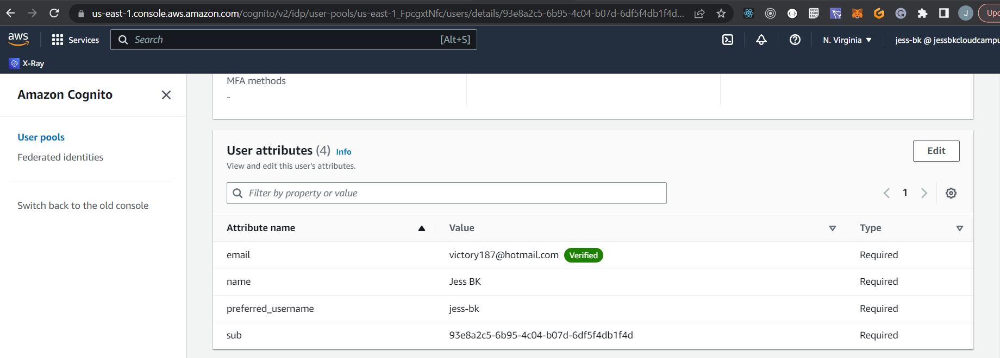

# Week 3 — Decentralized Authentication
Decentralized authentication using Amazon AWS refers to a method of authentication that allows users to authenticate themselves without relying on a central authority or a single point of failure. In this approach, users can authenticate themselves using decentralized identity systems, such as blockchain-based identity systems, without relying on a central authority.

Amazon Cognito, for example, can be used to manage user authentication and authorization in a decentralized way. It supports standard authentication protocols such as OAuth 2.0 and OpenID Connect, as well as decentralized identity systems such as blockchain-based identity systems.

# AWS Conginto Security Best Practices

1. Use strong passwords: Encourage users to choose strong passwords that contain a mix of upper and lower case letters, numbers, and symbols. Consider implementing password complexity requirements and enforcing password expiration policies.
2. Enable Multi-Factor Authentication (MFA): Enable MFA to add an extra layer of security to your authentication process. This ensures that even if a user’s password is compromised, an attacker still cannot gain access without the second factor.
3. Implement IP address restrictions: Limit access to your application from trusted IP addresses only. This helps to prevent unauthorized access from outside your organization.
4. Use SSL/TLS: Use SSL/TLS to encrypt communication between your application and Amazon Cognito. This helps to protect user data in transit and prevents man-in-the-middle attacks.
5. Implement access control: Use AWS Identity and Access Management (IAM) to control access to your resources. Assign IAM roles and permissions to specific users or groups to limit access to sensitive data.
6. Monitor access logs: Monitor access logs to detect suspicious activity or unauthorized access attempts. You can use Amazon CloudWatch to monitor access logs for Amazon Cognito.
7. Regularly review and rotate keys: Regularly review and rotate keys to prevent unauthorized access. Use AWS Key Management Service (KMS) to manage keys for encryption and decryption.
8. Keep software up-to-date: Keep your software up-to-date to ensure that you have the latest security patches and updates. This includes your application, operating system, and any third-party libraries or dependencies.
9. Regularly test security: Regularly test the security of your application and infrastructure to identify vulnerabilities and potential risks. You can use Amazon Inspector to automate security assessments of your Amazon Cognito resources.
10. Use AWS WAF: Use AWS WAF (Web Application Firewall) to protect your application from common web attacks such as SQL injection and cross-site scripting.
11. Follow compliance standards: Ensure that your application complies with relevant compliance standards such as HIPAA, PCI DSS, and GDPR.
12. Choose appropriate region: Choose a region for your Amazon Cognito deployment that complies with your data residency requirements.
13. AWS Organizations SCP: Use AWS Organizations Service Control Policies (SCPs) to manage permissions across multiple AWS accounts and enforce security best practices.
14. Enable AWS CloudTrail: Enable AWS CloudTrail to log all events and API calls related to your Amazon Cognito deployment.
15. Deletion and creation protection: Use deletion and creation protection to prevent accidental deletion or modification of your Amazon Cognito resources.


# AWS Authenticated in AWS Cloud
When a user is authenticated in AWS Cloud, it means that they have successfully proven their identity and have been granted access to the resources and services they are authorized to use. AWS provides several authentication mechanisms to ensure that only authorized users can access resources.

One of the most commonly used authentication mechanisms is AWS Identity and Access Management (IAM). IAM is a web service that enables you to manage access to AWS resources securely. You can create and manage users and groups, and assign them permissions to access AWS resources. IAM also allows you to use multifactor authentication (MFA) and enforce strong password policies to enhance security.

Another authentication mechanism provided by AWS is Security Assertion Markup Language (SAML) 2.0. SAML is an XML-based standard for exchanging authentication and authorization data between parties. SAML enables federated single sign-on (SSO) for web applications, where a user can sign in to multiple applications using the same set of credentials.

AWS also supports OpenID Connect (OIDC), which is a standard for building authentication and authorization workflows on top of OAuth 2.0. OIDC enables you to use third-party identity providers, such as Google, Facebook, or Amazon, to authenticate users in your application.

# Amazon Cognito is a managed service provided by Amazon Web Services

This allows developers to add user sign-up, sign-in, and access control to their web and mobile applications. It provides a secure and scalable way to handle user authentication and authorization, without the need for developers to build and manage their own authentication systems.

Amazon Cognito offers several different types of user pools and identity pools to meet different authentication and authorization requirements. Here's an overview of the types of Amazon Cognito pools:

1. User Pools: User Pools are used to handle user authentication and registration for web and mobile applications. They allow developers to create and manage user accounts, set up password policies, and enable multi-factor authentication (MFA) for added security. User Pools support standard authentication protocols such as OAuth 2. Identity Pools: Identity Pools are used to provide temporary AWS credentials to users who authenticate through external identity providers, such as Facebook, Google, or Amazon. Identity Pools allow developers to grant access to AWS resources based on user identity, without requiring users to create an AWS account. Identity Pools support standard authentication protocols such as OAuth 2.0 and OpenID Connect.
3. Social Identity Providers: Amazon Cognito allows developers to add support for external identity providers, such as Facebook, Google, and Amazon, to their applications. This enables users to sign in using their existing social media accounts, rather than creating a new account.
4. Custom Authentication: Amazon Cognito also provides a way for developers to create their own authentication flow using custom authentication providers. This allows developers to integrate with their own authentication systems or third-party authentication systems that are not supported by Amazon Cognito out of the box.

Amazon Cognito provides a flexible and scalable way to handle user authentication and authorization in web and mobile applications. With its various types of user and identity pools, social identity providers, and support for custom authentication, developers can choose the authentication and authorization method that best fits their application's needs.

# Why Use AWS Cognito

Amazon Cognito can simplify the development of your application by providing a secure and scalable way to handle user authentication and authorization. With its customization options, integration with other AWS services, and support for mobile platforms, Amazon Cognito can help you build a more secure and user-friendly application.

1. Security: Amazon Cognito provides a secure way to handle user authentication and authorization, using industry-standard protocols such as OAuth 2.0 and OpenID Connect. It supports multi-factor authentication (MFA) and encryption of user data at rest and in transit, helping to ensure the security and privacy of user data.
2. Scalability: Amazon Cognito is a fully managed service, meaning that AWS handles the infrastructure and scaling for you. It can handle millions of users and supports high availability across multiple regions, so you can focus on building your application instead of worrying about infrastructure.
3. Customization: Amazon Cognito offers a range of customization options to fit the needs of your application. You can customize the user interface for sign-in and sign-up pages, and you can also use your own identity providers and authentication flows.
4. ntegration with AWS Services: Amazon Cognito integrates with other AWS services, such as Amazon S3, AWS Lambda, and Amazon API Gateway, to provide secure access to AWS resources based on user identity. This can simplify the development of your application and reduce the need for custom integration code.
5. Support for Mobile Applications: Amazon Cognito supports mobile platforms, including iOS, Android, and Unity. It provides SDKs and libraries for mobile development, allowing developers to easily add user authentication and authorization to their mobile applications.

# Lifecycle Management In AWS Cognito

User lifecycle management in Amazon Cognito refers to the management of user accounts from creation to deletion, including various states of user accounts in between. Here are the different states of user accounts in Amazon Cognito -

1. UNCONFIRMED: This is the initial state of a user account after it has been created. Users can be created in this state via sign-up or imported from a CSV file. They can't access any features of your application until they have confirmed their email address or phone number.
2. CONFIRMED: This state indicates that the user has confirmed their email address or phone number. They can now access the features of your application 
3. ARCHIVED: This state is used to indicate that the user account has been archived and can no longer be used. Archived user accounts are deleted after a certain period of time.
4. COMPROMISED: This state is used to indicate that the user account has been compromised and access to the account has been suspended. This can occur if a user's account is hacked or if their login credentials have been exposed.
5. FORCE_CHANGE_PASSWORD: This state is used to indicate that the user.account requires a password reset. This can be triggered by an administrator or by the user themselves.
6. RESET_REQUIRED: This state is used to indicate that the user account requires a password reset or some other action before it can be used again. This can occur if the user's account has been inactive for a certain period of time.
7. DISABLED: This state is used to indicate that the user account has been disabled and access to the account has been suspended. This can be triggered by an administrator or by the user themselves.

# Token Lifecycle Management AWS

Token rotation: To ensure security, tokens should be rotated regularly, which means generating new tokens and revoking old ones. AWS provides tools for automatically rotating certain types of tokens, such as temporary security credentials issued by AWS Security Token Service (STS).
Token expiration: Tokens should have an expiration time or date to limit their lifespan and reduce the risk of unauthorized access. AWS services such as Amazon Cognito or AWS Security Token Service allow you to configure token expiration periods.
Token revocation: If a token is no longer needed or has been compromised, it should be revoked immediately to prevent further unauthorized access. AWS services such as AWS Identity and Access Management (IAM) allow you to revoke access keys or temporary security credentials.
Token permissions: Tokens should have the minimum necessary permissions to perform their intended function. AWS services such as AWS IAM allow you to define permissions for users and groups based on policies that specify what actions they are allowed to perform.
Token storage: Tokens should be stored securely, preferably in a vault or secure key store. AWS provides various options for storing and managing secrets, such as AWS Secrets Manager or AWS Key Management Service (KMS).
Token monitoring: Token usage should be monitored and audited regularly to detect unusual activity or potential security breaches. AWS provides various tools for monitoring access to AWS resources, such as AWS CloudTrail or Amazon GuardDuty.

# Implementing AWS Congito In Project

1. Navigate to Amazon Cognito in AWS
2. Click on create a new user pool
3. Authentication Providers --> Congnito user pool
4. Cognito user pool sign-in-options --> email only
5. User name requirements --> leave blank
6. Password Policy --> Password policy mode --> Cognito defaults
7. Mulit-Factor-Authentication --> No MFA
8. User account-recovery --> Enable self account recovery
9. Delivey method for user account recovery messages --> email
10. Configure sign-in experience --> self registration --> enable
11. Attribute verification and user account confirmation --> Cognito-assisted verfification and confirmation --> Allow cognito to automatically send messages to verify and confirm --> enable
12. Attributes to Verify --> Send email messages, verify email address
13. Veifying attribute changes --> keep original attribute value when an update is pending --> enable
14. Active attribute values when an update is pending --> email address
15. Required attributes --> select name and preferred_username
16. Configure message delivery --> Email --> Email Provider --> Send email with cognito --> enable
17. SES region --> set your aws region
18. From email address --> select --> no-reply@verificationemail.com
19. Reply to email address leave blank
20. Integrate your app --> User pool name --> enter user pool name cruddur-user-pool
21. Hosted authentication pages --> disable
22. Domain --> Domain type --> use coginto domain --> leave as it is
23. Intial app client --> App type --> select --> Public client
24. App client name --> enter name thats relevent to the project --> cruddur
25. Client secret --> select --> Dont generate a client secret
26. Advanced app client setting leave as default
27. Attribute read and write permission leave as default
28. Review and create user pool


# AWS Amplify(frontend implementation with aws cognito)

is a development platform and set of tools provided by Amazon Web Services (AWS) that helps developers build cloud-powered mobile and web applications quickly and efficiently. It provides a set of libraries, UI components, and tools to simplify the development process and enables developers to integrate their applications with various AWS services such as AWS Lambda, Amazon S3, Amazon DynamoDB, and others

1. Install AWS Amplify --> cd into frontend-react-js
```
npm i aws-amplify --save
```
2. Configuring Amplify in App.js
```
import { Amplify } from 'aws-amplify';

Amplify.configure({
  "AWS_PROJECT_REGION": process.env.REACT_APP_AWS_PROJECT_REGION,
  "aws_cognito_region": process.env.REACT_APP_AWS_COGNITO_REGION,
  "aws_user_pools_id": process.env.REACT_APP_AWS_USER_POOLS_ID,
  "aws_user_pools_web_client_id": process.env.REACT_APP_CLIENT_ID,
  "oauth": {},
  Auth: {
    // We are not using an Identity Pool
    // identityPoolId: process.env.REACT_APP_IDENTITY_POOL_ID, // REQUIRED - Amazon Cognito Identity Pool ID
    region: process.env.REACT_AWS_PROJECT_REGION, // REQUIRED - Amazon Cognito Region
    userPoolId: process.env.REACT_APP_AWS_USER_POOLS_ID,  // OPTIONAL - Amazon Cognito User Pool ID
    userPoolWebClientId: process.env.REACT_APP_CLIENT_ID,  // OPTIONAL - Amazon Cognito Web Client ID (26-char alphanumeric string)
  }
});
```
3.  Setting the env variables for the frontend from App.js and backend-flask in docker-compose file (This needs to be done inside the frontend in docker-compose)
```
******************************************************************
  frontend-react-js:
    environment:
      -----------------------code--------------------------------
      REACT_APP_AWS_PROJECT_REGION: "${AWS_DEFAULT_REGION}"
      REACT_APP_AWS_COGNITO_REGION: "${AWS_DEFAULT_REGION}"
      REACT_APP_AWS_USER_POOLS_ID: "us-east-1_<enter user pool ID from aws>"
      REACT_APP_CLIENT_ID: "<enter aws App integration tab --> App client and analytics CLIENT ID>"
      
    build: ./frontend-react-js
    ports:
      - "3000:3000"
    volumes:
      - ./frontend-react-js:/frontend-react-js
      -----------------------code--------------------------------
******************************************************************
```
4. Conditionally Show Logged in or Logged out HomeFeedPage --> HomeFeedPage.js (this page will conditionally render is user is logged in or not)
```
import { Auth } from 'aws-amplify';

// set a state
const [user, setUser] = React.useState(null);

// check if we are authenicated
const checkAuth = async () => {
  Auth.currentAuthenticatedUser({
    // Optional, By default is false. 
    // If set to true, this call will send a 
    // request to Cognito to get the latest user data
    bypassCache: false 
  })
  .then((user) => {
    console.log('user',user);
    return Auth.currentAuthenticatedUser()
  }).then((cognito_user) => {
      setUser({
        display_name: cognito_user.attributes.name,
        handle: cognito_user.attributes.preferred_username
      })
  })
  .catch((err) => console.log(err));
};
```
5. Passing props to the components from HomeFeedPages.js
```
<DesktopNavigation user={user} active={'home'} setPopped={setPopped} />
<DesktopSidebar user={user} />
```
6. Upadte DesktopSideBar.js syntax
```
import './DesktopSidebar.css';
import Search from '../components/Search';
import TrendingSection from '../components/TrendingsSection'
import SuggestedUsersSection from '../components/SuggestedUsersSection'
import JoinSection from '../components/JoinSection'

export default function DesktopSidebar(props) {
  const trendings = [
    {"hashtag": "100DaysOfCloud", "count": 2053 },
    {"hashtag": "CloudProject", "count": 8253 },
    {"hashtag": "AWS", "count": 9053 },
    {"hashtag": "FreeWillyReboot", "count": 7753 }
  ]

  const users = [
    {"display_name": "Andrew Brown", "handle": "andrewbrown"}
  ]

  let trending;
  let suggested;
  let join;
  if (props.user) {
    trending = <TrendingSection trendings={trendings} />
    suggested = <SuggestedUsersSection users={users} />
  } else {
    join = <JoinSection />
  }
  
  return (
    <section>
      <Search />
      {trending}
      {suggested}
      {join}
      <footer>
        <a href="#">About</a>
        <a href="#">Terms of Service</a>
        <a href="#">Privacy Policy</a>
      </footer>
    </section>
  );
}
```
7. Update ProfileInfo.js
```
// remove Cookies from "js-cookie and replace with code below
import { Auth } from 'aws-amplify';

const signOut = async () => {
  try {
      await Auth.signOut({ global: true });
      window.location.href = "/"
  } catch (error) {
      console.log('error signing out: ', error);
  }
}
```
8. Update SignIn Page with Amplify Auth
```
// replace cookies with auth from aws-amplify
import { Auth } from 'aws-amplify';

// const [cognitoErrors, setCognitoErrors] = React.useState('');

const onsubmit = async (event) => {
  setErrors('')
  event.preventDefault();
    Auth.signIn(email, password)
      .then(user => {
        localStorage.setItem("access_token", user.signInUserSession.accessToken.jwtToken)
        window.location.href = "/"
      })
      .catch(err => {
          if (error.code == 'UserNotConfirmedException') {
      window.location.href = "/confirm"
      }
    setErrors(error.message)
  });
  return false
}

let errors;
if (Errors){
  errors = <div className='errors'>{Errors}</div>;
}

```
9. Update Signup Page with Amplify Auth
```
import { Auth } from 'aws-amplify';

//const [cognitoErrors, setCognitoErrors] = React.useState('');

  const onsubmit = async (event) => {
    event.preventDefault();
    setErrors('')
    console.log('username',username)
    console.log('email',email)
    console.log('name',name)
    try {
      const { user } = await Auth.signUp({
        username: email,
        password: password,
        attributes: {
          name: name,
          email: email,
          preferred_username: username,
        },
        autoSignIn: { // optional - enables auto sign in after user is confirmed
          enabled: true,
        }
      });
      console.log(user);
      window.location.href = `/confirm?email=${email}`
    } catch (error) {
        console.log(error);
        setErrors(error.message)
    }
    return false
  }
```
10. Update Confirmation Page to handle Auth to resend email
```
import { Auth } from 'aws-amplify';

const resend_code = async (event) => {
  setErrors('')
  try {
    await Auth.resendSignUp(email);
    console.log('code resent successfully');
    setCodeSent(true)
  } catch (err) {
    // does not return a code
    // does cognito always return english
    // for this to be an okay match?
    console.log(err)
    if (err.message == 'Username cannot be empty'){
      setErrors("You need to provide an email in order to send Resend Activiation Code")   
    } else if (err.message == "Username/client id combination not found."){
      setErrors("Email is invalid or cannot be found.")   
    }
  }
}

const onsubmit = async (event) => {
  event.preventDefault();
  setErrors('')
  try {
    await Auth.confirmSignUp(email, code);
    window.location.href = "/"
  } catch (error) {
    setErrors(error.message)
  }
  return false
}
```
11. Upadte Recovery Page
```
import { Auth } from 'aws-amplify';

const onsubmit_send_code = async (event) => {
  event.preventDefault();
  setErrors('')
  Auth.forgotPassword(username)
  .then((data) => setFormState('confirm_code') )
  .catch((err) => setErrors(err.message) );
  return false
}

const onsubmit_confirm_code = async (event) => {
  event.preventDefault();
  setErrors('')
  if (password == passwordAgain){
    Auth.forgotPasswordSubmit(username, code, password)
    .then((data) => setFormState('success'))
    .catch((err) => setErrors(err.message) );
  } else {
    setErrors('Passwords do not match')
  }
  return false
}
```
12. AWS --> navigate to user pool --> select --> create a user
* click on email
* user name - enter name
* email address -  enter email address
* set password - enter password
* Users --> comfirm user by selecting the user to confirm
* check email for password from aws

# Resolving the issue with setting user with AWS INCOGNITO (step 14 did not work this will resolve the issue)
run this command in cli
```
cognito-idp admin-set-user-password --username <enter username> --password =<enter password> --user-pool-id <enter user pool ID>  --permanent
```


# Resolving Name In Frontend User Attributes --> frontend sidebar navigation
AWS navigate to user pool and inside the console click on user attributes and enter name and preffered name.

# Implementing signup in AWS Cognito --> frontend
1. delete the user created in AWS in the user pool (previously created manually now will be done in the frontend)

## Authenticating Server Side
Add in the `HomeFeedPage.js` a header eto pass along the access token (frontend-react-js)

```
  const loadData = async () => {
    const span = trace.getTracer('my-tracer').startSpan('my-function');
    try {
      const backend_url = `${process.env.REACT_APP_BACKEND_URL}/api/activities/home`
      const res = await fetch(backend_url, {
        headers: {
          Authorization: `Bearer ${localStorage.getItem("access_token")}`
        },
        method: "GET"
      });
      let resJson = await res.json();
      if (res.status === 200) {
        setActivities(resJson)
      } else {
        console.log(res)
      }
    } catch (err) {
      console.log(err);
    }
    span.end();
  };
```
13. Update backend-flask app.py to allow headers from the frontend for Authorization (cd into backend-flask)
14. Add in the `app.py`
```
import sys 

cors = CORS(
  app, 
  resources={r"/api/*": {"origins": origins}},
  headers=['Content-Type', 'Authorization'], 
  expose_headers='Authorization',
  methods="OPTIONS,GET,HEAD,POST"
)
```
15. Adding Token Verification --> verify JWTs obtained from an Amazon Cognito user pool and extract information from them,
create a folder name lib on the backend-flask directory and create a file inside cognito_jwt_token.py and add the following code
```
import time
import requests
from jose import jwk, jwt
from jose.exceptions import JOSEError
from jose.utils import base64url_decode

class FlaskAWSCognitoError(Exception):
  pass

class TokenVerifyError(Exception):
  pass

def extract_access_token(request_headers):
    access_token = None
    auth_header = request_headers.get("Authorization")
    if auth_header and " " in auth_header:
        _, access_token = auth_header.split()
    return access_token

class CognitoJwtToken:
    def __init__(self, user_pool_id, user_pool_client_id, region, request_client=None):
        self.region = region
        if not self.region:
            raise FlaskAWSCognitoError("No AWS region provided")
        self.user_pool_id = user_pool_id
        self.user_pool_client_id = user_pool_client_id
        self.claims = None
        if not request_client:
            self.request_client = requests.get
        else:
            self.request_client = request_client
        self._load_jwk_keys()


    def _load_jwk_keys(self):
        keys_url = f"https://cognito-idp.{self.region}.amazonaws.com/{self.user_pool_id}/.well-known/jwks.json"
        try:
            response = self.request_client(keys_url)
            self.jwk_keys = response.json()["keys"]
        except requests.exceptions.RequestException as e:
            raise FlaskAWSCognitoError(str(e)) from e

    @staticmethod
    def _extract_headers(token):
        try:
            headers = jwt.get_unverified_headers(token)
            return headers
        except JOSEError as e:
            raise TokenVerifyError(str(e)) from e

    def _find_pkey(self, headers):
        kid = headers["kid"]
        # search for the kid in the downloaded public keys
        key_index = -1
        for i in range(len(self.jwk_keys)):
            if kid == self.jwk_keys[i]["kid"]:
                key_index = i
                break
        if key_index == -1:
            raise TokenVerifyError("Public key not found in jwks.json")
        return self.jwk_keys[key_index]

    @staticmethod
    def _verify_signature(token, pkey_data):
        try:
            # construct the public key
            public_key = jwk.construct(pkey_data)
        except JOSEError as e:
            raise TokenVerifyError(str(e)) from e
        # get the last two sections of the token,
        # message and signature (encoded in base64)
        message, encoded_signature = str(token).rsplit(".", 1)
        # decode the signature
        decoded_signature = base64url_decode(encoded_signature.encode("utf-8"))
        # verify the signature
        if not public_key.verify(message.encode("utf8"), decoded_signature):
            raise TokenVerifyError("Signature verification failed")

    @staticmethod
    def _extract_claims(token):
        try:
            claims = jwt.get_unverified_claims(token)
            return claims
        except JOSEError as e:
            raise TokenVerifyError(str(e)) from e

    @staticmethod
    def _check_expiration(claims, current_time):
        if not current_time:
            current_time = time.time()
        if current_time > claims["exp"]:
            raise TokenVerifyError("Token is expired")  # probably another exception

    def _check_audience(self, claims):
        # and the Audience  (use claims['client_id'] if verifying an access token)
        audience = claims["aud"] if "aud" in claims else claims["client_id"]
        if audience != self.user_pool_client_id:
            raise TokenVerifyError("Token was not issued for this audience")

    def verify(self, token, current_time=None):
        """ https://github.com/awslabs/aws-support-tools/blob/master/Cognito/decode-verify-jwt/decode-verify-jwt.py """
        if not token:
            raise TokenVerifyError("No token provided")

        headers = self._extract_headers(token)
        pkey_data = self._find_pkey(headers)
        self._verify_signature(token, pkey_data)

        claims = self._extract_claims(token)
        self._check_expiration(claims, current_time)
        self._check_audience(claims)

        self.claims = claims 
        return claims
```
CognitoJwtToken, which is used to verify a JWT (JSON Web Token) obtained from an Amazon Cognito user pool. The purpose of this script is to provide a way to validate and extract information from the JWT provided by Amazon Cognito, such as the user ID, username, or other claims contained in the JWT.

The script imports several libraries that are used to decode, verify, and extract information from the JWT, such as requests, jose, and base64url_decode. The FlaskAWSCognitoError and TokenVerifyError classes are custom exceptions that are raised in case of errors while verifying the token.

The extract_access_token() function extracts the access token from the Authorization header of a request. The CognitoJwtToken class has several methods, including _loadjwt_keys() to download the public keys from the Cognito user pool, _extract_headers() to extract the headers from the JWT, _find_pkey() to find the matching public key based on the kid header, _verify_signature() to verify the signature of the JWT, _extract_claims() to extract the claims from the JWT, _check_expiration() to check if the token is expired, _check_audience() to check if the token was issued for the correct audience, and verify() to verify the JWT and return the claims contained in it.

16. Update requirements.txt
```
Flask-AWSCognito
```
run command in cli to update the dependencies 
```
pip install -r requirements.txt
```
17. Docker-compose file update the env vars for the backend to implement verification for incognito
```
  backend-flask:
    environment:
    -------------------code-------------------------------
      AWS_COGNITO_USER_POOL_ID: "us-east-1_<enter user pool ID from aws>"
      AWS_COGNITO_USER_POOL_CLIENT_ID: "<enter aws App integration tab --> App client and analytics CLIENT ID>"     
    build: ./backend-flask
    ports:
      - "4567:4567"
    volumes:
      - ./backend-flask:/backend-flask
    -------------------code-------------------------------
```
18. app.py --> import cognito_jwt_token into app.py to be used for verification
```
from lib.cognito_jwt_token import CognitoJwtToken, extract_access_token, TokenVerifyError
```
19. app.py --> allow the env vars to be passed into aws
```
----------------------
app = Flask(__name__)
----------------------

cognito_jwt_token = CognitoJwtToken(
  user_pool_id=os.getenv("AWS_COGNITO_USER_POOL_ID"), 
  user_pool_client_id=os.getenv("AWS_COGNITO_USER_POOL_CLIENT_ID"),
  region=os.getenv("AWS_DEFAULT_REGION")
)
```
20. In the @app.route("/api/activities/home") --> update with the following code
```
@app.route("/api/activities/home", methods=['GET'])
@xray_recorder.capture('activities_home')
def data_home():
  access_token = extract_access_token(request.headers)
  try:
    claims = cognito_jwt_token.verify(access_token)
    # authenicatied request
    app.logger.debug("authenicated")
    app.logger.debug(claims)
    app.logger.debug(claims['username'])
    data = HomeActivities.run(cognito_user_id=claims['username'])
  except TokenVerifyError as e:
    # unauthenicatied request
    app.logger.debug(e)
    app.logger.debug("unauthenicated")
    data = HomeActivities.run()
  return data, 200
```
When the route is accessed, it first extracts an access token from the request headers using the extract_access_token function. It then tries to verify the token using the cognito_jwt_token object, which is an instance of the CognitoJwtToken class defined in the previous code block.
If the token is successfully verified, the code logs that the request is authenticated and uses the username from the token claims to run the HomeActivities function with that user ID. If the token is not verified, the code logs that the request is unauthenticated and runs the HomeActivities function without a user ID.
The function returns the data generated by the HomeActivities function along with an HTTP status code of 200.

21. Adding aditional record to the list of results being returned by the HomeActivities.run() function call (from app.py for authenticated user)
```
def run(cognito_user_id=None):

if cognito_user_id != None:
  extra_crud = {
    'uuid': '248959df-3079-4947-b847-9e0892d1bab4',
    'handle':  'Lore',
    'message': 'My dear brother, it the humans that are the problem',
    'created_at': (now - timedelta(hours=1)).isoformat(),
    'expires_at': (now + timedelta(hours=12)).isoformat(),
    'likes': 1042,
    'replies': []
  }
  results.insert(0,extra_crud)
```
The if statement checks if the cognito_user_id variable is not equal to None. If it's not None, it means that the user is authenticated and the extra_crud dictionary containing some data is created and added to the results list at the beginning of the list using the insert() method.
The extra_crud dictionary contains some key-value pairs such as a UUID, a handle, a message, the creation and expiration timestamps, the number of likes, and an empty list of replies. These values will be returned to the client as part of the response.

22. Remove the user from local storage on signout from ProfileInfo.js
```
localStorage.removeItem("access_token")
```
# Images From UI after implementation of JWT and Incognito


# Exploring JWT's 
First an explaination about what JWT's, JWT stands for JSON Web Token, and it is a compact, URL-safe means of representing claims to be transferred between two parties. JWT is a type of authentication mechanism that allows users to securely transmit information between different systems.

JWTs consist of three parts: a header, a payload, and a signature. The header contains metadata about the token, such as the algorithm used to sign the token. The payload contains the data that is being transmitted, such as user information or authorization details. The signature is used to verify the integrity of the token.

When a user logs into an application, a JWT is generated and returned to the user. The user then sends the JWT with each subsequent request, and the server uses the signature to validate the JWT and extract the information contained in the payload. This allows the server to determine if the user is authenticated and authorized to access the requested resource.

JWTs are commonly used in web applications, mobile applications, and APIs, and they provide a scalable and secure means of transmitting information between different systems.

JWT (JSON Web Token) is a popular way to authenticate users and secure APIs. For your project, you can use JWT to securely authenticate users between the frontend and backend containers. steps to implement JWT in your project:
1. Generate JWT on login: When a user logs in, the frontend sends a request to the backend to verify the user's credentials. If the credentials are valid, the backend generates a JWT with a secret key and sends it back to the frontend.
2. Store JWT on the frontend: The frontend stores the JWT in the browser's local storage or session storage. This allows the frontend to access the JWT and include it in future requests to the backend.
3. Include JWT in requests: Whenever the frontend makes a request to the backend, it includes the JWT in the request headers. The backend verifies the JWT with the secret key to ensure the request is coming from a valid user.
4. Set JWT expiration: To prevent JWT from being used indefinitely, you can set an expiration time for the token. When the JWT expires, the frontend must generate a new token by logging in again.

# JWT's AWS 
AWS provides several services that can be used in conjunction with JWTs to create a secure and scalable application. One such service is Amazon Cognito, which is a fully managed user authentication and authorization service. With Cognito, you can create user pools and identity pools, which allow you to manage user authentication and authorization for your application.

In a coupled architecture, you can use Cognito to authenticate users and generate JWTs, which can then be used to access resources in other AWS services, such as Amazon S3 or Amazon API Gateway. This approach provides a seamless integration between authentication and authorization, making it easy to manage user access to your application.

In a decoupled architecture, you can use JWTs to authenticate users and then use the token to authorize access to your application's resources. This approach provides more flexibility and allows you to use a variety of authorization mechanisms, such as role-based access control or attribute-based access control.

Regardless of whether you choose a coupled or decoupled architecture, it's important to follow best practices for securing your JWTs. For example, you should use a strong algorithm to sign your tokens, such as HMAC-SHA256 or RSA-SHA256. You should also validate the signature and check the expiration time to ensure that the token has not been tampered with or expired.provides several services that can be used in conjunction with JWTs to create a secure and scalable application. One such service is Amazon Cognito, which is a fully managed user authentication and authorization service. With Cognito, you can create user pools and identity pools, which allow you to manage user authentication and authorization for your application.

In a coupled architecture, you can use Cognito to authenticate users and generate JWTs, which can then be used to access resources in other AWS services, such as Amazon S3 or Amazon API Gateway. This approach provides a seamless integration between authentication and authorization, making it easy to manage user access to your application.

In a decoupled architecture, you can use JWTs to authenticate users and then use the token to authorize access to your application's resources. This approach provides more flexibility and allows you to use a variety of authorization mechanisms, such as role-based access control or attribute-based access control.

Regardless of whether you choose a coupled or decoupled architecture, it's important to follow best practices for securing your JWTs. For example, you should use a strong algorithm to sign your tokens, such as HMAC-SHA256 or RSA-SHA256. You should also validate the signature and check the expiration time to ensure that the token has not been tampered with or expired.
