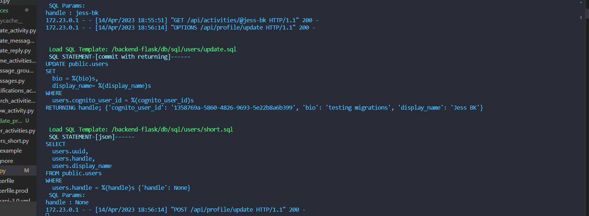
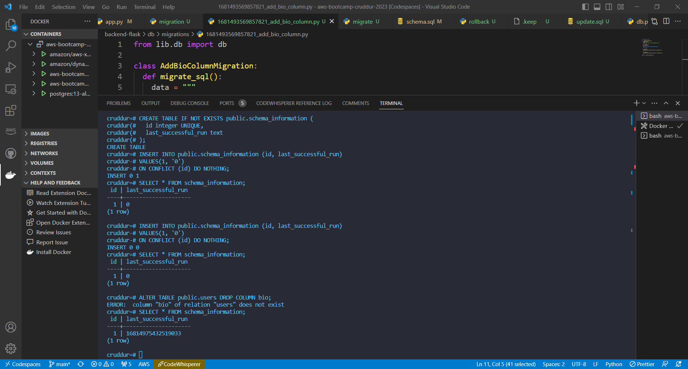
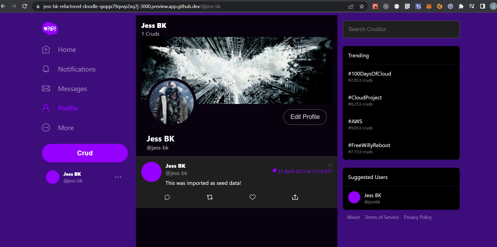
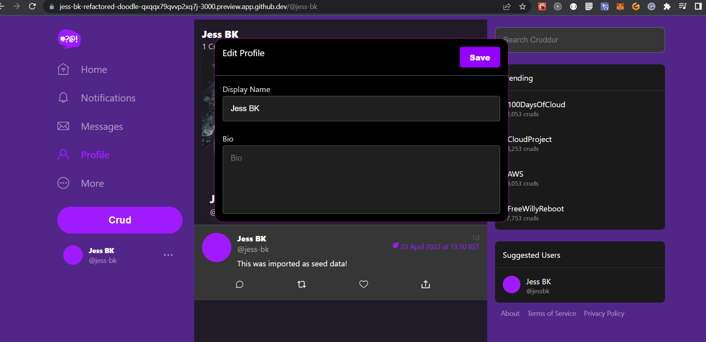
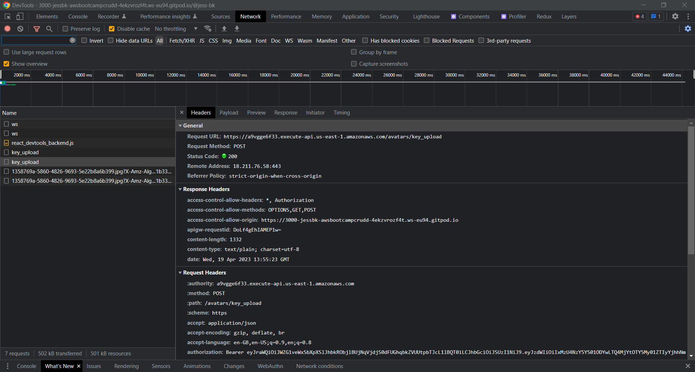
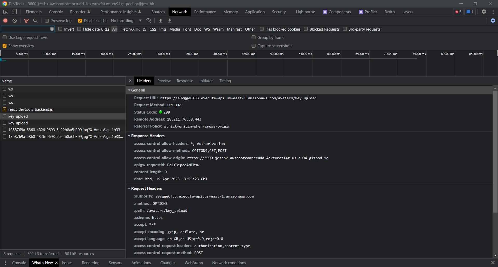
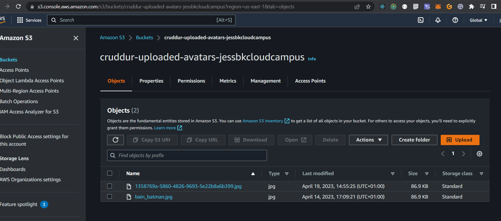

# Week 8 — Serverless Image Processing
Implmentation of AWS CDK STACK in project
The first step is to create a directory to install the AWS CDK in the the project.
1. create a new folder in the root of app and name it thumbing-serverless-cdk and then cd into the folder and and run
```
npm install aws-cdk -g
```
2. initialize for a typescript project
```
cdk init app --language typescript
```
3. cdk bootstrap command is a part of the AWS Cloud Development Kit (CDK) which sets up the AWS CloudFormation stack that is needed for deploying your CDK application.
```
cdk bootstrap "aws://$AWS_ACCOUNT_ID/$AWS_DEFAULT_REGION"
```
The cdk bootstrap command with the specified parameter aws://$AWS_ACCOUNT_ID/$AWS_DEFAULT_REGION sets up a CloudFormation stack with the required resources to deploy your CDK app in the AWS account with the specified $AWS_ACCOUNT_ID and $AWS_DEFAULT_REGION. This is done by creating an S3 bucket, an IAM role, and a CloudFormation stack that are necessary to deploy your CDK app.

4. install all the dependencies for the app.
```
npm install dotenv
```

5. In the folder naivgate to lib folder and then open and add the following thumbing-serverless-cdk-stack.ts and add the code.
```
import * as cdk from "aws-cdk-lib";
import * as s3 from "aws-cdk-lib/aws-s3";
import * as iam from "aws-cdk-lib/aws-iam";
import * as lambda from "aws-cdk-lib/aws-lambda";
import * as s3n from "aws-cdk-lib/aws-s3-notifications";
import * as subscriptions from "aws-cdk-lib/aws-sns-subscriptions";
import * as sns from "aws-cdk-lib/aws-sns";
import { Construct } from "constructs";
import * as dotenv from "dotenv";

dotenv.config();

export class ThumbingServerlessCdkStack extends cdk.Stack {
  constructor(scope: Construct, id: string, props?: cdk.StackProps) {
    super(scope, id, props);

    // The code that defines your stack goes here
    const uploadsBucketName: string = process.env.UPLOADS_BUCKET_NAME as string;
    const assetsBucketName: string = process.env.ASSETS_BUCKET_NAME as string;
    const folderInput: string = process.env.THUMBING_S3_FOLDER_INPUT as string;
    const folderOutput: string = process.env
      .THUMBING_S3_FOLDER_OUTPUT as string;
    const webhookUrl: string = process.env.THUMBING_WEBHOOK_URL as string;
    const topicName: string = process.env.THUMBING_TOPIC_NAME as string;
    const functionPath: string = process.env.THUMBING_FUNCTION_PATH as string;
    console.log("uploadsBucketName");
    console.log("assetsBucketName", assetsBucketName);
    console.log("folderInput", folderInput);
    console.log("folderOutput", folderOutput);
    console.log("webhookUrl", webhookUrl);
    console.log("topicName", topicName);
    console.log("functionPath", functionPath);

    const uploadsBucket = this.createBucket(uploadsBucketName);
    const assetsBucket = this.importBucket(assetsBucketName);

    // create a lambda
    const lambda = this.createLambda(
      functionPath,
      uploadsBucketName,
      assetsBucketName,
      folderInput,
      folderOutput
    );

    // create topic and subscription
    const snsTopic = this.createSnsTopic(topicName);
    this.createSnsSubscription(snsTopic, webhookUrl);

    // add our s3 event notifications
    this.createS3NotifyToLambda(folderInput, lambda, uploadsBucket);
    this.createS3NotifyToSns(folderOutput, snsTopic, assetsBucket);

    // create policies
    const s3UploadsReadWritePolicy = this.createPolicyBucketAccess(
      uploadsBucket.bucketArn
    );
    const s3AssetsReadWritePolicy = this.createPolicyBucketAccess(
      assetsBucket.bucketArn
    );
    //const snsPublishPolicy = this.createPolicySnSPublish(snsTopic.topicArn)

    // attach policies for permissions
    lambda.addToRolePolicy(s3UploadsReadWritePolicy);
    lambda.addToRolePolicy(s3AssetsReadWritePolicy);
    //lambda.addToRolePolicy(snsPublishPolicy);
  }

  createBucket(bucketName: string): s3.IBucket {
    const bucket = new s3.Bucket(this, "UploadsBucket", {
      bucketName: bucketName,
      removalPolicy: cdk.RemovalPolicy.DESTROY,
    });
    return bucket;
  }

  importBucket(bucketName: string): s3.IBucket {
    const bucket = s3.Bucket.fromBucketName(this, "AssetsBucket", bucketName);
    return bucket;
  }

  createLambda(
    functionPath: string,
    uploadsBucketName: string,
    assetsBucketName: string,
    folderInput: string,
    folderOutput: string
  ): lambda.IFunction {
    const lambdaFunction = new lambda.Function(this, "ThumbLambda", {
      runtime: lambda.Runtime.NODEJS_18_X,
      handler: "index.handler",
      code: lambda.Code.fromAsset(functionPath),
      environment: {
        DEST_BUCKET_NAME: assetsBucketName,
        FOLDER_INPUT: folderInput,
        FOLDER_OUTPUT: folderOutput,
        PROCESS_WIDTH: "512",
        PROCESS_HEIGHT: "512",
      },
    });
    return lambdaFunction;
  }

  createS3NotifyToLambda(
    prefix: string,
    lambda: lambda.IFunction,
    bucket: s3.IBucket
  ): void {
    const destination = new s3n.LambdaDestination(lambda);
    bucket.addEventNotification(
      s3.EventType.OBJECT_CREATED_PUT,
      destination //,
      //{prefix: prefix} // folder to contain the original images
    );
  }

  createPolicyBucketAccess(bucketArn: string) {
    const s3ReadWritePolicy = new iam.PolicyStatement({
      actions: ["s3:GetObject", "s3:PutObject"],
      resources: [`${bucketArn}/*`],
    });
    return s3ReadWritePolicy;
  }

  createSnsTopic(topicName: string): sns.ITopic {
    const logicalName = "ThumbingTopic";
    const snsTopic = new sns.Topic(this, logicalName, {
      topicName: topicName,
    });
    return snsTopic;
  }

  createSnsSubscription(
    snsTopic: sns.ITopic,
    webhookUrl: string
  ): sns.Subscription {
    const snsSubscription = snsTopic.addSubscription(
      new subscriptions.UrlSubscription(webhookUrl)
    );
    return snsSubscription;
  }

  createS3NotifyToSns(
    prefix: string,
    snsTopic: sns.ITopic,
    bucket: s3.IBucket
  ): void {
    const destination = new s3n.SnsDestination(snsTopic);
    bucket.addEventNotification(s3.EventType.OBJECT_CREATED_PUT, destination, {
      prefix: prefix,
    });
  }

  /*
  createPolicySnSPublish(topicArn: string){
    const snsPublishPolicy = new iam.PolicyStatement({
      actions: [
        'sns:Publish',
      ],
      resources: [
        topicArn
      ]
    });
    return snsPublishPolicy;
  }
  */
}
```
6. The code is defining an AWS CDK (Cloud Development Kit) stack in TypeScript for a serverless application that handles the processing of uploaded images stored in S3 buckets, and notifying other services about the processed images. The stack consists of an S3 bucket to store uploads, a Lambda function to process images, an SNS topic to notify subscribers, and two S3 bucket event notifications to trigger Lambda function and SNS topic. The stack also includes AWS IAM policies to grant permissions for the Lambda function to access the S3 buckets and publish messages to the SNS topic.

* Import the required AWS CDK libraries and dependencies.
* Define a CDK stack class ThumbingServerlessCdkStack that extends the base cdk.Stack class.
* Define a constructor for the stack that takes scope, id, and props parameters.
* Use the dotenv package to load environment variables from a .env file.
* Define variables for the S3 bucket names, S3 folder names, SNS topic name, and Lambda function code path, and log their values to the console.
* Create an S3 bucket using the createBucket method, passing in the uploadsBucketName variable.
* Import an existing S3 bucket using the importBucket method, passing in the assetsBucketName variable.
* Create a Lambda function using the createLambda method, passing in the function path, bucket names, and folder names.
* Create an SNS topic using the createSnsTopic method, passing in the topicName variable.
* Create an SNS subscription using the createSnsSubscription method, passing in the topic and a webhook URL.
* Create two S3 bucket event notifications using the createS3NotifyToLambda and createS3NotifyToSns methods, passing in the Lambda function, SNS topic, and bucket names and folder names.
* Create IAM policies using the createPolicyBucketAccess method, passing in the bucket ARN.
* Attach the policies to the Lambda function using the addToRolePolicy method.

7. Set the environment varibales, create a .env.file and create a .env.example
```
UPLOADS_BUCKET_NAME="cruddur-uploaded-avatars-jessbkcloudcampus"
ASSETS_BUCKET_NAME="assets.jessbkcloudcampus.com"
THUMBING_S3_FOLDER_OUTPUT="avatars/processed"
THUMBING_WEBHOOK_URL="https://api.jessbkcloudcampus.com/webhooks/avatar"
THUMBING_TOPIC_NAME="cruddur-assets"
THUMBING_FUNCTION_PATH="/workspace/aws-bootcamp-cruddur-2023/aws/lambdas/process-images"
```

What the lambda function is doing:
* const process = require("process");: This line imports the built-in Node.js process module, which provides information about the current Node.js process.
*const {getClient, getOriginalImage, processImage, uploadProcessedImage} = require("./s3-image-processing.js");: This line imports four functions (getClient, getOriginalImage, processImage, and uploadProcessedImage) from a local module called s3-image-processing.js. These functions are used to download, process, and upload images in S3.
* const path = require("path");: This line imports the built-in Node.js path module, which provides utilities for working with file and directory paths.
* const bucketName = process.env.DEST_BUCKET_NAME;: This line retrieves the destination bucket name from an environment variable called DEST_BUCKET_NAME.
* const folderInput = process.env.FOLDER_INPUT;: This line retrieves the input folder name from an environment variable called FOLDER_INPUT.
* const folderOutput = process.env.FOLDER_OUTPUT;: This line retrieves the output folder name from an environment variable called FOLDER_OUTPUT.
* const width = parseInt(process.env.PROCESS_WIDTH);: This line retrieves the desired image width from an environment variable called PROCESS_WIDTH, and converts it from a string to a number using parseInt().
* const height = parseInt(process.env.PROCESS_HEIGHT);: This line retrieves the desired image height from an environment variable called PROCESS_HEIGHT, and converts it from a string to a number using parseInt().
* client = getClient();: This line calls the getClient() function (which was imported from s3-image-processing.js) to create a new S3 client object.
* exports.handler = async (event) => {: This line exports a function called handler, which is the entry point for the Lambda function. The async keyword indicates that this function uses async/await syntax.
* const srcBucket = event.Records[0].s3.bucket.name;: This line extracts the source S3 bucket name from the event object passed to the Lambda function.
* const srcKey = decodeURIComponent(event.Records[0].s3.object.key.replace(/\+/g, " "));: This line extracts the source S3 object key from the event object passed to the Lambda function, and decodes any URL encoding.
* const dstBucket = bucketName;: This line sets the destination S3 bucket name to the value retrieved from the DEST_BUCKET_NAME environment variable.
* filename = path.parse(srcKey).name;: This line uses the path.parse() function to extract the file name (without extension) from the source S3 object key.
* const dstKey = ${folderOutput}/${filename}.jpg;: This line constructs the destination S3 object key by concatenating the output folder name, the file name (without extension), and the .jpg extension.
* const originalImage = await getOriginalImage(client, srcBucket, srcKey);: This line calls the getOriginalImage() function (which was imported from s3-image-processing.js) to download the original image from S3.
* const processedImage = await processImage(originalImage, width, height);: This line calls the processImage() function (which was imported from s3-image-processing.js) to resize the original image to the desired dimensions.
* await uploadProcessedImage(client, dstBucket, dstKey, processedImage); calls the uploadProcessedImage function defined in the ./s3-image-processing.js module with the client object, dstBucket, dstKey, and processedImage as arguments. This function uploads the processed image to the destination S3 bucket specified by bucketName in the environment variables.

8. create a file inside aws-bootcamp-cruddur-2023/aws/lambdas/process-images --> name s3-image-processing.js
```
const sharp = require("sharp");
const {
  S3Client,
  PutObjectCommand,
  GetObjectCommand,
} = require("@aws-sdk/client-s3");

function getClient() {
  const client = new S3Client();
  return client;
}

async function getOriginalImage(client, srcBucket, srcKey) {
  console.log("get==");
  const params = {
    Bucket: srcBucket,
    Key: srcKey,
  };
  console.log("params", params);
  const command = new GetObjectCommand(params);
  const response = await client.send(command);

  const chunks = [];
  for await (const chunk of response.Body) {
    chunks.push(chunk);
  }
  const buffer = Buffer.concat(chunks);
  return buffer;
}

async function processImage(image, width, height) {
  const processedImage = await sharp(image)
    .resize(width, height)
    .jpeg()
    .toBuffer();
  return processedImage;
}

async function uploadProcessedImage(client, dstBucket, dstKey, image) {
  console.log("upload==");
  const params = {
    Bucket: dstBucket,
    Key: dstKey,
    Body: image,
    ContentType: "image/jpeg",
  };
  console.log("params", params);
  const command = new PutObjectCommand(params);
  const response = await client.send(command);
  console.log("repsonse", response);
  return response;
}

module.exports = {
  getClient: getClient,
  getOriginalImage: getOriginalImage,
  processImage: processImage,
  uploadProcessedImage: uploadProcessedImage,
};
```
* This code defines several functions to handle image processing in AWS S3. The functions use the Sharp library to resize images, the AWS SDK to interact with S3, and Promises and async/await for handling asynchronous operations.
* The getClient() function creates a new S3 client.
* The getOriginalImage() function retrieves an image from S3, reads its data as a buffer, and returns it.
* The processImage() function resizes the input image using Sharp and returns the resulting image buffer.
* The uploadProcessedImage() function uploads the processed image to a destination S3 bucket, given a key and content type.
* Finally, all the functions are exported as an object with the same names as the functions, allowing them to be used by other parts of the application.

9. cd into the aws-bootcamp-cruddur-2023/aws/lambdas/process-images and install sharp.js
```
npm i @aws-sdk/client-s3
npm i sharp
npm install
rm -rf node_modules/sharp
SHARP_IGNORE_GLOBAL_LIBVIPS=1 npm install --arch=x64 --platform=linux --libc=glibc sharp
```
The commands npm i sharp and npm install are used to install the sharp package and its dependencies. rm -rf node_modules/sharp removes any previously installed version of sharp.The last command SHARP_IGNORE_GLOBAL_LIBVIPS=1 npm install --arch=x64 --platform=linux --libc=glibc sharp installs the sharp package with a specific architecture, platform and libc using the npm package manager.The SHARP_IGNORE_GLOBAL_LIBVIPS=1 environment variable is set to prevent the installation of a system-wide version of libvips, by doing this it will alllow to work in aws for the lambda function.

10. add the node modules to the .gitignore file.
11. created a bash script to install sharp --> aws-bootcamp-cruddur-2023/bin/avatar/build
```
#!/usr/bin/bash

CYAN='\033[1;36m'
NO_COLOR='\033[0m'
LABEL="build serverless images aws s3Bucket"
printf "${CYAN}==== ${LABEL}${NO_COLOR}====\n"

ABS_PATH=$(readlink -f "$0")
SERVERLESS_PATH=$(dirname $ABS_PATH)
BIN_PATH=$(dirname $SERVERLESS_PATH)
PROJECT_PATH=$(dirname $BIN_PATH)
SERVERLESS_PROJECT_PATH="$PROJECT_PATH/thumbing-serverless-cdk"

cd $SERVERLESS_PROJECT_PATH

npm install
rm -rf node_modules/sharp
SHARP_IGNORE_GLOBAL_LIBVIPS=1 npm install --arch=x64 --platform=linux --libc=glibc sharp
```
run chmod to give access to scripts chmod u+x bin/avatar/build

12. create a S3 Bucket in aws to store images --> assets.jessbkcloudcampus.com 

13. create bash script to upload images to aws S3 Bucket --> aws-bootcamp-cruddur-2023/bin/avatar/upload
```
#! /usr/bin/bash

CYAN='\033[1;36m'
NO_COLOR='\033[0m'
LABEL="upload s3 bucket"
printf "${CYAN}==== ${LABEL}${NO_COLOR}\n"

ABS_PATH=$(readlink -f "$0")
SERVERLESS_PATH=$(dirname $ABS_PATH)
DATA_FILE_PATH="$SERVERLESS_PATH/files/bain_batman.jpg"

aws s3 cp "$DATA_FILE_PATH" "s3://cruddur-uploaded-avatars-jessbkcloudcampus/bain_batman.jpg"
```
run chmod to give access to scripts chmod u+x bin/avatar/upload
```
./bin/avatar/upload
```
14. create a  bash script to delete images for aws S3 Bucket --> aws-bootcamp-cruddur-2023/bin/avatar/clear
```
#!/usr/bin/bash

CYAN='\033[1;36m'
NO_COLOR='\033[0m'
LABEL="clear images aws s3Bucket"
printf "${CYAN}==== ${LABEL}${NO_COLOR}====\n"

ABS_PATH=$(readlink -f "$0")
SERVERLESS_PATH=$(dirname $ABS_PATH)
DATA_FILE_PATH="$SERVERLESS_PATH/files/bain_batman.jpg"

aws s3 rm "s3://cruddur-uploaded-avatars-jessbkcloudcampus/bain_batman.jpg"
aws s3 rm "s3://assets.$DOMAIN_NAME/avatars/processed/bain_batman.jpg"
```
run chmod to give access to scripts chmod u+x bin/avatar/clear
you only need to run this if you want to delete the image.

15. update gitpod yaml file to install aws cdk on running gitpod.
```
  - name: cdk
    before: |
      npm install aws-cdk -g
      cd thumbing-serverless-cdk
      cp .env.example .env
      npm i
```

16. create a new folder in aws-bootcamp-cruddur-2023/aws/lambdas --> name process-images and create a file named index.js.
AWS Lambda function for processing images stored in an S3 bucket.
```
const process = require("process");
const {
  getClient,
  getOriginalImage,
  processImage,
  uploadProcessedImage,
} = require("./s3-image-processing.js");
const path = require("path");

const bucketName = process.env.DEST_BUCKET_NAME;
const folderInput = process.env.FOLDER_INPUT;
const folderOutput = process.env.FOLDER_OUTPUT;
const width = parseInt(process.env.PROCESS_WIDTH);
const height = parseInt(process.env.PROCESS_HEIGHT);

client = getClient();

exports.handler = async (event) => {
  const srcBucket = event.Records[0].s3.bucket.name;
  const srcKey = decodeURIComponent(
    event.Records[0].s3.object.key.replace(/\+/g, " ")
  );
  console.log("srcBucket", srcBucket);
  console.log("srcKey", srcKey);

  const dstBucket = bucketName;

  filename = path.parse(srcKey).name;
  const dstKey = `${folderOutput}/${filename}.jpg`;
  console.log("dstBucket", dstBucket);
  console.log("dstKey", dstKey);

  const originalImage = await getOriginalImage(client, srcBucket, srcKey);
  const processedImage = await processImage(originalImage, width, height);
  await uploadProcessedImage(client, dstBucket, dstKey, processedImage);
};
```

17. Run cdk synth in the terminal
cdk synth is a CDK CLI command that generates a CloudFormation template from your CDK app code.
```
cdk synth
```
18. now run cdk deploy
```
cdk deploy
```

# Serving Avatars via CloudFront
implement CloudFront and serve S3 content faster with more control and flexibility, follow these steps:
1. Obtain a certificate in the us-east-1 zone for *.<your_domain_name> via AWS Certificate Manager, and click "Create records in Route 53" after the certificate is issued.
2. Create a CloudFront distribution:
* Go to the AWS Management Console and select the CloudFront service.
* Click the "Create Distribution" button to start the distribution creation process.
* In the "Web" section of the "Create Distribution" page, select "Get Started" under the "Create a new origin" section.
* In the "Origin Domain Name" field, enter the endpoint for your S3 bucket, which should be in the format <your_bucket_name>.s3.amazonaws.com.
* Leave the "Origin Path" field blank.
* Under the "Origin ID" section, you can leave the default value or customize it.
* In the "Viewer Protocol Policy" section, select "Redirect HTTP to HTTPS" to enforce HTTPS for all viewer requests.
* In the "Allowed HTTP Methods" section, choose the HTTP methods that you want to allow.
* Under the "Cache Key and Origin Requests" section, choose "CachingOptimized" for the "Origin Request Policy" and "SimpleCORS" for the "Response Headers Policy". Choose "None" for the "Object Caching" setting.
* Under the "Custom SSL Certificate" section, select the ACM SSL certificate that you created earlier for your domain.
* Under the "Distribution Settings" section, choose "Web" as the distribution type.
* In the "Alternate Domain Names (CNAMEs)" section, enter the domain name that you want to use for your distribution, which should be in the format assets.<your_domain_name>.
* Leave the "Default Root Object" field blank.
* Click the "Create Distribution" button to create your CloudFront distribution.
* Once your distribution is created, navigate to your S3 bucket and update its bucket policy to allow access from your CloudFront distribution. Specifically, add a statement to your bucket policy that allows access from the CloudFront origin access identity (OAI) associated with your distribution.

3. Create a record via Route 53:
* Set record name as assets.<your_domain_name>.
* Turn on alias and route traffic to alias to CloudFront distribution.
* In your case, you can see your profile at https://assets.<your_domain_name>/avatars/bain_batman.jpg.

4. To ensure that CloudFront always serves the latest avatar uploaded by the user, invalidate files by creating an invalidation:
* Go to the distribution created.
* Under the Invalidations tab, click create.
* Add object path /avatars/*.

# Implementing User Profile Page (Frontend and Backend Updates)
BACKEND
1. To get info about a user, we need to update the aws-bootcamp-cruddur-2023/backend-flask/db/sql/users/show.sql file:
* Add a new query that selects the user's information based on their ID or username.
* This query should return the user's ID, username, email, avatar URL, bio, and any other information you want to display.
```
SELECT 
  (SELECT COALESCE(row_to_json(object_row),'{}'::json) FROM (
    SELECT
      users.uuid,
      users.cognito_user_id as cognito_user_uuid,
      users.handle,
      users.display_name,
      users.bio,
      (
       SELECT 
        count(true) 
       FROM public.activities
       WHERE
        activities.user_uuid = users.uuid
       ) as cruds_count
  ) object_row) as profile,
  (SELECT COALESCE(array_to_json(array_agg(row_to_json(array_row))),'[]'::json) FROM (
    SELECT
      activities.uuid,
      users.display_name,
      users.handle,
      activities.message,
      activities.created_at,
      activities.expires_at
    FROM public.activities
    WHERE
      activities.user_uuid = users.uuid
    ORDER BY activities.created_at DESC 
    LIMIT 40
  ) array_row) as activities
FROM public.users
WHERE
  users.handle = %(handle)s
```

2. To update a user's bio, we need to update the backend-flask/db/sql/users/update.sql file:
* Add a new query that updates the user's bio based on their ID or username.
* This query should set the value of the bio column in the users table to the new bio value provided in the request.
```
UPDATE public.users 
SET 
  bio = %(bio)s,
  display_name= %(display_name)s
WHERE 
  users.cognito_user_id = %(cognito_user_id)s
RETURNING handle;
```

3. We also need to update the backend-flask/services/user_activities.py file:
* Add a new function that retrieves a user's information based on their ID or username.
* This function should execute the query from show.sql and return the user's information as a dictionary.
```
from lib.db import db

class UserActivities:
  def run(user_handle):
      model = {
        'errors': None,
        'data': None
      }
      if user_handle == None or len(user_handle) < 1:
        model['errors'] = ['blank_user_handle']
      else:
        print("else:")
        sql = db.template('users','show')
        results = db.query_object_json(sql,{'handle': user_handle})
        model['data'] = results
        
      return model
```

4. We need to update the backend-flask/services/update_profile.py file:
* Add a new function that updates a user's bio based on their ID or username.
* This function should execute the query from update.sql and commit the changes to the database.
```
from lib.db import db

class UpdateProfile:
  def run(cognito_user_id,bio,display_name):
    model = {
      'errors': None,
      'data': None
    }

    if display_name == None or len(display_name) < 1:
      model['errors'] = ['display_name_blank']

    if model['errors']:
      model['data'] = {
        'bio': bio,
        'display_name': display_name
      }
    else:
      handle = UpdateProfile.update_profile(bio,display_name,cognito_user_id)
      data = UpdateProfile.query_users_short(handle)
      model['data'] = data
    return model

  def update_profile(bio,display_name,cognito_user_id):
    if bio == None:    
      bio = ''

    sql = db.template('users','update')
    handle = db.query_commit(sql,{
      'cognito_user_id': cognito_user_id,
      'bio': bio,
      'display_name': display_name
    })
  def query_users_short(handle):
    sql = db.template('users','short')
    data = db.query_object_json(sql,{
      'handle': handle
    })
    return data
```

5. Update the backend-flask/app.py file:
* Add a new route that retrieves a user's information based on their ID or username.
* This route should call the get_user_info() function from user_activities.py and return the user's information as a JSON response.
* Add a new route that updates a user's bio based on their ID or username.
* This route should call the update_user_bio() function from update_profile.py and return a success message as a JSON response.
```
from services.update_profile import *

@app.route("/api/profile/update", methods=['POST','OPTIONS'])
@cross_origin()
def data_update_profile():
  bio          = request.json.get('bio',None)
  display_name = request.json.get('display_name',None)
  access_token = extract_access_token(request.headers)
  try:
    claims = cognito_jwt_token.verify(access_token)
    cognito_user_id = claims['sub']
    model = UpdateProfile.run(
      cognito_user_id=cognito_user_id,
      bio=bio,
      display_name=display_name
    )
    if model['errors'] is not None:
      return model['errors'], 422
    else:
      return model['data'], 200
  except TokenVerifyError as e:
    # unauthenicatied request
    app.logger.debug(e)
    return {}, 401

```

FRONTEND
1. Created new component EditProfileButton.js and created a css file.
2. Updated frontend-react-js/src/components/CrudButton.js.
3. Updated frontend-react-js/src/pages/UserFeedPage.js to fetch data and imported EditProfileButton.js
4. Updated frontend-react-js/src/components/ActivityFeed.js.
5. Updated frontend-react-js/src/pages/HomeFeedPage.js
6. Upadted frontend-react-js/src/pages/NotificationsFeedPage.js
7. Added user to pass in dynamically in frontend-react-js/src/components/DesktopNavigation.js.
8. Created Created new component frontend-react-js/src/components/ProfileHeading.js and created a css file. --> display profile image of user.
9. create a folder inside aws bucket assets.<bucketname> and create a folder name banners, inside the ProfileHeading.js add your bucket address.
```
 const backgroundImage =
    'url("https://assets.<bucket name>")';
```

# Implementing Migration Backend Endpoint and ProfileForm.js
Backend
The code updates i have made adds a new table called schema_information with two columns id and last_successful_run. It also inserts a new row into this table with the id value of 1 and a last_successful_run value of 0, but only if there is no row with the same id already present in the table. This table is used to store information about the database schema and its updates.

In db.py file, i have added an if verbose: condition to the db() function. This is used to toggle verbose logging when the db() function is called.

I have also added a new class called AddBioColumnMigration that defines two methods, migrate_sql() and rollback_sql(). These methods contain SQL commands that add and remove the bio column in the users table, respectively.

The migrate() and rollback() methods use the query_commit() function from the db module to execute the SQL commands defined in migrate_sql() and rollback_sql(), respectively. These methods are used to apply or roll back the migration in case of errors or changes to the schema.

Finally, i have defined a new instance of the AddBioColumnMigration class called migration, which can be used to execute the migration by calling migration.migrate() or roll back the migration by calling migration.rollback().

Frontend
I have added configuration file jsconfig.json, which is used by the JavaScript language service to provide IntelliSense and other language features for your project in Visual Studio Code.

The changes you made are updating the compilerOptions property to include a baseUrl property set to "src", which means that any imports with a relative path will be resolved relative to the src directory.

The include property is also updated to include "src", which tells the language service to only include files under the src directory.
  
Create a new bash script migrations --> aws-bootcamp-cruddur-2023/bin/generate/migration.
  
1. It first checks if an argument has been provided. If no argument is provided, it prints a message and exits the script.
2. It then generates a timestamp string by getting the current time and replacing the dot with an empty string. This is used as part of the filename to ensure that each generated file has a unique name.
3. It then constructs the filename by concatenating the timestamp, the provided argument (converted to snake case), and the ".py" extension.
4. Next, it converts the provided argument from snake case to title case and removes any underscores to generate a class name for the migration.
5. It then constructs the contents of the Python script by inserting the generated class name into a template string. The template string includes empty SQL strings for the migration and rollback methods, as well as methods for executing the migration and rollback SQL statements.
6. Then removes any leading or trailing new lines from the generated file content.
7. Then it constructs the absolute path to the new migration file and writes the generated content to that file.

Created 2 more bash scripts in aws-bootcamp-cruddur-2023/bin/db/ --> migrate and rollback
migrate script
  
This is a Python script that executes database migrations based on timestamp. It first imports the necessary modules and sets the path for the migration files. It then gets the timestamp of the last successful migration from the schema_information table in the database.

It uses the glob module to get a list of all the migration files in the migrations folder and iterates through them. For each file, it extracts the timestamp from the filename and checks if the timestamp is greater than the last successful run timestamp. If it is, it imports the module, runs the migration, and updates the last successful run timestamp in the schema_information table.

This script is designed to be used with a Flask application and the migration files are stored in the "backend-flask/db/migrations" folder. and each migration file has a timestamp in its filename, followed by an underscore and a description of the migration (e.g. "1234567890_add_bio_column.py").

rollback script

This script is a Python script that rolls back a database migration if the last_successful_run timestamp in the public.schema_information table is greater than the timestamp of the migration file.

Here's what the script does:
* Import necessary modules
* Define a function to get the last_successful_run timestamp from the public.schema_information table in the database
* Define a function to update the last_successful_run timestamp in the public.schema_information table in the database
* Get the last_successful_run timestamp from the database
* Get the list of migration files in the backend-flask/db/migrations directory
* Iterate through each migration file and check if the timestamp of the file is less than or equal to the last_successful_run timestamp
* If the timestamp of the file is less than or equal to the last_successful_run timestamp, then the script rolls back the migration by importing the migration file as  a module and calling its rollback() method. The script also sets the last_successful_run timestamp to the timestamp of the migration file.
* The script stops rolling back migrations when it finds a migration file whose timestamp is greater than the last_successful_run timestamp. This is because the migrations are applied in order of increasing timestamp, so all previous migrations would have already been rolled back.

# Implement Avatar Uploading
  
Created a new component ProfileForm.js and css file to upload image to the s3 Bucket --> aws-bootcamp-cruddur-2023/frontend-react-js/src/components/ProfileForm.js.
ProfileForm.js component which renders a popup form for editing user profile information, including the display name and bio, and uploading an avatar image. The component uses React hooks to manage state and effect, and also interacts with a backend API and AWS S3 for uploading the avatar image. The component is conditionally rendered based on a boolean "popped" prop passed to it.
  
This is a set of instructions for setting up an API endpoint to upload an image to an S3 bucket using AWS services. Here's a breakdown of each step:
  
1. Create an API endpoint: The first step is to create an API endpoint that will invoke a presigned URL to give access to the S3 bucket and deliver the uploaded image to the bucket. The presigned URL can be accessed using a URL like https://<API_ID>.execute-api.<AWS_REGION>.amazonaws.com.
2. Create a Lambda function for decoding the URL and the request: Create a Lambda function named CruddurAvatarUpload that will decode the URL and the request. This function will be used to manipulate the /avatars/key_upload resource using the POST method.
3. implement authorization: To control the data that is allowed to be transmitted from the gitpod workspace using the APIs, implement authorization using another Lambda function named CruddurApiGatewayLambdaAuthorizer.
4. Create a basic function.rb file: In aws/lambdas/cruddur-upload-avatar/, create a basic function.rb file and run bundle init. Edit the generated Gemfile and run bundle install and bundle exec ruby function.rb. This will generate a presigned URL for local testing.
5. Create a Lambda function for authorization: In aws/lambdas/lambda-authorizer/, create index.js and run npm install aws-jwt-verify --save, this file will be used to authorize the user when creating and uploading images to the S3 Bucket. Download everything in this folder into a zip file and upload it into CruddurApiGatewayLambdaAuthorizer.
6. Create two Lambda functions: At AWS Lambda, create two Lambda functions - CruddurAvatarUpload and CruddurApiGatewayLambdaAuthorizer.
7. Update permissions of the S3 bucket: At AWS S3, update the permissions of the cruddur-uploaded-avatars-jessbkcloudcampus bucket by editing the CORS configuration.
8. Create API Gateway: At AWS API Gateway, create api.<domain_name> (example -->  https://d9zllf6d77.execute-api.us-east-1.amazonaws.com) 
9. Create two routes - POST /avatars/key_upload with authorizer CruddurJWTAuthorizer and OPTIONS /{proxy+} without authorizer. Theese two routes will be for integration with CruddurAvatarUpload S3 Bucket.

# Images Of Implementation










  

  

