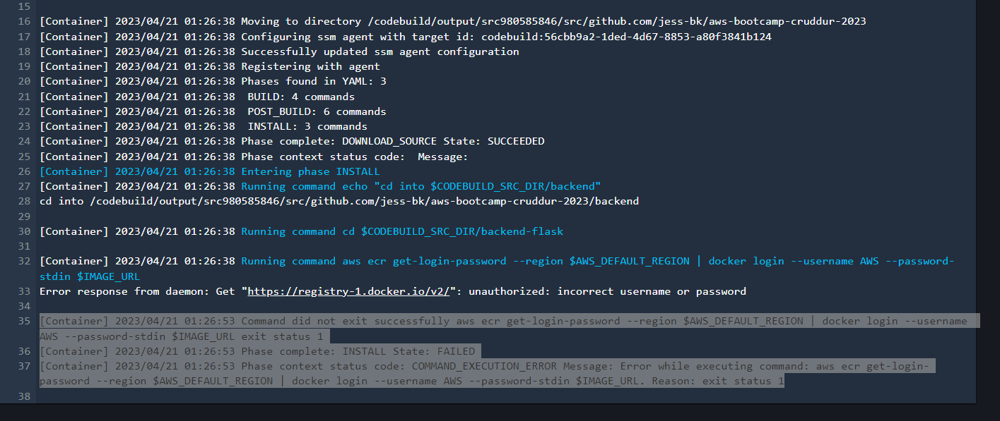
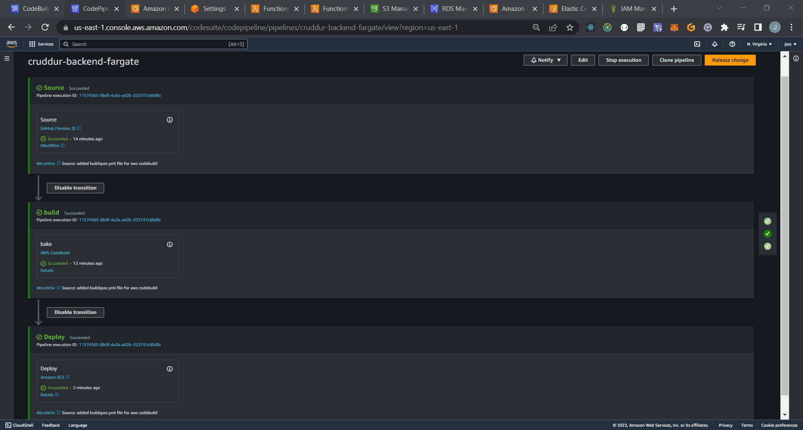
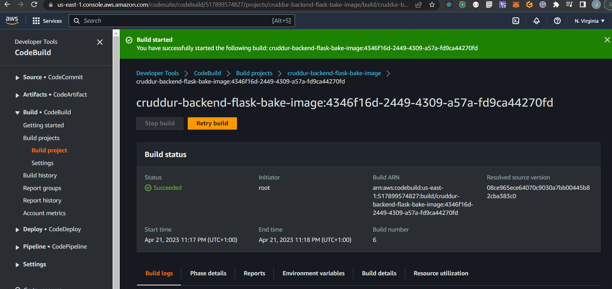
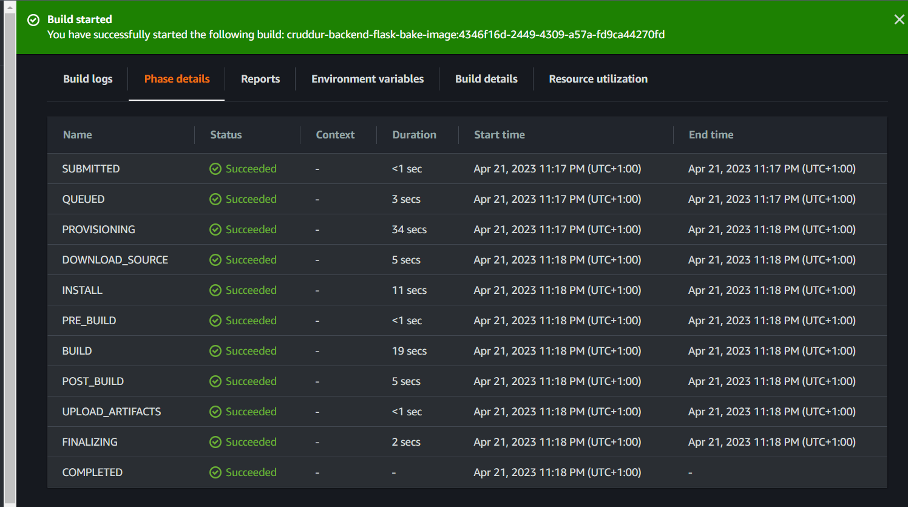

# Week 9 — CI/CD with CodePipeline, CodeBuild and CodeDeploy

CI/CD (Continuous Integration and Continuous Deployment/Delivery) is a software engineering approach that involves automating the processes of building, testing, and deploying software applications. AWS provides a suite of tools to implement CI/CD, including CodePipeline, CodeBuild, and CodeDeploy.

CodePipeline is a fully managed continuous delivery service that automates the build, test, and deployment of your code every time there is a code change, based on the release process model you define.

CodeBuild is a fully managed build service that compiles source code, runs tests, and produces software packages that are ready to deploy. You can use CodeBuild to build and test code in a variety of languages, including Java, Python, Ruby, and Node.js.

CodeDeploy is a fully managed deployment service that automates software deployments to a variety of compute services, including Amazon EC2, AWS Fargate, AWS Lambda, and your on-premises servers. With CodeDeploy, you can deploy applications in a consistent, reliable, and repeatable way, while minimizing downtime and reducing deployment errors.

By using these three services together, you can set up a fully automated CI/CD pipeline that can build, test, and deploy your code changes with just a few clicks, while ensuring that your application is always available and up-to-date.

# CI CD Pipeline Security Best Practices 

1. Use the principle of least privilege to grant only necessary permissions to AWS services, roles, and users.
2. Use version control tools such as GitHub to store and manage the code repository.
3. Implement secure build practices by using CodeBuild, which ensures the integrity and security of the build process.
4. Use Amazon ECR as the container registry, which encrypts and stores Docker images securely.
5. Configure AWS ECS task definitions to enable Fargate launch type, which ensures isolation and security of the containerized applications.
6. Implement automated testing and vulnerability scanning of Docker images before deployment to production.
7. Implement network security measures such as using a VPC, security groups, and access control lists to protect the AWS ECS resources from unauthorized access.

By implementing these measures, you can ensure the security of your CI/CD pipeline for AWS ECS and mitigate the risks of security breaches and data theft.

# The OWASP Top 10 list of the most common and critical web application security risks

OWASP stands for "Open Web Application Security Project". It is a nonprofit organization that aims to improve the security of software and web applications. OWASP provides a wide range of resources and tools related to application security, including guidelines, best practices, and testing frameworks. One of the most well-known OWASP resources is the "OWASP Top Ten", which is a list of the most critical web application security risks. This list is regularly updated to reflect new threats and vulnerabilities.

1. Injection attacks
2. Broken authentication and session management
3. Cross-site scripting (XSS)
4. Broken access control
5. Security misconfigurations
6. Insecure cryptographic storage
7. Insufficient logging and monitoring
8. Insecure communication
9. Using components with known vulnerabilities
10. Insufficient data validation and sanitization


# CREATING CODEPIPELINE

1. Choose Pipeline Settings:

* Pipeline name cruddur-backend-fargate.
* Select service role to create a new service role.(role name will be auto generated by aws)
* Select allow AWS CodePipline to create a service role so it can be used with this new pipline.
* Advanced Settings leave as default.
* Click next

2 Add Source Stage:

* Select GitHub as the Source Provider and create a GitHub connection. (Connection name Cruddur(provide a connection name)
* Select the repo that you want to create the pipeline for and this will provide you witha number in Connect to Github in the tab Github Apps. (click on connect)
* You will be redirected back to the page for to add source stage and the Connection tab will be auto generated with repo to connect if not select manually.
* Repository name select the repository that you just added.
* Branch name add the branch you want to trigger in this case prod
* Change detectection options select start the pipeline on the source code change.
* Output artifact format leave as CodePipline default.
* Click next

3 Add Build Stage:
*create this after you have create codebuild you will to edit the pipline in codebuild.

* Add stage, stage name --> build and click on Add stage.
* Click on Edit actions.
* Action name --> bake.
* Action provider select --> AWS CodeBuild.
* Region select the region that your are using in thw aws account.
* Input artifacts select ImageDefinition.
* Project name select project name cruddur-backend-flask-bake-image.
* Build type select single build.
* Variable namespace leave blank.
* Output artifacts add ImageDefinition to the tab.

4. Add Deploy Stage:

* Select Amazon ECS as the Deploy Provider.
* Region select your region.
* Choose the Cluster and Service name.
* Click next.

5. Create Pipeline:

* Review the pipeline details and click Create Pipeline.

# CODEBUILD:

1. Create Build Project:

* Give a project name and description.
* Enable build badge and disable build limit.
* Select GitHub as the Source Provider and create a GitHub connection.
* Select the repository and branch you want to create the pipeline for.
* Select "Pull merged requests" as the Event Type.
* Choose Amazon Linux 2 as the Operating System.
* Select "Managed image" as the Environment Image.
* Enable "Privileged" to allow building Docker images.
* Create a new service role and increase the timeout to 0 hours and 20 minutes.
* Select "Use a buildspec file" and add the path to the buildspec file.
* Select "No artifacts" as the Type.

2. Create Inline Policy:

* Create an inline policy for the IAM role "build-crudder-service-role".
```
{
    "Version": "2012-10-17",
    "Statement": [
        {
            "Sid": "ECRRepositoryPermissions",
            "Effect": "Allow",
            "Action": [
                "ecr:BatchCheckLayerAvailability",
                "ecr:GetDownloadUrlForLayer",
                "ecr:GetAuthorizationToken",
                "ecr:GetRepositoryPolicy",
                "ecr:DescribeRepositories",
                "ecr:DescribeImages",
                "ecr:ListImages",
                "ecr:PutImage",
                "ecr:PutImageTagMutability",
                "ecr:UploadLayerPart",
                "ecr:CompleteLayerUpload",
                "ecr:InitiateLayerUpload"
            ],
            "Resource": [
                "arn:aws:ecr:region:account-id:repository/repository-name"
            ]
        }
    ]
}
```
3. Create BuildSpec YAML File:
*aws-bootcamp-cruddur-2023/backend-flask/buildspec.yml

* Create a buildspec.yaml file in the backend-flask directory of your project.
```
# Buildspec runs in the build stage of your pipeline.
version: 0.2
phases:
  install:
    runtime-versions:
      docker: 20
    commands:
      - echo "cd into $CODEBUILD_SRC_DIR/backend"
      - cd $CODEBUILD_SRC_DIR/backend-flask
      - aws ecr get-login-password --region $AWS_DEFAULT_REGION | docker login --username AWS --password-stdin $IMAGE_URL
  build:
    commands:
      - echo Build started on `date`
      - echo Building the Docker image...
      - docker build -f Dockerfile.prod -t backend-flask .
      - docker tag $REPO_NAME $IMAGE_URL/$REPO_NAME
  post_build:
    commands:
      - echo Build completed on `date`
      - echo Pushing the Docker image..
      - docker push $IMAGE_URL/$REPO_NAME
      - cd $CODEBUILD_SRC_DIR
      - echo "imagedefinitions.json > [{\"name\":\"$CONTAINER_NAME\",\"imageUri\":\"$IMAGE_URL/$REPO_NAME\"}]" > imagedefinitions.json
      - printf "[{\"name\":\"$CONTAINER_NAME\",\"imageUri\":\"$IMAGE_URL/$REPO_NAME\"}]" > imagedefinitions.json

env:
  variables:
    AWS_ACCOUNT_ID: 517899574827
    AWS_DEFAULT_REGION: us-east-1
    CONTAINER_NAME: backend-flask
    IMAGE_URL: 517899574827.dkr.ecr.us-east-1.amazonaws.com
    REPO_NAME: backend-flask:latest
artifacts:
  files:
    - imagedefinitions.json
```
4. Create Pull Request:

* Create a pull request and merge it to the production branch to trigger the CodeBuild pipeline.

5. Check Build Logs:

* Check the build logs in the CodeBuild console to see if the build was successful.

# Images Of CodePipline and CodeBuild Integration

*Initially, I encountered an error from Docker stating that my credentials were incorrect. I tried to resolve this issue by adding an inline policy to the role, but it did not fix the problem. In the end, I had to recreate both the pipeline and CodeBuild, and delete the original ones.



*After deleteing the original pipeline and codebuild, the pipeline and CodeBuild project began working correctly and the Docker error was no longer present.






